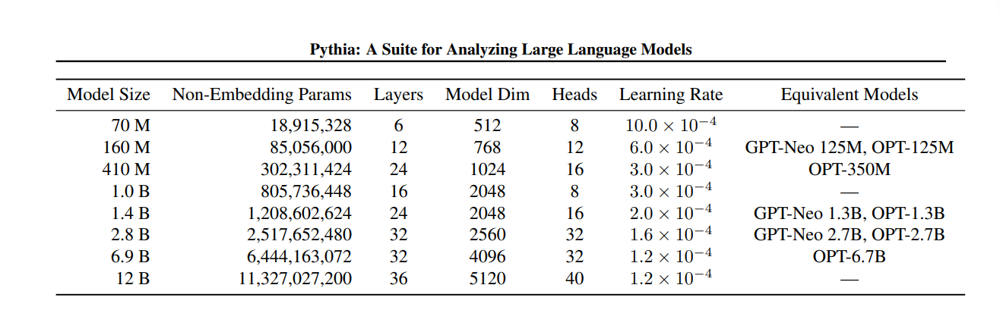

### 摘要 
#### 大型语言模型（LLM）在训练过程中是如何发展和演化的？随着模型的扩展，这些模式如何变化？
为了回答这些问题，我们介绍了 Pythia，这是一套由 16 个 LLM 组成的套件，所有 LLM 都以完全相同的顺序进行训练，大小从 70M 到 12B 参数不等。我们为 16 个模型中的每个模型提供 154 个检查点的公共访问权限，以及下载和重建其确切训练数据加载器的工具，以供进一步研究。我们打算 Pythia 促进许多领域的研究，我们提出了几个案例研究，包括记忆方面的新结果、术语频率对少镜头表现的影响以及减少性别偏见。我们证明，这种高度受控的设置可用于对 LLM 及其训练动态产生新的见解。训练模型、分析代码、训练代码和训练数据可以在 https：//github.com/EleutherAI/pythia 找到。

#### 要了解transformer的功能，关键是要更好地理解这些模型在两个轴上的行为：训练和缩放。
众所周知，经过训练的语言模型在扩展时的行为存在规律和可预测的模式，但之前将这些“缩放定律”与语言模型的学习动态联系起来的工作很少。造成这种研究差距的驱动原因之一是缺乏适当的模型套件来测试理论：尽管公开可用的LLM比以往任何时候都多，但它们并不符合研究人员的共同要求，如本文第2节所述。在确实存在的这些研究，它绝大多数是在非公开模型或模型检查点上完成的，这进一步强调了拥有公开可用的模型套件用于科学研究的重要性。

#### 在本文中，我们介绍了 Pythia，这是一套仅解码器的自回归语言模型，参数范围从 70M 到 12B 不等，专为促进此类科学研究而设计。Pythia 套件是唯一公开发布的 LLM 套件，它满足三个关键属性： 
1.模型跨越模型规模的几个数量级。 
2. 所有模型都以相同的顺序在相同的数据上进行训练。 
3. 数据和中间检查点公开供研究。我们在两个桩上分别训练 8 个模型尺寸和重复数据删除后的 Pile，提供了 2 个可以比较的套件副本。 

#### 减轻性别偏见
有很多工作对语言模型如何反映其训练数据中编码的偏见进行分类。然而，虽然一些工作已经探索了微调对语言模型偏见的影响（，或语料库统计与测量偏差之间的关系，研究人员普遍缺乏工具来研究训练数据对不同规模的大型语言模型中偏差学习动力学的作用。为了证明 Pythia 现在的可能性，我们分析了故意修改语言模型预训练数据中性别术语的频率是否会对其下游行为和偏见产生影响。我们利用模型套件的已知预训练数据和公共训练代码库，并反事实地重新训练模型，使得最后 7% 和 21% 的模型训练对大多数代词进行了修改，使其语法性别是女性而不是男性。我们证明，这种干预成功地减少了目标基准上的偏倚测量，并提出了反事实干预和部分模型的可再训练性，作为未来研究训练语料库对模型行为影响的关键工具

#### 精简总结
该论文的核心观点是，通过构建Pythia模型套件，为研究大规模语言模型的行为和局限性提供了新的研究工具。该套件包含16个大小从70M到12B参数的模型，且所有模型使用相同的数据集和数据顺序进行训练，并提供了模型的中间检查点。 
关键的逻辑推理过程如下： 
1. 提出问题：如何理解和控制大规模语言模型的训练和扩展行为？ 
2. 介绍Pythia模型套件：该套件包含16个模型，覆盖7个数量级的模型大小，所有模型使用相同的数据集和顺序进行训练，并提供模型的中间检查点。 
3. 案例研究：使用Pythia套件进行案例研究，探索语言模型中的性别偏见、记忆机制和训练数据中的术语频率效应等话题。 
4. 分析性别偏见：通过修改部分训练数据中的性别代词，发现可以显著减少模型在下游任务中的性别偏见。 
5. 分析记忆机制：发现记忆序列的出现符合泊松点过程，与模型大小无关。 
6. 分析训练数据中的术语频率：发现随着模型规模增大，训练数据中术语频率对模型性能的影响逐渐显现。 
7. 总结：Pythia模型套件为研究大规模语言模型的行为提供了新的研究工具，有望启发更多深入研究。 
通过Pythia模型套件，研究人员可以更系统地分析大规模语言模型的训练和扩展过程，并从微观层面理解模型行为，从而为设计更高质量的模型提供指导。 
