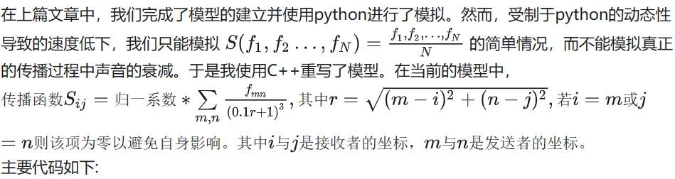

```
#include <bits/stdc++.h>
using namespace std;
int length=10;//人阵规模，不得超出10000*10000
int width=10;
//下为f二三项
double A(double a,double b)
{
	double y=log1p(a)/log(2)*0.5*(1+tanh(5*(b+1.5)));
	return y;
}
//下为随机函数
double g(double t)
{
	double y=1+tanh(7*(sin((sqrt(3))*0.7*t)+sin((sqrt(5))*0.7*t)+0.332*sin((sqrt(16))*0.7*t)+sin((sqrt(14))*0.7*t)+1.02*sin((sqrt(2.5803)*0.7*t))));
	return y;
}
//这个g2是用来错开各个f的随机初始值，为了省事直接把g里面的部分拿出来了
double g2(double t)
{
	double y=(sin((sqrt(3))*0.7*t)+sin((sqrt(5))*0.7*t)+0.332*sin((sqrt(16))*0.7*t)+sin((sqrt(14))*0.7*t)+1.02*sin((sqrt(2.5803)*0.7*t)));
	return y;
}
//递推步进函数
double Nextf(int step,vector<double> ramvec,double deltat)
{
	double t=0.05*step;
	double fl=(ramvec[(step+19)%20]+ramvec[(step+18)%20]+ramvec[(step+17)%20]+ramvec[(step+16)%20]+ramvec[(step+15)%20]+ramvec[(step+14)%20])/6;
	double fv=(((ramvec[(step+19)%20]+ramvec[(step+18)%20]+ramvec[(step+17)%20]+ramvec[(step+16)%20]+ramvec[(step+15)%20])/5)-((ramvec[(step+9)%20]+ramvec[(step+8)%20]+ramvec[(step+7)%20]+ramvec[(step+6)%20]+ramvec[(step+5)%20])/5))*2;
	double ft=g(t-deltat)*A(fl,fv)+0.001*g(t-deltat);
	return ft;
}

double fdata[10000][10000];//传出响度定义
//卷积核(迫真)就是模型里的S(……),决定声音如何传播，衰减
double core(int i,int j)//接收坐标
{
	double fsum=0;
	double f1sum=0;
	double daor=0;
	for(int m=0;m<width;m++)//遍历发射坐标
	{
		for(int n=0;n<length;n++)
		{
			double r=sqrt(pow((m-i),2)+pow((n-j),2));//两人距离(平直空间，不整花活)
			if(r==0)//排除自身影响
			{
				daor=0;	
			}
			else
			{
				daor=(pow((0.1*r+1),-3));
			}
			fsum=fsum+(fdata[m][n])*daor;//求和
			f1sum=f1sum+daor;//归一化倒系数
		}
	}
	double loud=fsum/f1sum;
	return loud;
}
//——————————————————————————施法前摇结束——————————————————————————————————————————————
int main()
{
	//输出
	freopen("outputtest.txt","w",stdout);
	//传出响度初始化
	for(int i=0;i<width;i++)
	{
		for(int j=0;j<length;j++)
		{
			fdata[i][j]=1;
		}
	}
	
	vector<double> fsave[width][length];//历史接受响度初始化
	vector<double> example(20,1);
	for(int i=0;i<width;i++)
	{
		for(int j=0;j<=length;j++)
		{
			fsave[i][j]=example;
		}
	}
	

	//数据记录用量暂时没用到
//	vector<double> tdata={};//突变时间记录
//	int count=0;//突变次数
//	int test=0;
//	int last=0;
	long long int step;//这里step指第几步而非步长，步长固定在0.05
	//———————————————————————————————————递推循环————————————————醒目的分界线——————————————————————————————— 
	for(step=0;step<=(20*1000);step=step+1)//迭代循环,1000s用15s
	{
		double t=0.05*step;
		//这里放迭代主体
		//这里放卷积
		for(int i=0;i<width;i++)//开卷!
		{
			for(int j=0;j<length;j++)
			{
				fsave[i][j][step%20]=core(i,j);
			}
		}
		for(int i=0;i<width;i++)//反馈计算
		{
			for(int j=0;j<length;j++)
				{
					fdata[i][j]=Nextf(step,fsave[i][j],(114*g2(i)+1919*g2(j)));//最后一个自变量用来错开随机
				}
		}

		//突变判断（没用上）
//		if(fall>=0.1)
//		{
//			test=0;
//		}
//		else
//		{
//			test=1;
//		}
//		
//		if(test-last==1)
//		{
//			count=count+1;
//			tdata.push_back(t);
//		}
//		last=test;
		
		for (int i = 0; i < width; ++i) {//把每个step的矩阵拍扁后输出，这里代码排版莫名其妙炸了
    	    for (int j = 0; j < length; ++j) {
   	         cout<<fdata[i][j]<<" ";
  	      }
  	  }
  	  cout<<""<<endl;
	}//循环结束——————————很醒目的分界线————————

	
return 0;	
}
```
随后我们把输出的数据丢给py进行可视化
```
import os
import math
import numpy as np
import matplotlib.pyplot as plt
current_dir = os.getcwd()

folder_path = "/storage/emulated/0/Documents/Pydroid3"
file_name = "long.txt"
 
full_path = os.path.join(current_dir, folder_path, file_name)

with open(full_path, 'r') as file:
	content = file.read().splitlines() 
	list = [[float(x) for x in line.split()]for line in content] 
fig=plt.figure(figsize=(10,10))
fig,ax = plt.subplots()
for step in range(0,1200):#把被拍扁的矩阵立起来
	for i in range(0,1000):
		a=math.tanh(list[step][i])
		rect=plt.Rectangle((i%200,(i//200)),1,1,alpha=a)
		ax.add_patch(rect)
		plt.axis([0, 200, 0, 5])
	
	plt.savefig('/storage/emulated/0/Documents/Pydroid3/longaa/'+str(step)+'.png')
	ax.cla()
	
```
	