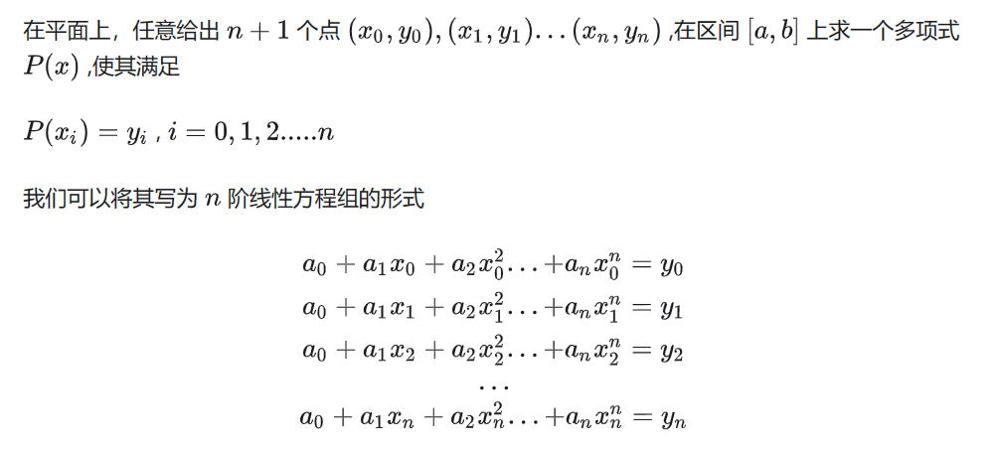
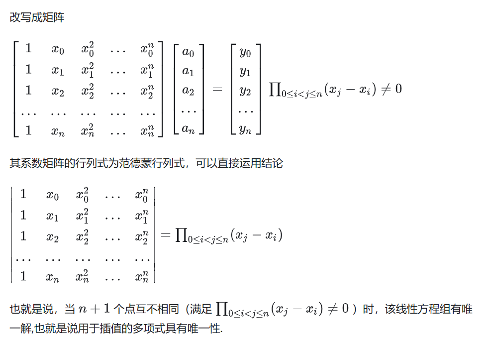
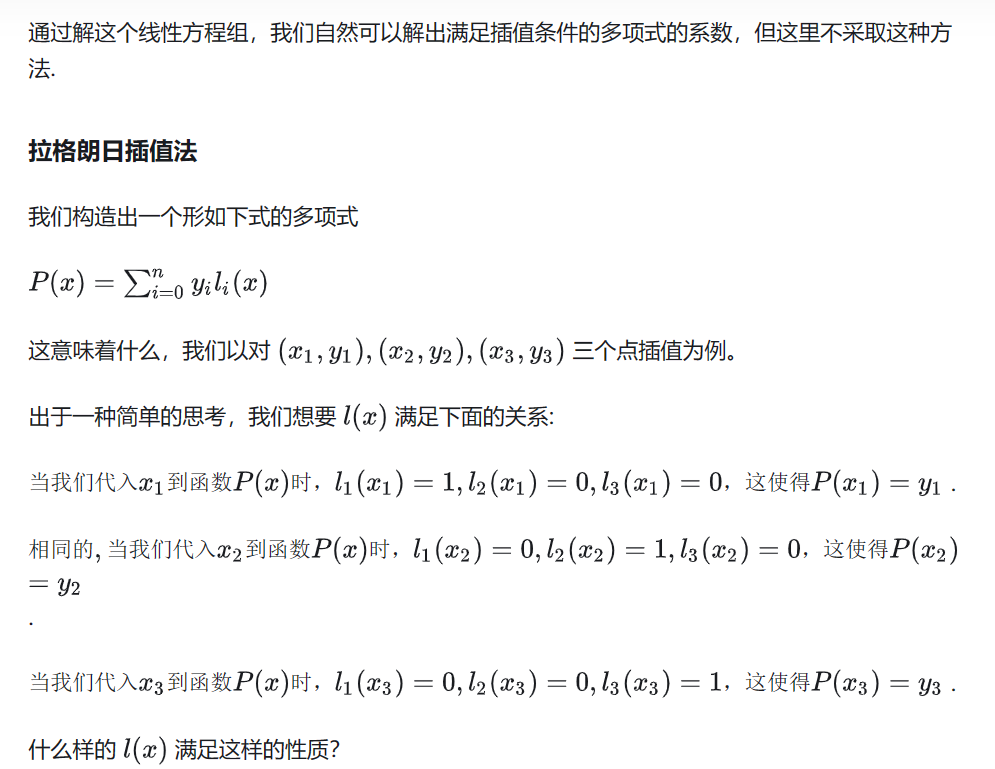
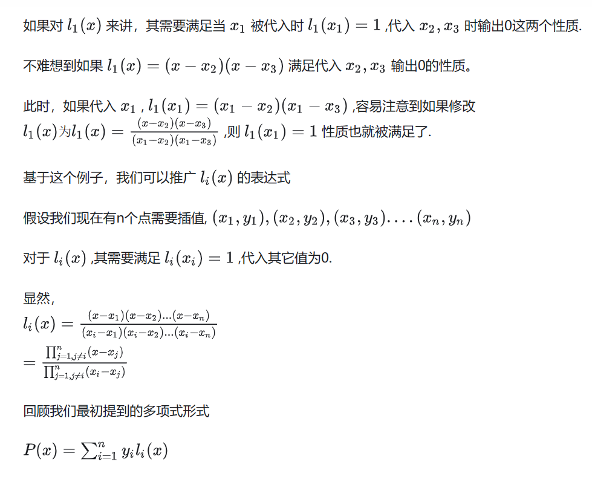
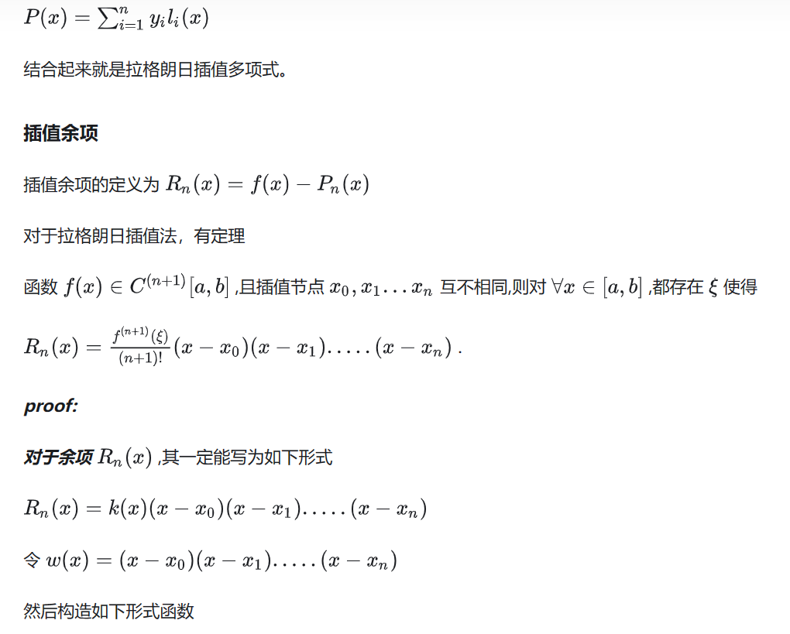
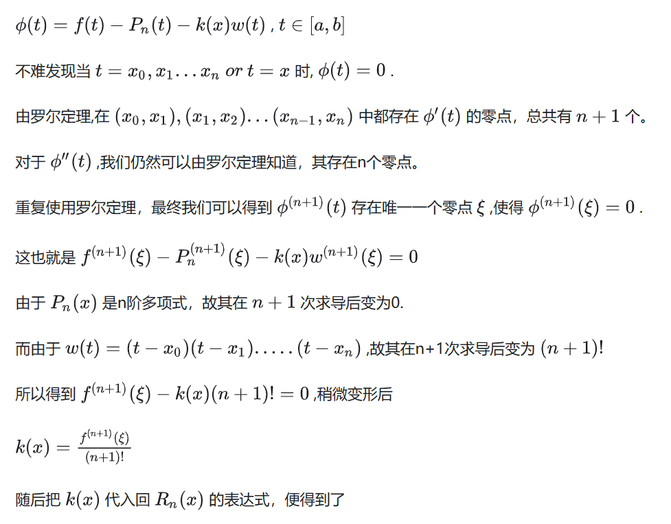
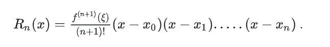

```
X = [100 121 144 169];
Y = [10 11 12 13];
m = length(X); % 获取节点个数，也就是题目中所给出的点数，n个点，对应的插值函数就是n-1阶
L = ones(m, m); % 初始化基函数系数矩阵
for k = 1 : m % 循环计算每个基函数的系数
V = 1; % 初始化基函数的临时变量
for i = 1 : m
if k ~= i % 排除当前节点时的计算
V = conv(V, poly(X(i))) / (X(k) - X(i)); % 在当前节点处计算基函数的系数
end
end
L(k, :) = V; % 将基函数的系数存储到矩阵中
end
l = sym(zeros(m, 1)); % 初始化基函数数组
for k = 1 : m % 遍历基函数系数矩阵
l(k) = poly2sym(L(k, :)); % 将基函数系数转化为符号表达式
end
fprintf('\n基函数为：\n');
for k = 1 : m % 输出每个基函数的表达式
fprintf('q%d(x)=%s\n', k, char(l(k)));
end
P = sym(0); % 初始化拉格朗日多项式
for k = 1 : m % 计算拉格朗日多项式的表达式
P = P + Y(k) * l(k);
end
fprintf('拉格朗日多项式为：\nP(x)=%s\n', char(P)); % 输出拉格朗日多项式的表达式
% 计算 x=115 处的 y 的近似值
x = 115;
y_approx = polyval(coeff, x);
y_approx_str=num2str(y_approx);
% 计算根号115的值
result=sqrt(115);
% 将结果转换为字符串
result_str=num2str(result);
% 计算差值
difference = result_str - y_approx;
% 寻找小数点的位置
decimal_point = strfind(result_str, '.');
% 计算有效数字位数
if ~isempty(decimal_point)
effective_digits = sum(result_str ~= '0' & result_str ~= '.');
else
effective_digits = sum(result_str ~= '0');
end
disp(['有效数字位数：', num2str(effective_digits)]);
disp('sqrt(115)近似值为')
% 格式化输出结果
format_string = ['%0.', num2str(effective_digits), 'g\n'];
fprintf(format_string, result);
```