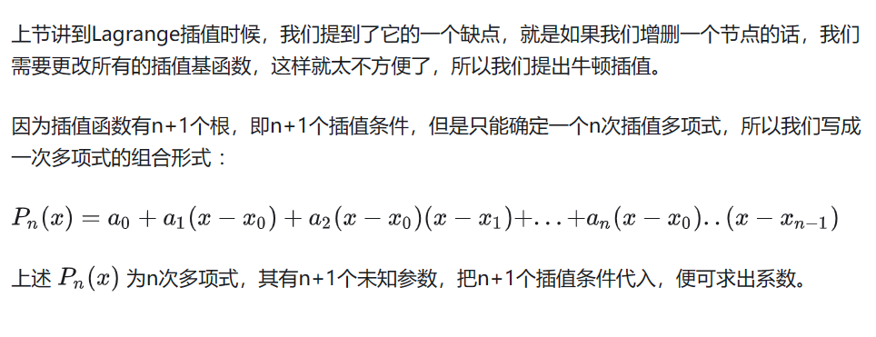
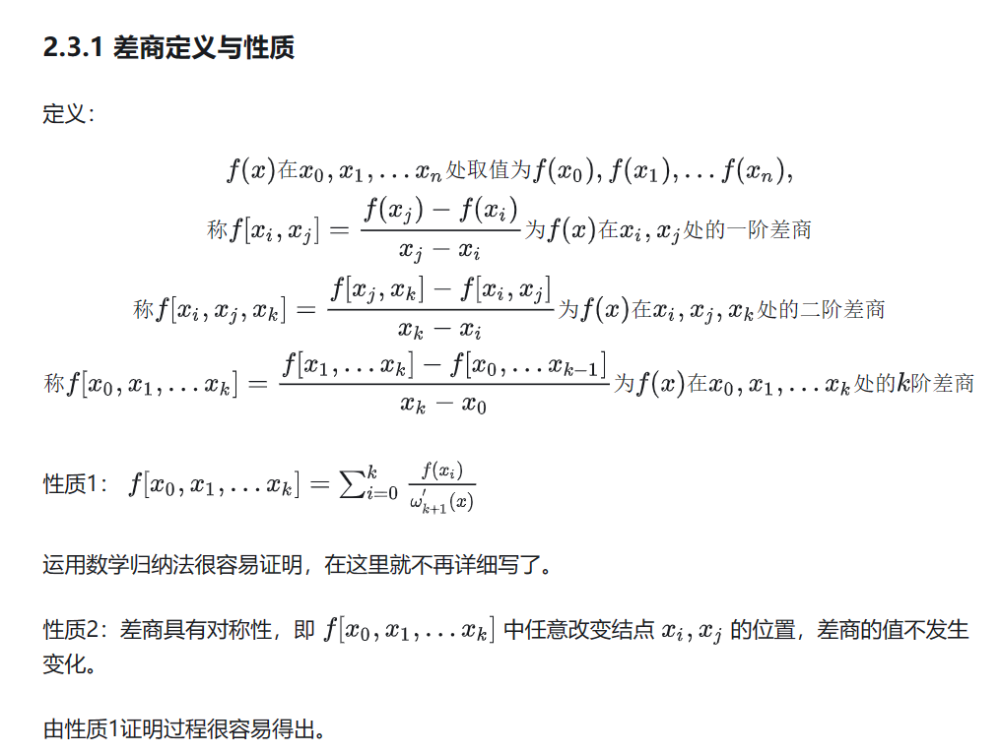
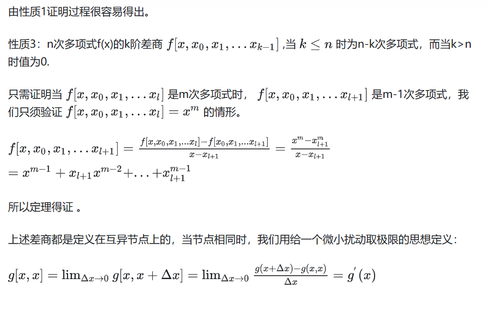
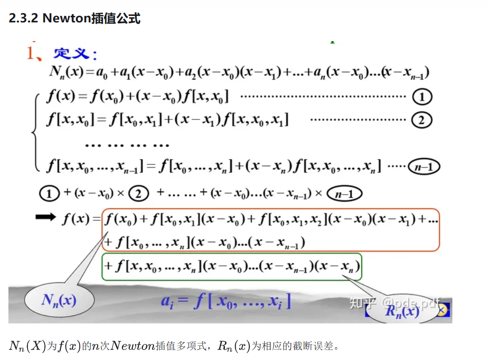
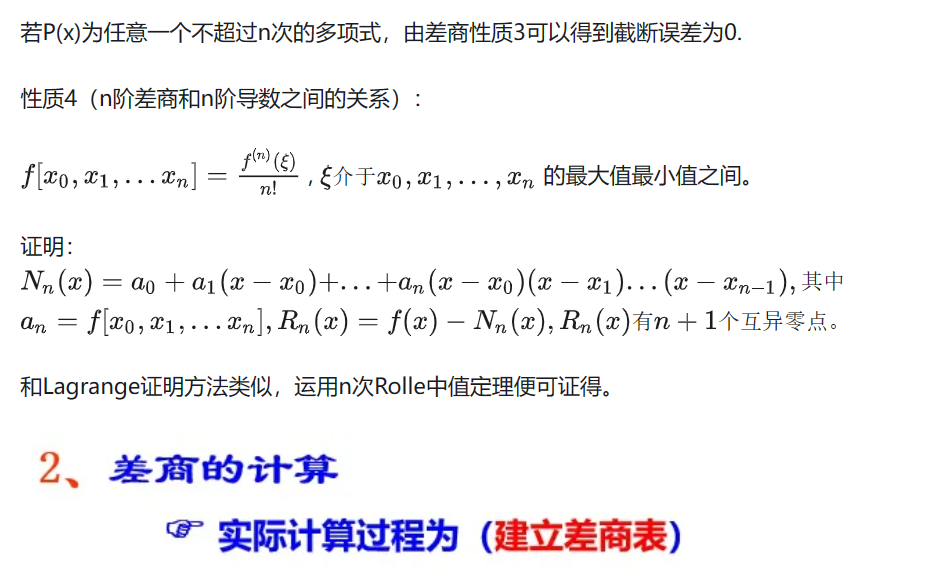
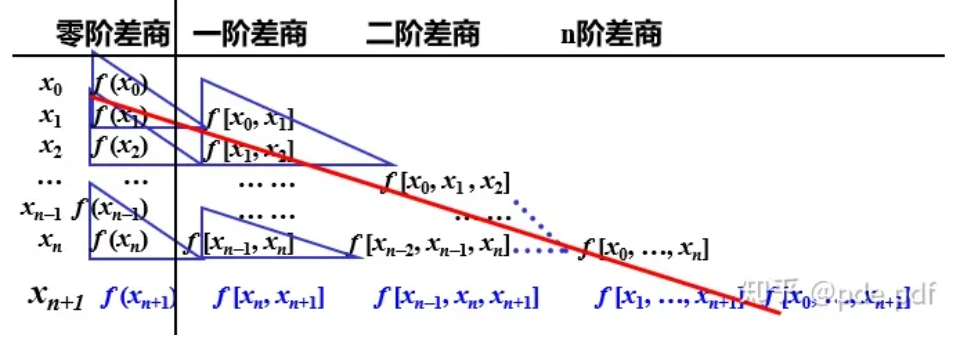
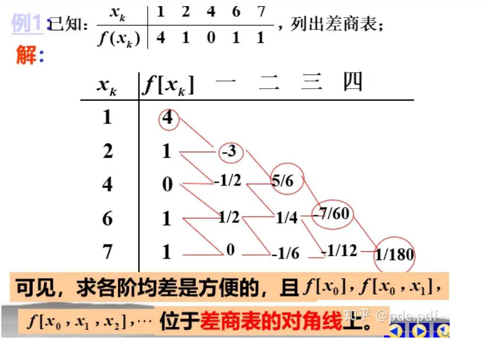
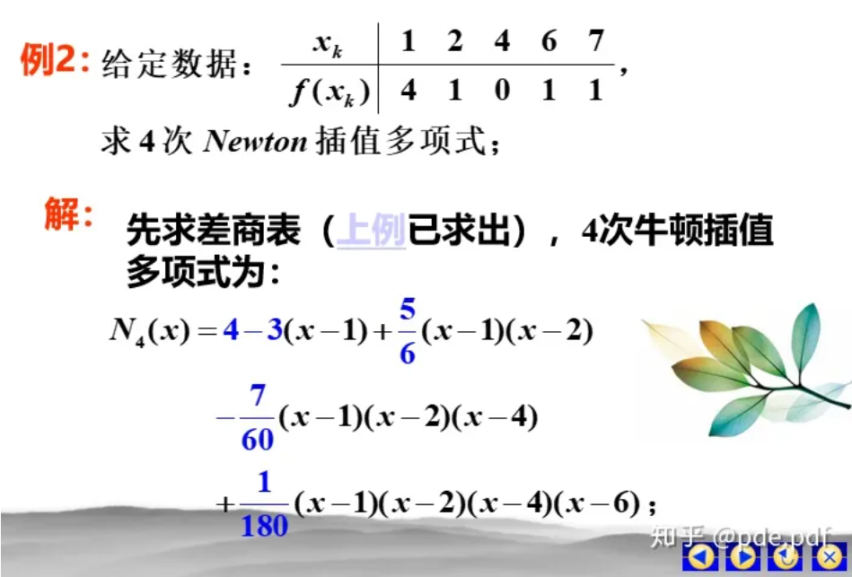
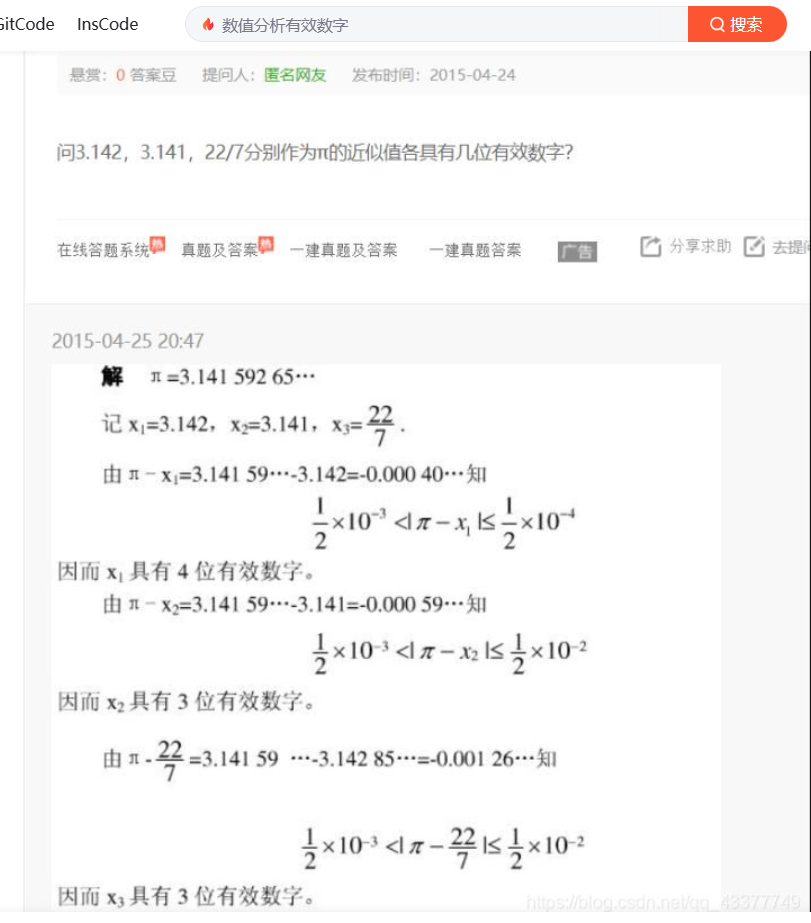

```
function p= Newton_fun(x,xi,yi)
n=length(xi);
f=zeros(n,n);
% 对差商表第一列赋值
for k=1:n 
f(k)=yi(k);
end
% 求差商表
for i=2:n % 差商表从0阶开始；但是矩阵是从1维开始存储！！！！！！
for k=i:n
f(k,i)=(f(k,i-1)-f(k-1,i-1))/(xi(k)-xi(k+1-i)); 
end
end
disp('差商表如下：');
disp(f);
%求插值多项式
p=0; 
for k=2:n
t=1;
for j=1:k-1
t=t*(x-xi(j));
end
p=f(k,k)*t+p;
end
p=f(1,1)+p;
end
xi=[1 2 3];
yi=[2 3 4];
x=sym('x');
p= Newton_fun(x,xi,yi);
disp(p)
```

