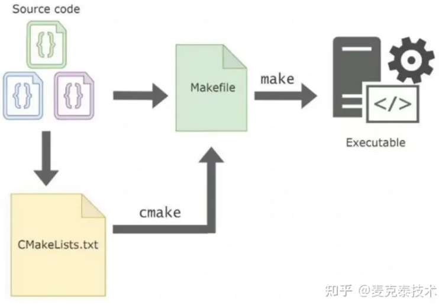
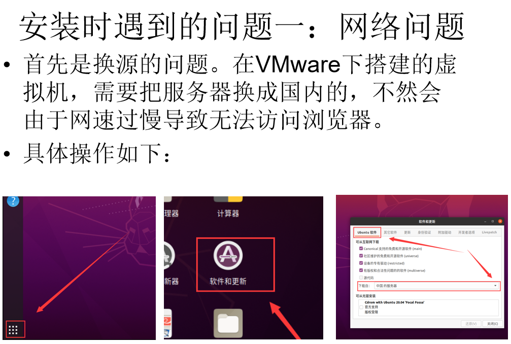
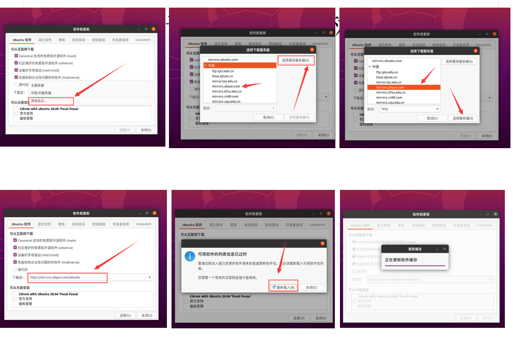
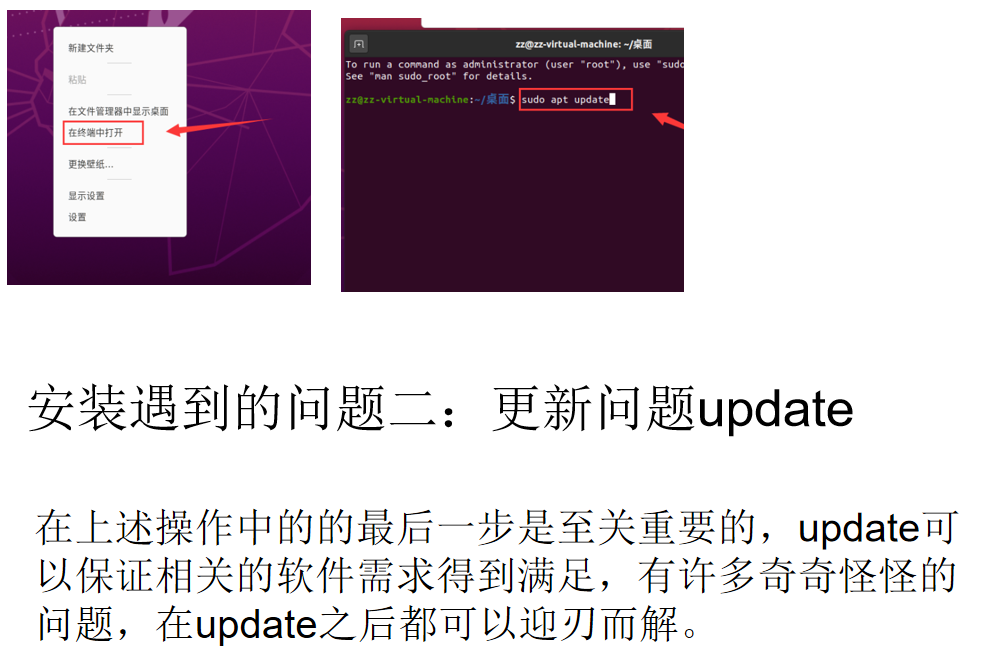
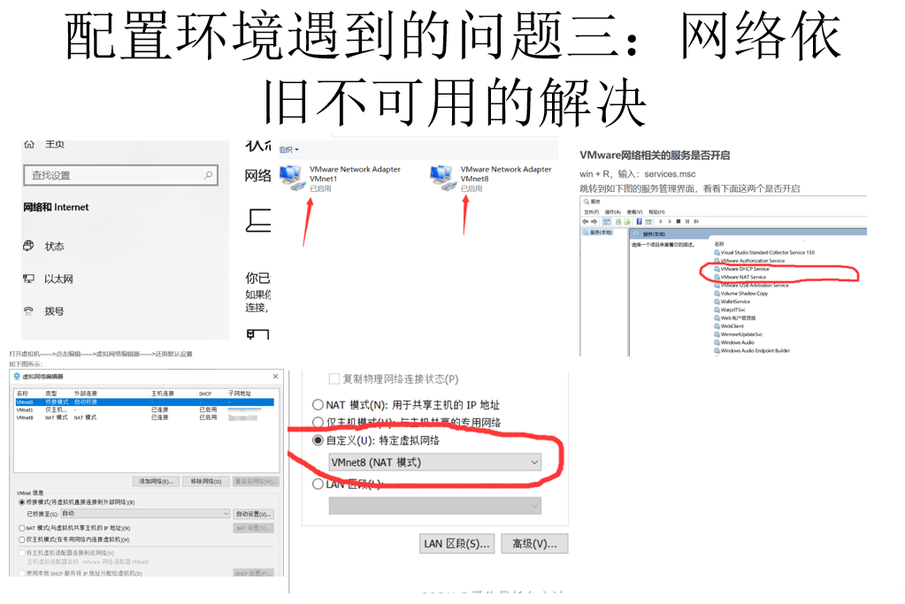
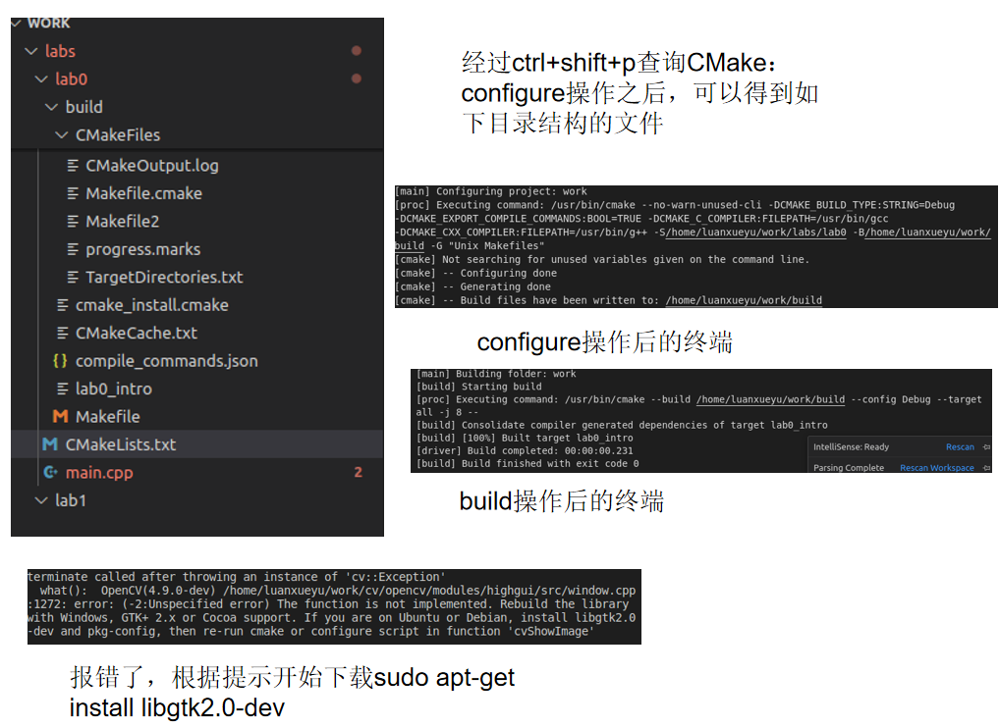
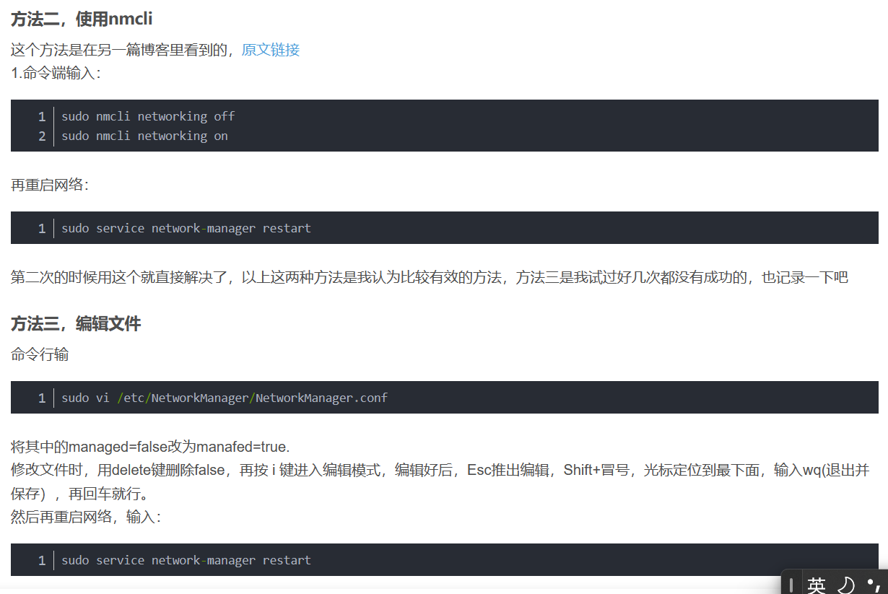
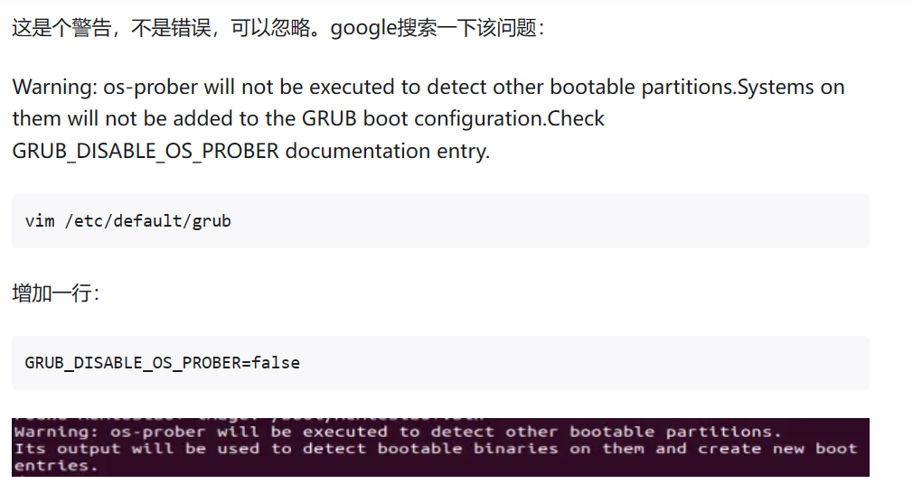
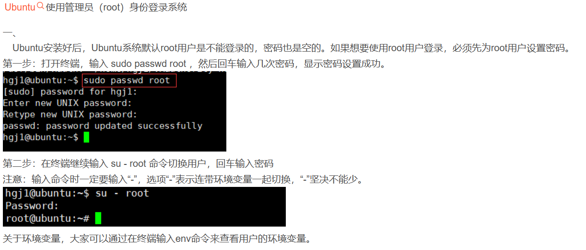

### 【CMake 和 make 的区别】

#### Make 如何工作：

-控制从源代码生成可执行文件和其他文件。  
-构建程序的说明在名为 Makefile 的文件中指定。  
-Make 读取 Makefile，以确定构建程序的必要步骤。  
（也就是说，最终的执行就是 make 操作）

#### CMake 的工作原理：

-CMake 需要一个 CMakeLists.txt 文件，并充当跨平台制作工具。  
-它允许与编译器无关的软件构建、测试、打包和安装。  
-CMake 为各种系统生成构建文件，但不直接编译代码。  
-CMake 可以生成 Makefiles，然后与 Make 一起使用，在目标平台上构建程序。  
!!!![最本质的解释如下]

#### CMake 与 Make 构建比较：

-都是生成构建系统：CMake 创建输出，可供 Make 等构建系统使用，作为其他构建系统的生成器。另一方面，Make 生成一个编译的二进制可执行文件。

#### 跨平台与单平台

-CMake 跨平台：CMake 旨在在不同的操作系统上工作，实现跨平台的一致构建。  
-Make 单一平台：Make 主要在单个平台上使用，需要手动干预，以确保不同系统之间的兼容性。

#### 小结：

-CMake 和 Make 都是软件开发中自动化构建过程的基本工具。 -了解 CMake 和 Make 之间的区别使开发人员能够根据其特定项目需求选择最合适的工具。

### 遇到的问题

注意！！！
三板斧：
sudo apt-get update
sudo apt-get upgrade
sudo apt-get upaptitude
一定经常使用
同时，当网络出现问题时，可以尝试改变网络的连接方式

### 非常实用的技术！！！如何解决网络问题！！！

