### 图神经网络基础知识

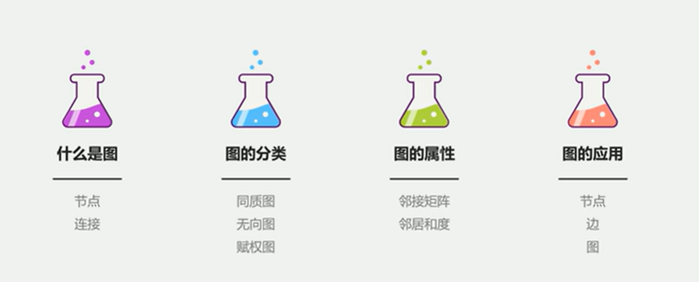
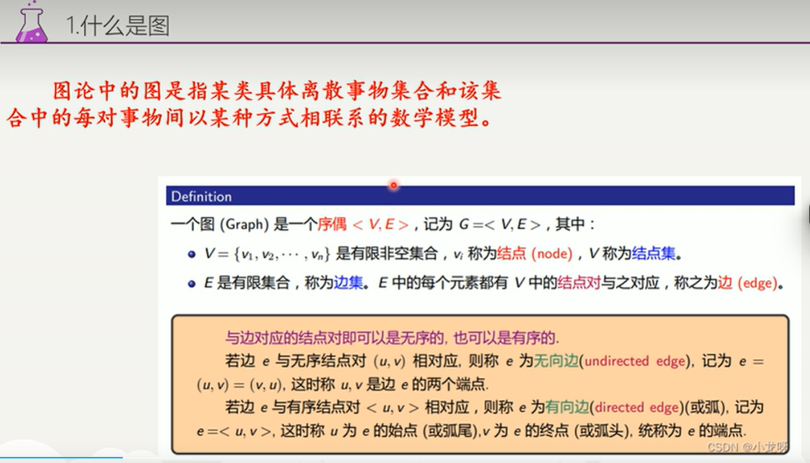
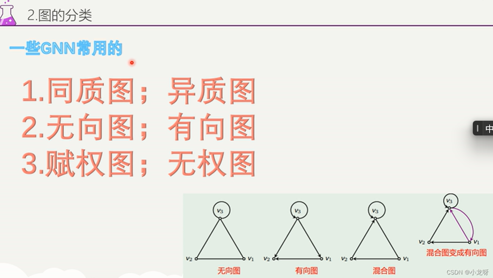
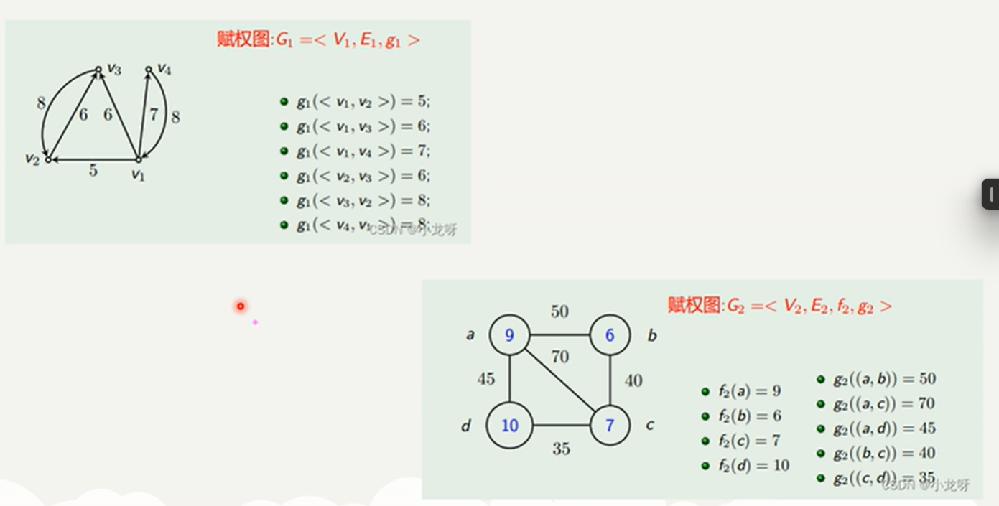
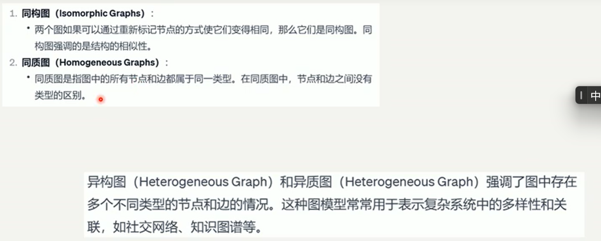
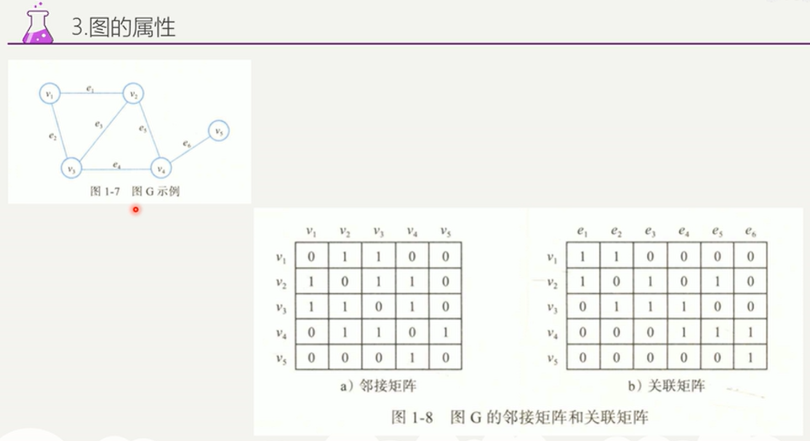

#### k-top，也就是k级邻居，k级跳点

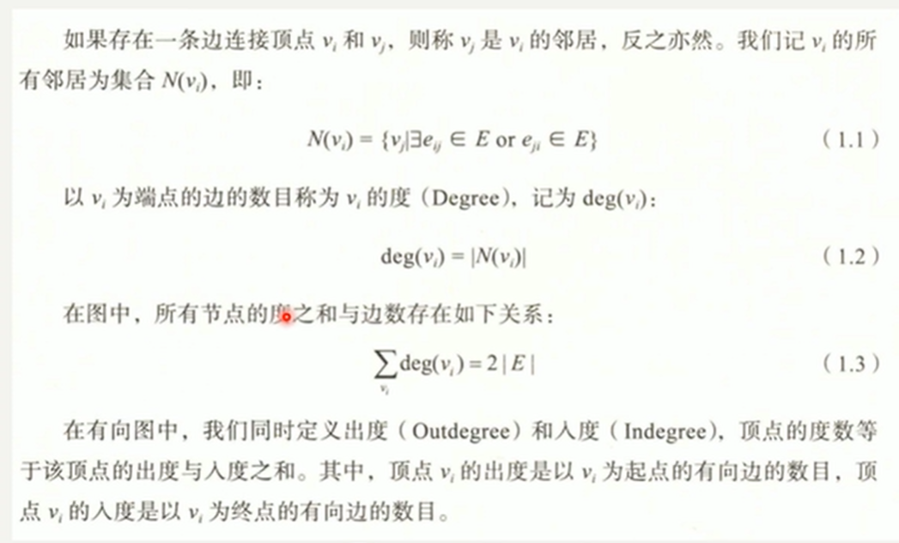
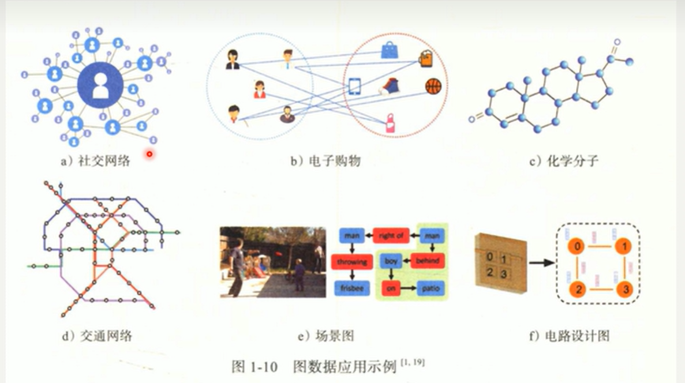

#### 结点的预测，分类-分割问题【例如将节点进行分类划分，最终实现一个分割问题，例如有一张图片描述了人际关系，将人群进行分组】

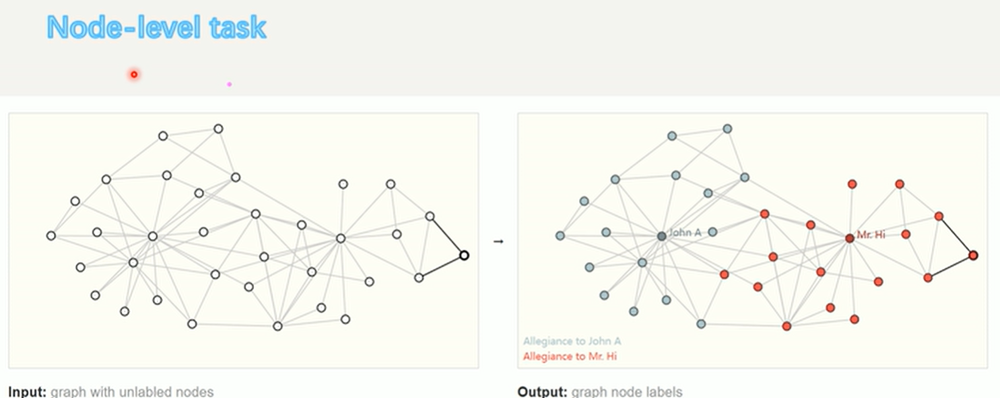

#### 图层面的的任务【比如给了一张图片，是一个蛋白质分子，想要分析它是由毒还是无毒的，它的功能是什么】

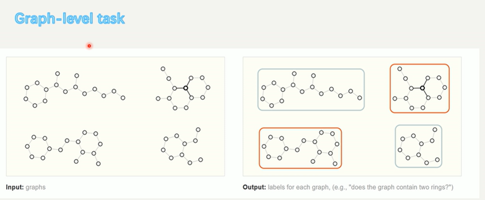

#### 边的预测：连接预测，也就是边层面的预测【例如预测两个节点之间的关系是什么】

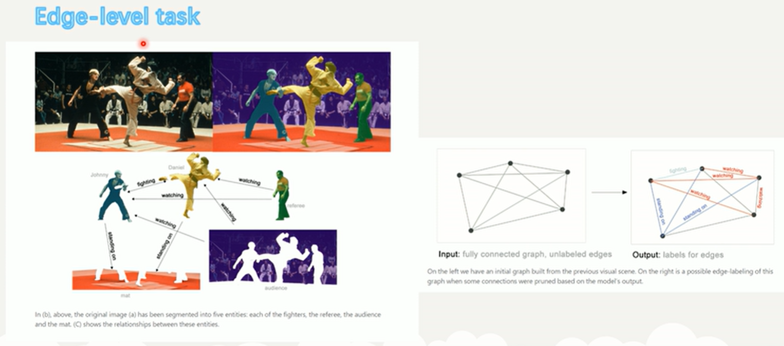
