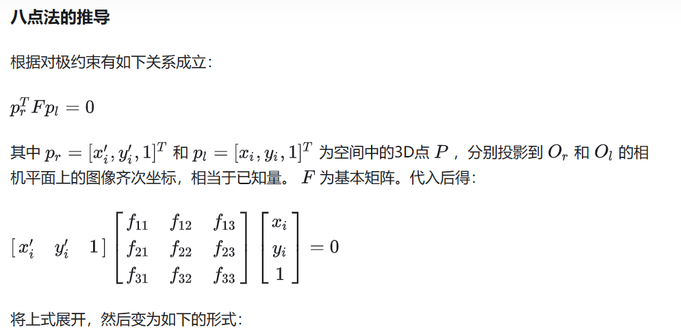
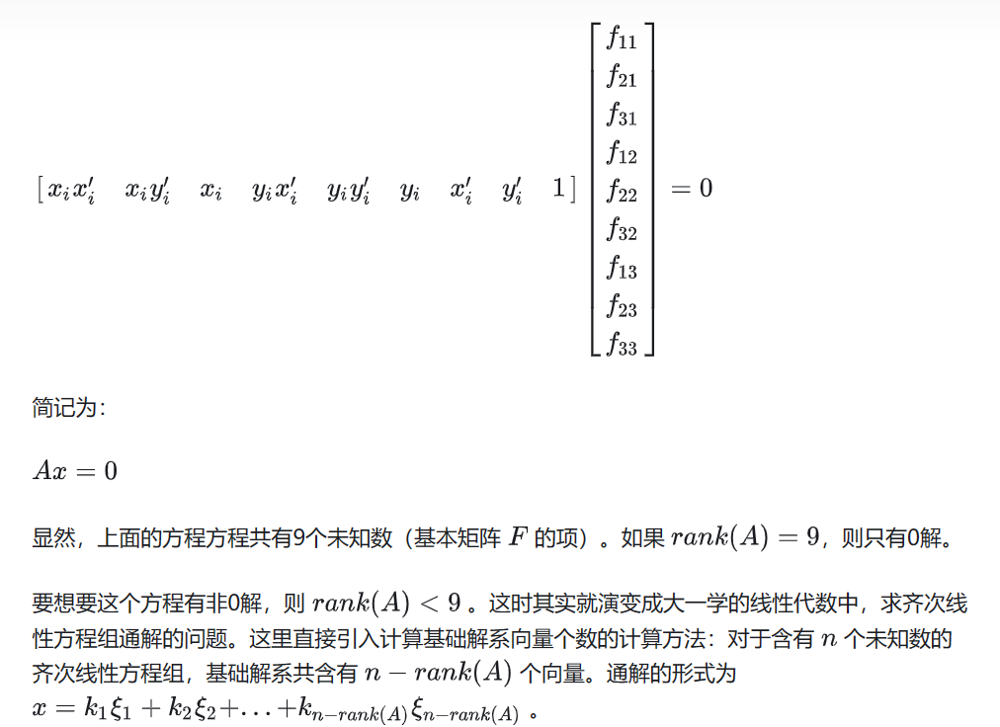
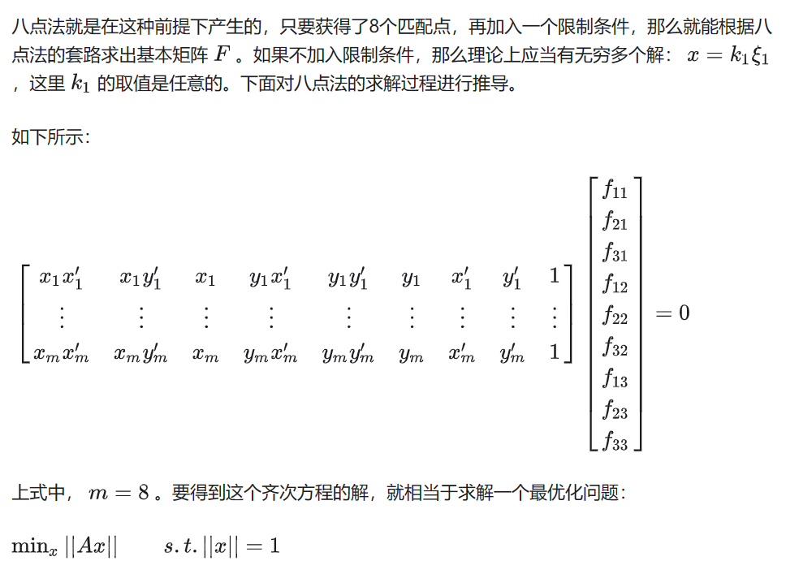
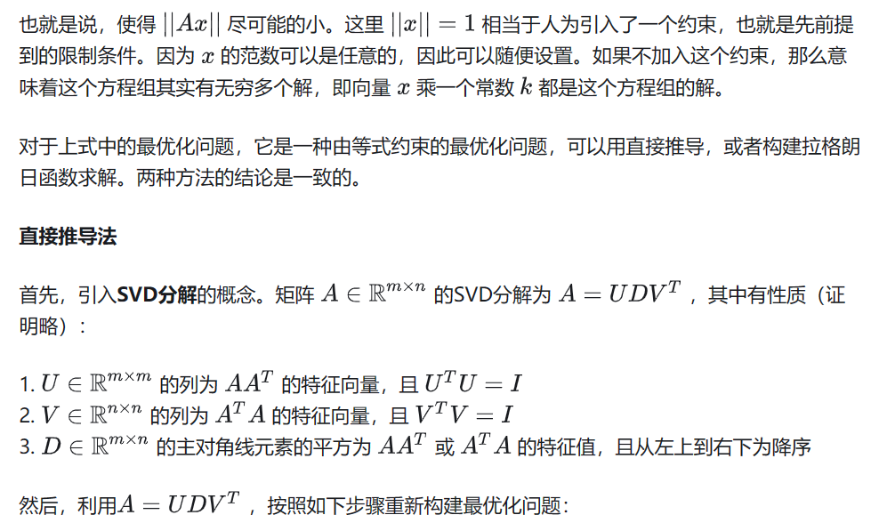
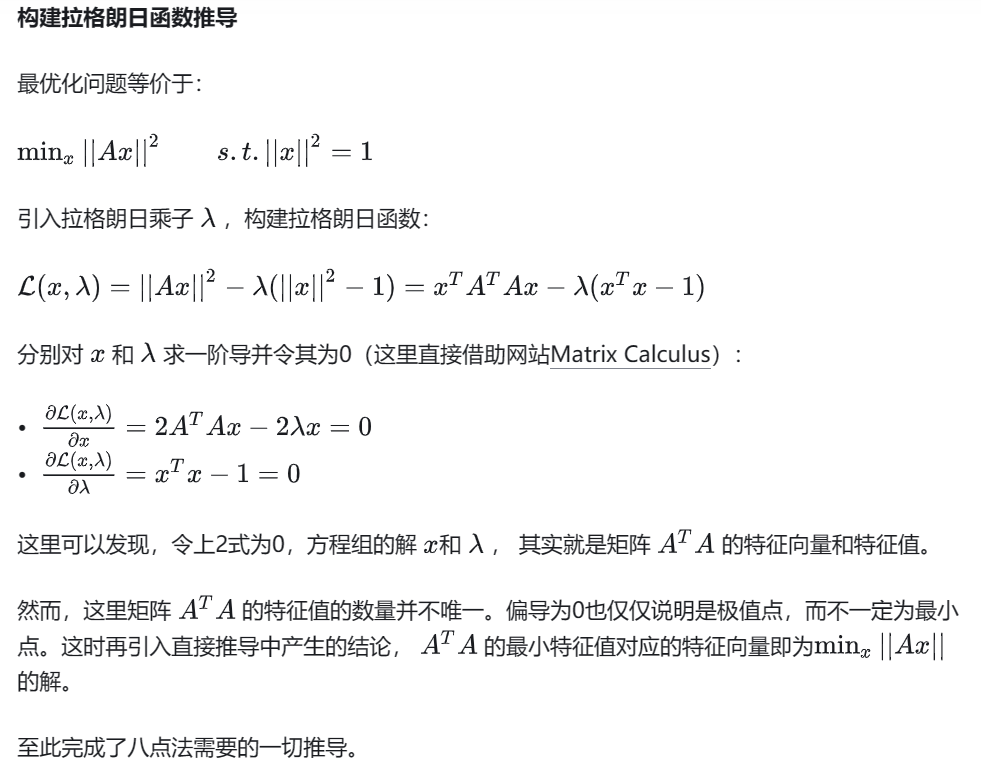
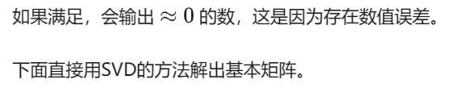
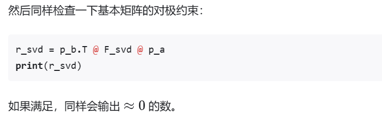

```
https://zhuanlan.zhihu.com/p/508149559
```







### Python 实现

代码实现部分用 OpenCV 的库作为 baseline，验证手推的八点法是否准确。

```
import cv2
import numpy as np
import matplotlib.pyplot as plt

# Step 0: Read images
img1 = cv2.imread("./data/1.png")
img2 = cv2.imread("./data/2.png")

# Step 1: Feature extraction
sift = cv2.SIFT_create()
# find the keypoints and descriptors with SIFT
kp1, des1 = sift.detectAndCompute(img1,None)
kp2, des2 = sift.detectAndCompute(img2,None)

# Step 2: Feature match
bf = cv2.BFMatcher()
matches = bf.knnMatch(des1, des2, k=2)

# select 8 good matches for testing
pts1 = []
pts2 = []
good_matches = []
k = 0
for i,(m,n) in enumerate(matches):
    if m.distance < 0.1 * n.distance:
        pts2.append(kp2[m.trainIdx].pt)
        pts1.append(kp1[m.queryIdx].pt)
        good_matches.append(m)
        k = k + 1
        if k == 8:
            # only reserve 8 points
            break

# visualize the selected 8 feature match
# match_result = cv2.drawMatches(img1, kp1, img2, kp2, good_matches, None, flags=2)
# plt.imshow(match_result)
# plt.show()

pts1 = np.int32(pts1)
pts2 = np.int32(pts2)

# opencv's default Fundamental Matrix estimation with 8 point method
# https://docs.opencv.org/4.x/d9/d0c/group__calib3d.html#ga59b0d57f46f8677fb5904294a23d404a
F_opencv, mask = cv2.findFundamentalMat(pts1, pts2, cv2.FM_8POINT)
print(F)
```

可以看出，其实用 OpenCV 的库，选择好匹配的特征，一行语句就 OK 了。

然后任取一对匹配点，检查一下这个输出的矩阵是否满足基本矩阵的对极约束：

```
p_a = np.array([[pts1[1][0]], [pts1[1][1]], [1]])
p_b = np.array([[pts2[1][0]], [pts2[1][1]], [1]])

r_ocv = p_b.T @ F @ p_a
print(r_ocv)``
```



````
def generate_A_matrix(pt1_list, pt2_list):
    A_matrix = []
    for i in range(len(pt1_list)):
        x_l = pt1_list[i][0]
        y_l = pt1_list[i][1]
        x_r = pt2_list[i][0]
        y_r = pt2_list[i][1]
        row_vector = [x_l * x_r, x_l * y_r, x_l, y_l * x_r, y_l * y_r, y_l, x_r, y_r, 1]
        A_matrix.append(row_vector)
    return A_matrix

def compute_fundamental_matrix(eigenvalue, eigenvector):
    # find min eigen value
    index = np.argmin(eigenvalue)
    F_vector = eigenvector[index]
    F_matrix = [[F_vector[0], F_vector[3], F_vector[6]], [F_vector[1], F_vector[4], F_vector[7]], [F_vector[2], F_vector[5], F_vector[8]]]
    F_matrix = np.array(F_matrix)
    return F_matrix

A_matrix = np.array(generate_A_matrix(pts1, pts2))
U, D, V = np.linalg.svd(A_matrix)
F_svd = compute_fundamental_matrix(D, V)
print(F_svd)```
````


