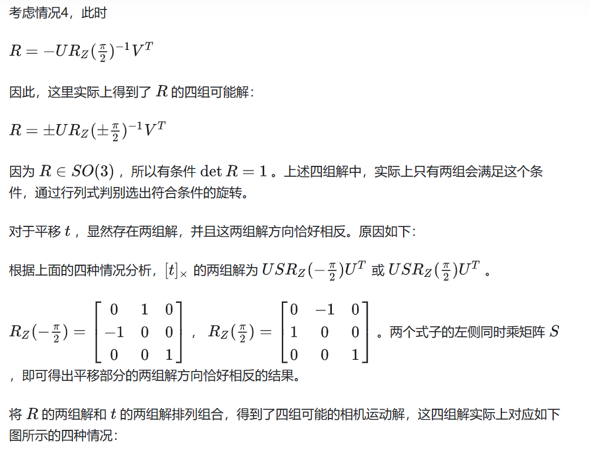

### Python 实现

按照惯例先调用 opencv 里的方法作为 baseline。

```
# set the intrinsic matrix
K = np.array([[fx, 0, cx],[0, fy, cy],[0, 0, 1]])

# compute essential matrix
E_matrix = K.T @ F_svd @ K

# decompose the Essential Matrix
R_1, R_2, t = cv2.decomposeEssentialMat(E_matrix)

# The 4 possible solutions is [R_1, t], [R_1, -t], [R_2, t], [R_2, -t]
```

然后用 SVD 分解的方法实现一下：

```
from scipy.spatial.transform import Rotation as R

def compute_possible_RT(U, V):
    R_Z_90 = R.from_euler('z', 90, degrees=True).as_matrix()
    R_Z_minus_90 = R.from_euler('z', -90, degrees=True).as_matrix()

    # compute four possible solutions for rotation
    R_1 = U @ R_Z_minus_90.T @ V.T
    R_2 = U @ R_Z_90.T @ V.T
    R_3 = - U @ R_Z_minus_90.T @ V.T
    R_4 = - U @ R_Z_90.T @ V.T
    candidate_rotation_list = [R_1, R_2, R_3, R_4]

    # check the determinant and return the final rotation
    final_rotation_list = []
    for rotation in candidate_rotation_list:
        if np.linalg.det(rotation) > 0:
            final_rotation_list.append(rotation)

    # compute possible translation
    S_matrix = np.array([[1,0,0],[0,1,0],[0,0,0]])
    t_skew = U @ S_matrix @ R_Z_minus_90 @ U.T
    # skew matrix to vec
    t_vec = np.array([-t_skew[1][2], t_skew[0][2], -t_skew[0][1]]).reshape(-1,1)
    return final_rotation_list[0], final_rotation_list[1], t_vec


U, D, V = np.linalg.svd(E_matrix)
# compute two solutions for rotation
R_1_svd, R_2_svd, t_svd = compute_possible_RT(U, V)
```

然后简单的评估一下两种方法旋转部分的差异。

```
theta_1 = np.arccos((np.trace(R_1_svd.T @ R_1) - 1)/2 )
theta_2 = np.arccos((np.trace(R_1_svd.T @ R_2) - 1)/2 )
theta_3 = np.arccos((np.trace(R_2_svd.T @ R_1) - 1)/2 )
theta_4 = np.arccos((np.trace(R_2_svd.T @ R_2) - 1)/2 )
```


````
U, D, V = np.linalg.svd(E_matrix)

Z = np.array([[0,1,0], [-1,0,0],[0,0,0]])
W = np.array([[0,-1,0], [1,0,0],[0,0,1]])

# compute 4 possible solutions
t_svd_1 = skew_matrix_to_vector(U @ Z @ U.T)
t_svd_2 = skew_matrix_to_vector(U @ Z.T @ U.T)
R_svd_1 = U @ W @ V.T
R_svd_2 = U @ W.T @ V.T```
````


