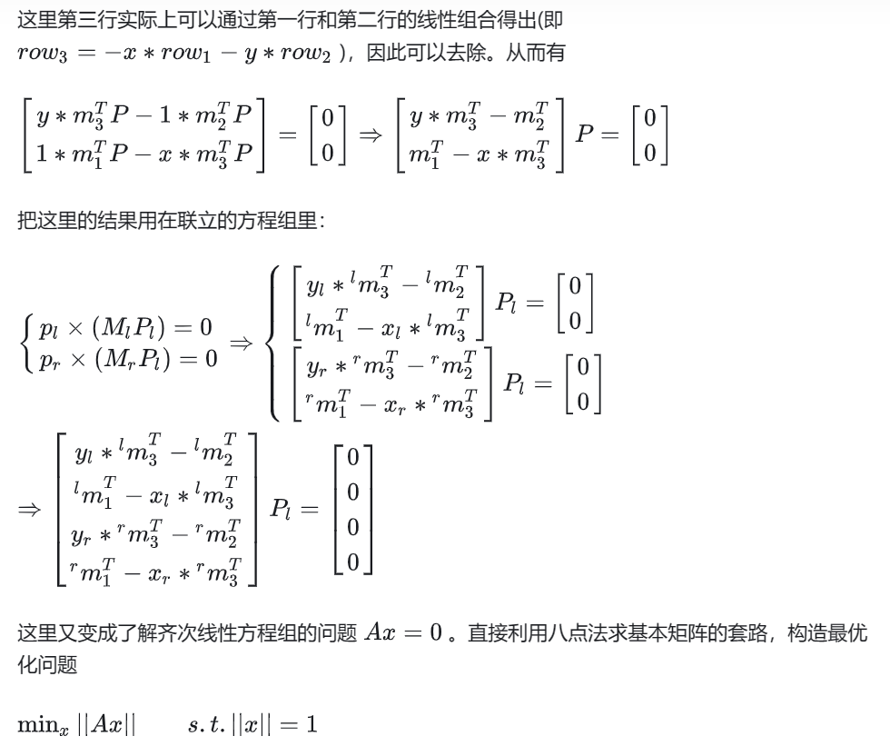

```
P0 = K @ np.eye(3, 4, dtype=np.float32)
Rt = np.hstack((R, t))
P1 = K @ Rt
X = cv.triangulatePoints(P0, P1, pts0.T, pts1.T)
X /= X[3]
X = X.T
```

### 然后用 SVD 分解的方法实现一下:

```
def triangulate_point(p_l, p_r, R, t, K):
    # compute camera projection matrix
    M_l = K @ np.eye(3, 4, dtype=np.float32)
    M_r = K @ np.hstack((R, t))

    # construct A matrix
    x_l = p_l[0][0]
    y_l = p_l[1][0]
    x_r = p_r[0][0]
    y_r = p_r[1][0]
    A_matrix = np.array([y_l * M_l[2] - M_l[1],
                         M_l[0] - x_l * M_l[2],
                         y_r * M_r[2] - M_r[1],
                         M_r[0] - x_r * M_r[2]])
    # svd decomposition
    U, D, V = np.linalg.svd(A_matrix)

    # find min eigen value
    index = np.argmin(D)
    # get P_l
    P_l = V[index]

    # normalize the P_l
    P_l /= P_l[3]
    return P_l

```


### 小结:

事实上，OpenCV 已经被本文的所有算法打包好了。这里直接给出个 python 脚本：

```
import cv2
import numpy as np

# set the camera intrinsic value
fx = 517.3
fy = 516.5
cx = 318.6
cy = 255.3

# Step 0: Read images
img1 = cv2.imread("./data/1.png")
img2 = cv2.imread("./data/2.png")

# Step 1: Feature extraction
sift = cv2.SIFT_create()
# find the keypoints and descriptors with SIFT
kp1, des1 = sift.detectAndCompute(img1,None)
kp2, des2 = sift.detectAndCompute(img2,None)

# Step 2: Feature match
bf = cv2.BFMatcher()
matches = bf.knnMatch(des1, des2, k=2)

# Step 3: Select the good match
pts1 = []
pts2 = []
good_matches = []
for i,(m,n) in enumerate(matches):
    if m.distance < 0.1 * n.distance:
        pts1.append(kp1[m.queryIdx].pt)
        pts2.append(kp2[m.trainIdx].pt)
        good_matches.append(m)

# Step 4: Estimate relative pose of two view
F, _ = cv.findFundamentalMat(pts0, pts1, cv.FM_8POINT)    # Estimate fundamental matrix using 8-point algorithm
K = np.array([[fx, 0, cx], [0, fy, cy], [0, 0, 1]])    # Set the camera intrinsic matrix
E = K.T @ F @ K    # Compute the essential matrix

# Get the motion estimation result
_, R, t, _ = cv.recoverPose(E, pts1, pts2, K)
```

根据本文的推导，可以看出通过对极几何似乎可以很容易的求出相机的运动。但是，考虑一种极端的运动情况：相机的投影中心原地旋转，也就是没有平移运动，只有纯旋转。这种情况下，想用对极几何的解法去恢复相机运动显然就不可能了。
