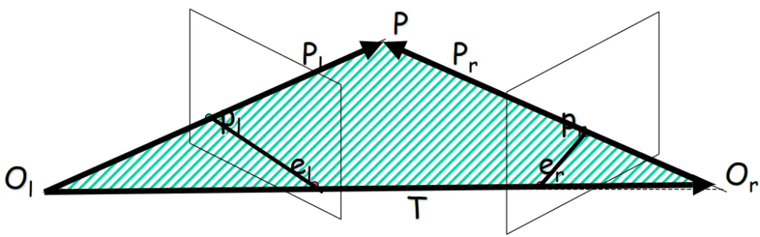
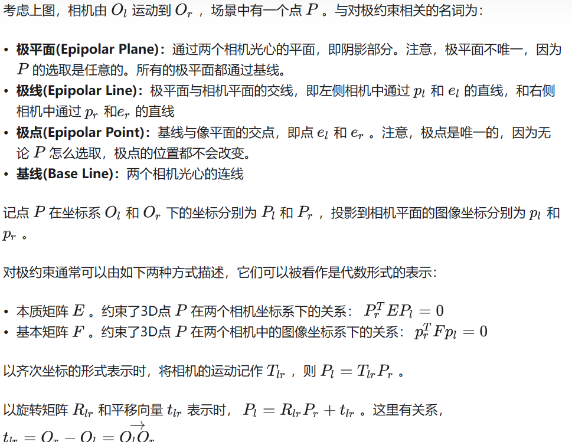
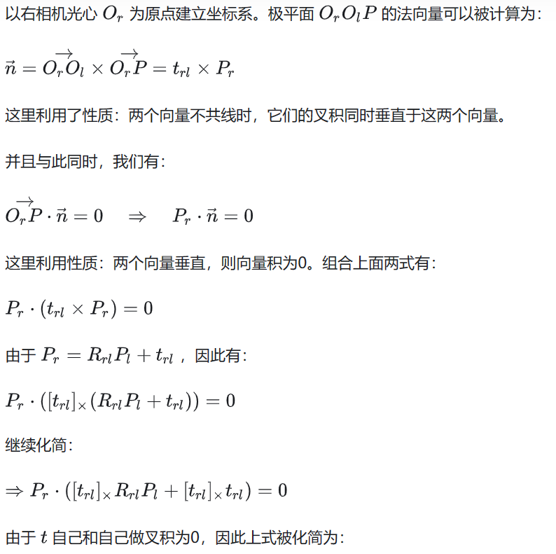
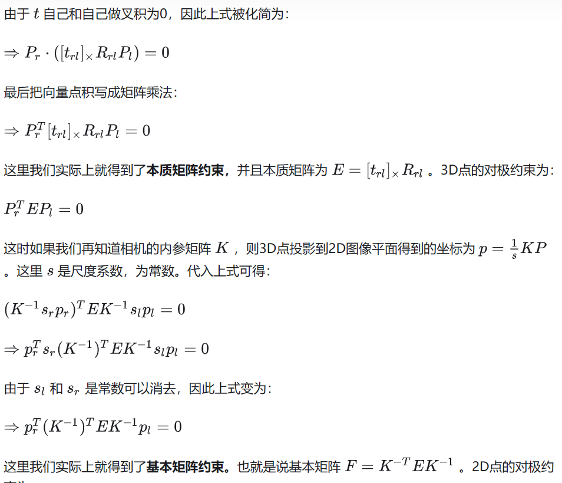
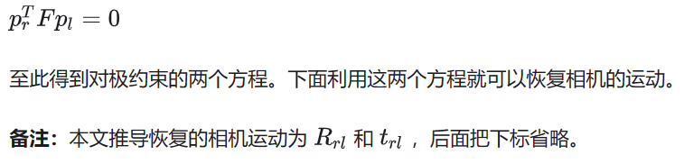

### 对极几何

```
The epipolar geometry is the intrinsic projective geometry between two views.
It is independent of scene structure, and only depends on the cameras’ internal
parameters and relative pose. ——引自《Multiple view geometry in computer vision》

极线几何是两个视图之间的内在射影几何。 它与场景结构无关，仅取决于相机的内部参数和相对姿态。
——摘自《计算机视觉中的多视图几何》
```

### 对极约束 Epipolar Constraint




### 对极约束的证明





```
https://zhuanlan.zhihu.com/p/508149559
```
