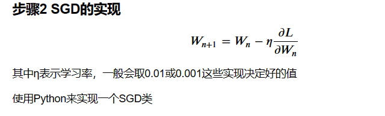

## SGD 与 Momentum

#### 概述

神经网络的学习的目的是找到使损失函数的值尽可能小的参数，这是寻找最优参数的问题，解决这个问题的过程称为最优化（optimization）。<br/>

然而由于参数空间非常复杂，神经网络的最优化问题非常难，无法使用那种通过解数学式一下子就求得最小值的方法。<br/>
前面我们将参数的梯度（导数）作为了线索，使用参数的梯度，沿梯度方向更新参数，并重复这个步骤多次，从而逐渐靠近最优参数，这个过程称为随机梯度下降法（stochastic gradient descent），简称 SGD。
<br/>
SGD 是一个简单的方法，不过比起胡乱地搜索参数空间，也算是“聪明”的方法。但是，根据不同的问题，也存在比 SGD 更加聪明的方法。
<br/>
本节我们将指出 SGD 的缺点，并介绍 SGD 以外的其他最优化方法。<br/>

```
import numpy as np
import matplotlib.pyplot as plt #绘图用的模块
from mpl_toolkits.mplot3d import Axes3D #绘制3D坐标的函数
```



```
class SGD:
    def __init__(self, lr=0.01):
        self.lr = lr
    def update(self, params, grads):
        for key in params.keys():
            params[key] -= self.lr * grads[key]
```
