[TOC]
# <center> 影视管理数据库设计与操作文档
## 一. 数据表设计
根据提供的ER图，我们可以确定需要建立以下数据表：
### 1.用户实体表（用户实体）
* 列名：id，name，password
* 主键：id
* SQL语句：
```sql
CREATE TABLE IF NOT EXISTS 用户实体 (
    id INT AUTO_INCREMENT PRIMARY KEY,
    name VARCHAR(255),
    password VARCHAR(255)
) ENGINE=InnoDB DEFAULT CHARSET=utf8mb4 COLLATE=utf8mb4_unicode_ci;
```

### 2.视频实体表（视频实体）
* 列名：id，name，type，score，starring，date，description，path
* 主键：id
* SQL语句：
```sql
CREATE TABLE IF NOT EXISTS 视频实体 (
    id INT AUTO_INCREMENT PRIMARY KEY,
    name VARCHAR(255),
    type VARCHAR(255),
    score DECIMAL(5,2),
    starring VARCHAR(255),
    date DATE,
    description TEXT,
    path VARCHAR(255)
) ENGINE=InnoDB DEFAULT CHARSET=utf8mb4 COLLATE=utf8mb4_unicode_ci;
```

### 3.收藏关系表（收藏关系）
* 列名：id（主键），user_id（外键，关联用户实体表的id），video_id（外键，关联视频实体表的id）
* 主键：id
* 外键：user_id REFERENCES 用户实体(id)，video_id REFERENCES 视频实体(id)
* SQL语句：
```sql
CREATE TABLE IF NOT EXISTS 收藏关系 (
    id INT AUTO_INCREMENT PRIMARY KEY,
    user_id INT,
    video_id INT,
    FOREIGN KEY (user_id) REFERENCES 用户实体(id),
    FOREIGN KEY (video_id) REFERENCES 视频实体(id)
) ENGINE=InnoDB DEFAULT CHARSET=utf8mb4 COLLATE=utf8mb4_unicode_ci;
```

### 4.留言关系表（留言关系）
* 列名：id（主键），user_id（外键，关联用户实体表的id），video_id（外键，关联视频实体表的id），description，date
* 主键：id
* 外键：user_id REFERENCES 用户实体(id)，video_id REFERENCES 视频实体(id)
* SQL语句：
```sql
CREATE TABLE IF NOT EXISTS 留言关系 (
    id INT AUTO_INCREMENT PRIMARY KEY,
    user_id INT,
    video_id INT,
    description TEXT,
    date DATE,
    FOREIGN KEY (user_id) REFERENCES 用户实体(id),
    FOREIGN KEY (video_id) REFERENCES 视频实体(id)
) ENGINE=InnoDB DEFAULT CHARSET=utf8mb4 COLLATE=utf8mb4_unicode_ci;
```
## 二. 查询和删除操作
### 1.查询操作
* SQL语句
```sql
SELECT DISTINCT u.name, avg_score
FROM 用户实体 u
INNER JOIN 留言关系 l ON u.id = l.user_id
INNER JOIN (
    SELECT user_id, AVG(v.score) AS avg_score
    FROM 收藏关系 s
    INNER JOIN 视频实体 v ON s.video_id = v.id
    GROUP BY user_id
) AS s ON u.id = s.user_id
WHERE l.description = '喜欢看动作电影'
GROUP BY u.id
HAVING avg_score > 8
```
* 查询结果
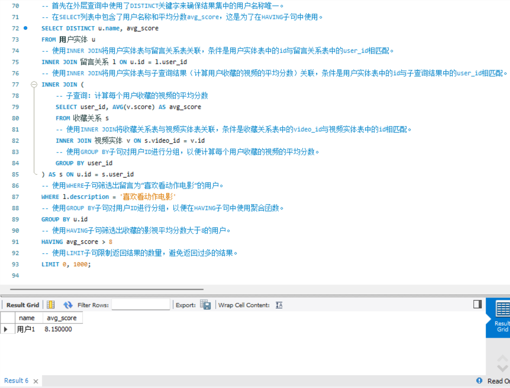

### 2.删除操作
* SQL语句
```sql
DELETE FROM 留言关系 WHERE user_id IN (SELECT id FROM 用户实体 WHERE name LIKE '用户1');
```
* 删除结果

|      删除前       |      删除后       |
| :---------------: | :---------------: |
| 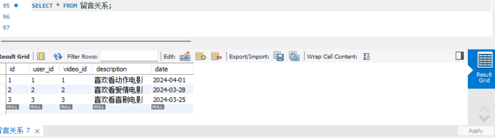 | 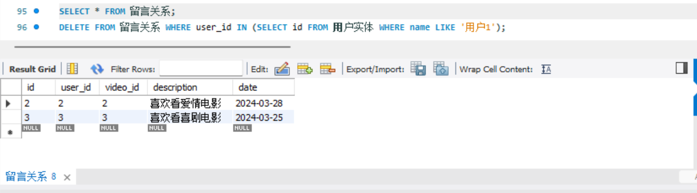 |

## 三. 查询语句有效性验证
### 1.正例
(1). 查询留言为“喜欢看动作电影”的用户中，收藏的影视中有类型为“动作”的视频的用户名字
* SQL语句
```sql
SELECT DISTINCT u.name
FROM 用户实体 u
INNER JOIN 留言关系 l ON u.id = l.user_id
INNER JOIN 收藏关系 s ON u.id = s.user_id
INNER JOIN 视频实体 v ON s.video_id = v.id
WHERE l.description = '喜欢看动作电影'
AND v.type = '动作'
LIMIT 0, 1000;
```
* 查询结果
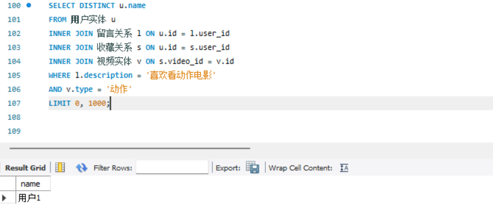

(2). 查询留言为“喜欢看动作电影”的用户中，收藏的影视中有演员包含“演员1”的视频的用户名字。
* SQL语句
```sql
SELECT DISTINCT u.name
FROM 用户实体 u
INNER JOIN 留言关系 l ON u.id = l.user_id
INNER JOIN 收藏关系 s ON u.id = s.user_id
INNER JOIN 视频实体 v ON s.video_id = v.id
WHERE l.description = '喜欢看动作电影'
AND v.starring LIKE '%演员1%'
LIMIT 0, 1000;
```
* 查询结果
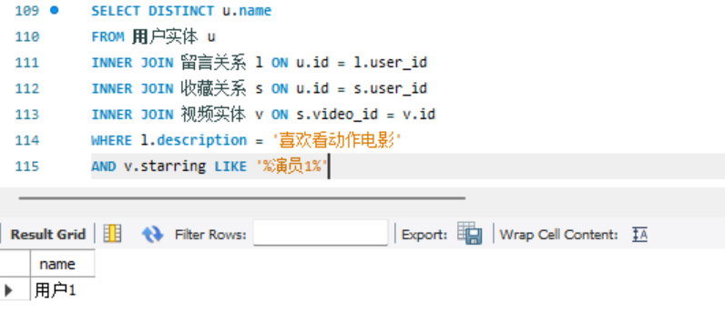

(3). 查询留言为“喜欢看动作电影”的用户中，收藏的影视中有评分高于7的视频的用户名字。
* SQL语句
```sql
SELECT DISTINCT u.name
FROM 用户实体 u
INNER JOIN 留言关系 l ON u.id = l.user_id
INNER JOIN 收藏关系 s ON u.id = s.user_id
INNER JOIN 视频实体 v ON s.video_id = v.id
WHERE l.description = '喜欢看动作电影'
AND v.score > 7
LIMIT 0, 1000;
```
* 查询结果
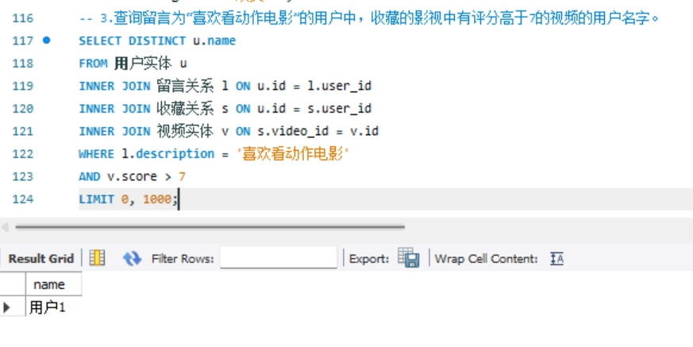

### 2.反例
(1). 查询留言为“喜欢看动作电影”的用户中，收藏的影视中没有类型为“动画”的视频的用户名字。
* SQL语句
```sql
SELECT DISTINCT u.name
FROM 用户实体 u
INNER JOIN 留言关系 l ON u.id = l.user_id
LEFT JOIN 收藏关系 s ON u.id = s.user_id
LEFT JOIN 视频实体 v ON s.video_id = v.id
WHERE l.description = '喜欢看动作电影'
AND (v.type = '动画' AND v.type IS NULL)
LIMIT 0, 1000;
```
* 查询结果
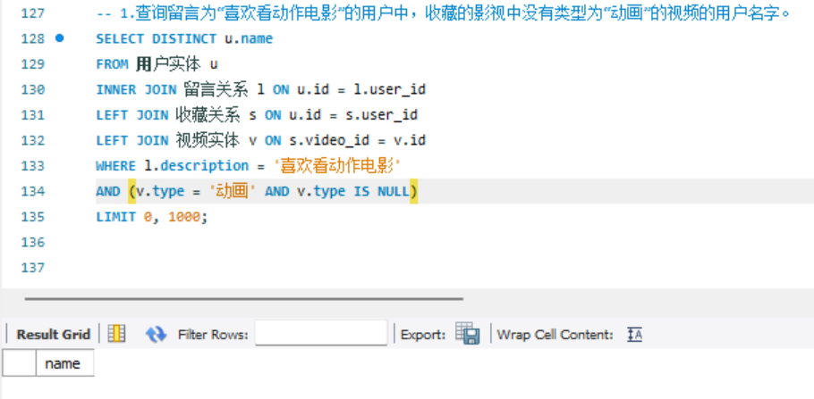

(2). 查询留言为“喜欢看动作电影”的用户中，收藏的影视中没有演员包含“演员2”的视频的用户名字。
* SQL语句
```sql
SELECT DISTINCT u.name
FROM 用户实体 u
INNER JOIN 留言关系 l ON u.id = l.user_id
LEFT JOIN 收藏关系 s ON u.id = s.user_id
LEFT JOIN 视频实体 v ON s.video_id = v.id
WHERE l.description = '喜欢看动作电影'
AND (v.starring NOT LIKE '%演员2%' OR v.starring IS NULL)
LIMIT 0, 1000;
```
* 查询结果
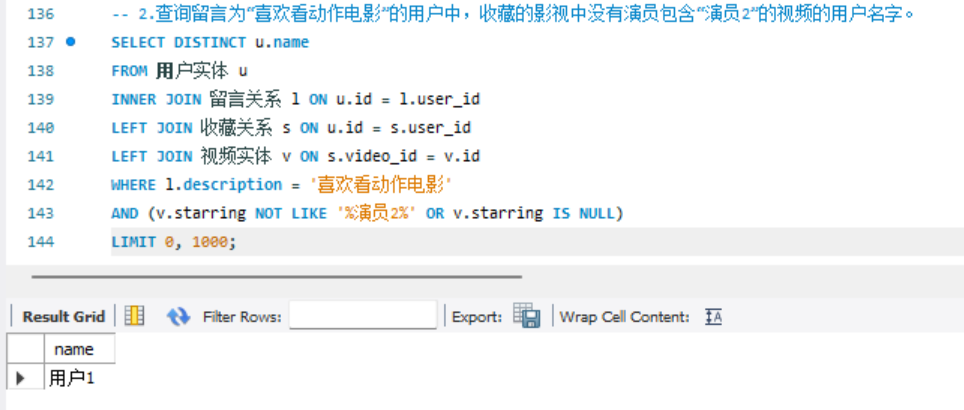

(3). 查询留言为“喜欢看动作电影”的用户中，收藏的影视中没有评分低于6的视频的用户名字。
* SQL语句
```sql
SELECT DISTINCT u.name
FROM 用户实体 u
INNER JOIN 留言关系 l ON u.id = l.user_id
LEFT JOIN 收藏关系 s ON u.id = s.user_id
LEFT JOIN 视频实体 v ON s.video_id = v.id
WHERE l.description = '喜欢看动作电影'
AND (v.score >= 6 OR v.score IS NULL)
LIMIT 0, 1000;
```
* 查询结果
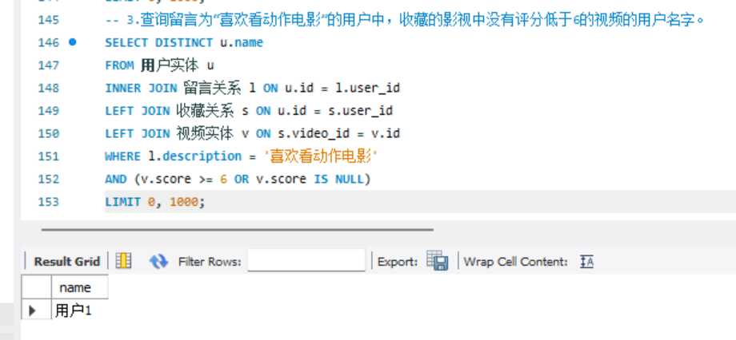

## 四.数据库表结构内容图

|          |          结构           |          内容           |
| :------: | :---------------------: | :---------------------: |
|  tables  |    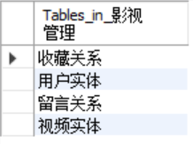    |                         |
| 用户实体 | 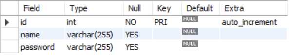 | 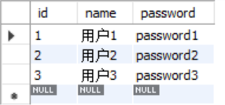 |
| 视频实体 | 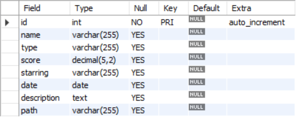 | 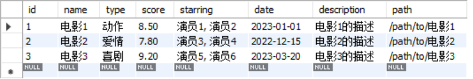 |
| 收藏关系 | 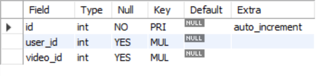 |  |
| 留言关系 | 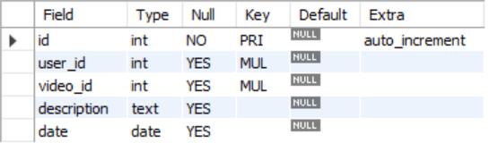 | 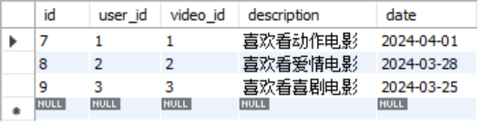 |