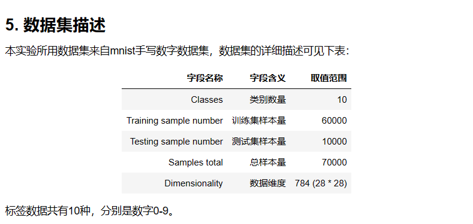

#### 1. 实验目标

本实验结合了上一实验学习的 Affine/Softmax-with-loss 层的知识构建两层神经网络实现误差反向传播，并在 mnist 手写数字数据集上对以上算法进行应用。<br/>

#### 2. 实验所用 𝑃𝑦𝑡ℎ𝑜𝑛

库名称 版本 简介
𝑃𝑦𝑡ℎ𝑜𝑛 3.6 编程语言
𝑁𝑢𝑚𝑝𝑦 1.19.5 数组运算

#### 3. 实验前导知识

建议您在学习完成下列知识后开始本实验：<br/>
python<br/>
numpy<br/>

#### 4. 实验适用对象

本科学生、研究生 <br/>
人工智能、算法相关研究者、开发者<br/>
大数据与人工智能<br/>


#### 步骤 2：多维数组梯度如何实现

我们先来看看基于微分思想下，多维数组的梯度如何实现<br/>
与之前实现一维数组求梯度的思路相同，只不过使用 numpy 中 nditer 这个函数<br/>

```

def numerical_gradient(f, x): ## n维数组求梯度
    h = 1e-4 # 0.0001
    grad = np.zeros_like(x) ## 梯度的形状与x的形状相同

    it = np.nditer(x, flags=['multi_index'], op_flags=['readwrite'])
    ## multi_index将元素索引（0，0）（0，1）等取出来
    ## readwrite，使用可读可写的格式，我们需要改变x的值来计算f，所以需要可写
    while not it.finished:
        idx = it.multi_index
        tmp_val = x[idx] ## 取出某个元素
        x[idx] = float(tmp_val) + h
        fxh1 = f(x) # f(x+h)

        x[idx] = tmp_val - h
        fxh2 = f(x) # f(x-h)
        grad[idx] = (fxh1 - fxh2) / (2*h)

        x[idx] = tmp_val
        it.iternext()

    return grad
```

#### 步骤 3：实现 Affine 层的类

还记得 Affine 类的实现吗

我们在之前的基础上稍作改动

```
class Affine:
    def __init__(self, W, b):
        self.W =W
        self.b = b

        self.x = None
        self.original_x_shape = None
        self.dW = None
        self.db = None

    def forward(self, x):
        self.original_x_shape = x.shape # 如果x是100*28*28
        x = x.reshape(x.shape[0], -1)## 这里的形状变成100*784这种
        self.x = x

        out = np.dot(self.x, self.W) + self.b

        return out

    def backward(self, dout):
        dx = np.dot(dout, self.W.T)
        self.dW = np.dot(self.x.T, dout)
        self.db = np.sum(dout, axis=0)

        dx = dx.reshape(*self.original_x_shape)
        return dx

```

#### 步骤 4：实现 Softmax-with-loss 类

这里为了有更好的兼容性，再定义类时我们在之前的基础上做一点小小的改动

```
class SoftmaxWithLoss:
    def __init__(self):
        self.loss = None
        self.y = None # softmax输出
        self.t = None # 正确解

    def forward(self, x, t):
        self.t = t
        self.y = softmax(x)
        self.loss = cross_entropy_error(self.y, self.t)

        return self.loss

    def backward(self, dout=1):
        batch_size = self.t.shape[0]
        if self.t.size == self.y.size:
            # 如果是one hot格式
            dx = (self.y - self.t) / batch_size
        else:
            dx = self.y.copy()
            dx[np.arange(batch_size), self.t] -= 1
            dx = dx / batch_size

        return dx
```

#### 步骤 5：误差反向传播的两层神经网络的实现

我们已经介绍过两层神经网络了

在这里我们定义两种求梯度的方法

一种是使用微分的思想求出梯度

另一中是使用误差反向传播法实现梯度

```
from collections import OrderedDict
from common.functions import *
from common.layers import *

class TwoLayerNet:

    def __init__(self, input_size, hidden_size, output_size, weight_init_std = 0.01):

        self.params = {}
        self.params['W1'] = weight_init_std * np.random.randn(input_size, hidden_size)
        self.params['b1'] = np.zeros(hidden_size)
        self.params['W2'] = weight_init_std * np.random.randn(hidden_size, output_size)
        self.params['b2'] = np.zeros(output_size)

        self.layers = OrderedDict()
        self.layers['Affine1'] = Affine(self.params['W1'], self.params['b1'])
        self.layers['Relu1'] = Relu()
        self.layers['Affine2'] = Affine(self.params['W2'], self.params['b2'])

        self.lastLayer = SoftmaxWithLoss()

    def predict(self, x):
        for layer in self.layers.values():
            x = layer.forward(x)

        return x

    def loss(self, x, t):
        y = self.predict(x)
        return self.lastLayer.forward(y, t)

    def accuracy(self, x, t):
        y = self.predict(x)
        y = np.argmax(y, axis=1)
        if t.ndim != 1 : t = np.argmax(t, axis=1)

        accuracy = np.sum(y == t) / float(x.shape[0])
        return accuracy

    def numerical_gradient(self, x, t):
        loss_W = lambda W: self.loss(x, t)

        grads = {}
        grads['W1'] = numerical_gradient(loss_W, self.params['W1'])
        grads['b1'] = numerical_gradient(loss_W, self.params['b1'])
        grads['W2'] = numerical_gradient(loss_W, self.params['W2'])
        grads['b2'] = numerical_gradient(loss_W, self.params['b2'])

        return grads

    def gradient(self, x, t):
        # forward
        self.loss(x, t)

        # backward
        dout = 1
        dout = self.lastLayer.backward(dout)

        layers = list(self.layers.values())
        layers.reverse()
        for layer in layers:
            dout = layer.backward(dout)

        grads = {}
        grads['W1'], grads['b1'] = self.layers['Affine1'].dW, self.layers['Affine1'].db
        grads['W2'], grads['b2'] = self.layers['Affine2'].dW, self.layers['Affine2'].db

        return grads
```

其中，微分方法不容易出错，但计算效率较低
<br/>
误差反向学习法的梯度计算效率高，但是容易出错
<br/>
我们想要使用误差反向学习法来计算梯度
<br/>
但是为了避免出错，我们先来用微分法检验一下误差反向学习法计算的梯度是否正确
<br/>

#### 步骤 6：误差反向学习法的梯度确认

我们选出少量的数据，分别用两种方法计算一下梯度<br/>

```
from dataset.mnist import load_mnist

(x_train, t_train), (x_test, t_test) = load_mnist(normalize=True, one_hot_label=True)

network = TwoLayerNet(input_size=784, hidden_size=50, output_size=10)

x_batch = x_train[:3]
t_batch = t_train[:3]

grad_numerical = network.numerical_gradient(x_batch, t_batch)
grad_backprop = network.gradient(x_batch, t_batch)

for key in grad_numerical.keys():
    diff = np.average( np.abs(grad_backprop[key] - grad_numerical[key]) )
    print(key + ":" + str(diff))
```

从结果的比对来看，梯度反向传播法的计算与微分方法的计算差距很小<br/>

说明我们的方法是正确的<br/>

#### 步骤 7：使用误差反向传播法学习

下面我们就是用 MNIST 数据集进行误差方希那个传播法的学习<br/>

```
(x_train, t_train), (x_test, t_test) = load_mnist(normalize=True, one_hot_label=True)

network = TwoLayerNet(input_size=784, hidden_size=50, output_size=10)

iters_num = 10000
train_size = x_train.shape[0]
batch_size = 100
learning_rate = 0.1

train_loss_list = []
train_acc_list = []
test_acc_list = []

iter_per_epoch = max(train_size / batch_size, 1)
for i in range(iters_num):
    batch_mask = np.random.choice(train_size, batch_size)
    x_batch = x_train[batch_mask]
    t_batch = t_train[batch_mask]

    grad = network.gradient(x_batch, t_batch)

    for key in ('W1', 'b1', 'W2', 'b2'):
        network.params[key] -= learning_rate * grad[key]

    loss = network.loss(x_batch, t_batch)
    train_loss_list.append(loss)

    if i % iter_per_epoch == 0:
        train_acc = network.accuracy(x_train, t_train)
        test_acc = network.accuracy(x_test, t_test)
        train_acc_list.append(train_acc)
        test_acc_list.append(test_acc)
        print(train_acc, test_acc)
```

#### 步骤 8：思考与总结

至此我们介绍了 ReLU 层、Softmax-with-Loss 层、Affine 层、Softmax 层等；<br/>
这些层中实现了 forward 和 backward 方法，通过将数据正向和反向地传播，可以高效地计算权重参数的梯度；<br/>
同时我们将层进行模块化，神经网络中可以自由地组装层，轻松构建出自己喜欢的网络。<br/>
