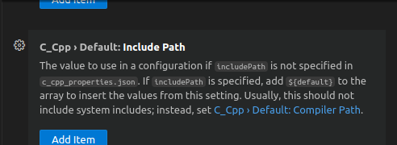
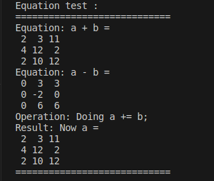
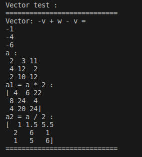
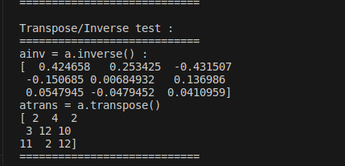
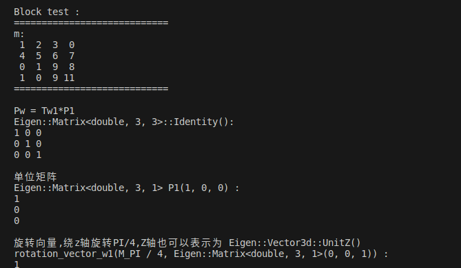
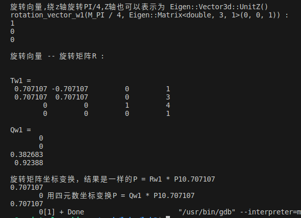

#### 在此之前,我们先解决一个问题:引用eigen库报错找不到对应的文件，此时需要在c++插件中设置include_path:"usr/local/include/eigen3"即可

#### [关于usr

一、由来

曾几何时，我总觉得这个词非常奇怪，如果说是 user 的缩写词，那么未免太过于不优雅（仅仅缩写掉了一个 e 单词，反而造成了拼写错误的极大可能，何必呢）。于是我上网搜索了下 user 的来历。

二、解释
这是我复制这一篇博客 linux的usr目录的全称是什么？ 的解释，我觉得挺好的：

usr是user的缩写，是曾经的HOME目录，然而现在已经被/home取代了，现在usr被称为是Unix System Resource，即Unix系统资源的缩写。

/usr 是系统核心所在，包含了所有的共享文件。它是 unix 系统中最重要的目录之一，涵盖了二进制文件，各种文档，各种头文件，还有各种库文件；还有诸多程序，例如 ftp，telnet 等等。

曾经的 /usr 还是用户的家目录，存放着各种用户文件 —— 现在已经被 /home 取代了（例如 /usr/someone 已经改为 /home/someone）。现代的 /usr 只专门存放各种程序和数据，用户目录已经转移。虽然 /usr 名称未改，不过其含义已经从“用户目录”变成了“unix 系统资源”目录。值得注意的是，在一些 unix 系统上，仍然把 /usr/someone 当做用户家目录，如 Minix

简单来说，我们就把 usr 记作成 Unix System Resource 就可以了，非常的典雅完美，不像 user 那样的牵强。
]

#### [我们来思考一个问题：为什么在C++中使用Eigen库进行线性代数计算?

根据网上的回答：Eigen库是一个开源的C++线性代数库，它提供了高效、易用的接口，可以方便地进行各种线性代数计算。Eigen库可以用于机器学习、计算机图形学和科学计算等领域，被广泛应用于各种算法和程序中。
Eigen库的优点包括：

高效：Eigen库使用SSE指令集和BLAS库进行优化，可以实现高效的矩阵运算。
]
---

# 使用Eigen库进行线性代数计算

这份报告展示了在C++中使用Eigen库进行线性代数计算的各种操作。

## 矩阵运算

### 矩阵加法

```cpp
Eigen::Matrix<double, 3, 3> A, B, C;
C = A + B;
```

矩阵加法是将两个矩阵对应位置的元素相加得到新的矩阵。

### 矩阵减法

```cpp
C = A - B;
```

矩阵减法是将两个矩阵对应位置的元素相减得到新的矩阵。

### 标量乘法

```cpp
C = 2 * A;
```

标量乘法是将矩阵中的每个元素乘以一个标量得到新的矩阵。

### 标量除法

```cpp
C = A / 2;
```

标量除法是将矩阵中的每个元素除以一个标量得到新的矩阵。

### 矩阵求逆

```cpp
Eigen::Matrix<double, 3, 3> A_inv = A.inverse();
```

矩阵求逆是求出原矩阵的逆矩阵，用于解决线性方程组等问题。

### 矩阵转置

```cpp
Eigen::Matrix<double, 3, 3> A_transpose = A.transpose();
```

矩阵转置是将矩阵的行和列对调得到新的矩阵。

## 向量操作

### 块操作

```cpp
Eigen::Vector3d v1, v2, v3;
v3 << v1, v2;
```

块操作是将多个向量合并成一个更大的向量。

## 变换操作

### 旋转矩阵

```cpp
Eigen::AngleAxisd rotation_vector_w1(M_PI / 4, Eigen::Matrix<double, 3, 1>(0, 0, 1));
Eigen::Matrix<double, 3, 3> Rw1 = rotation_vector_w1.matrix();
```

旋转矩阵是用来描述物体在三维空间中的旋转变换。

### 同构变换

```cpp
Eigen::Isometry3d Tw1 = Eigen::Isometry3d::Identity();
Tw1.rotate(Rw1);
Eigen::Matrix<double, 3, 1> tw1(1, 3, 4);
Tw1.pretranslate(tw1);
```

同构变换是包括旋转和平移的组合变换，用于描述物体在空间中的姿态和位置。

### 四元数

```cpp
Eigen::Quaterniond Qw1 = Eigen::Quaterniond(Rw1);
```

四元数是一种用来表示旋转的数学工具，常用于姿态控制和运动规划中。

## 解释和心得体会

Eigen库提供了丰富的功能和高效的算法，能够方便地进行各种线性代数计算。通过这些操作，我们可以实现矩阵运算、向量操作和变换操作，为机器人学、计算机图形学和科学计算等领域提供了强大的支持。深入理解线性代数计算的原理和应用，有助于我们更好地理解和解决复杂的数学和工程问题。

---

# 结果展示








```cpp

#include <iostream>
#include <ctime>
#include <eigen3/Eigen/Geometry> //各种平移和旋转运算
#include <Eigen/Core>
#include <Eigen/Dense>
using namespace std;

int main()
{
    //sum/difference
    Eigen::Matrix3d a;
    a << 1,3,7,
         2,5,1,
         1,8,9;
    Eigen::MatrixXd b(3, 3);
    b << 1,0,4,
         2,7,1,
         1,2,3;
    std::cout << "Equation test : " << endl;
    std::cout << "============================" << std::endl;
    std::cout << "Equation: a + b =\n" << a + b << std::endl;
    std::cout << "Equation: a - b =\n" << a - b << std::endl;
    std::cout << "Operation: Doing a += b;" << std::endl;
    a += b;
    std::cout << "Result: Now a =\n" << a << std::endl;
    std::cout << "============================" << std::endl;

    std::cout << std::endl;
    std::cout << "Vector test : " << endl;
    std::cout << "============================" << std::endl;
    Eigen::Vector3d v(1, 2, 3);
    Eigen::Vector3d w(1, 0, 0);
    std::cout << "Vector: -v + w - v =\n" << -v + w - v << std::endl;
    
    cout << "a : " <<endl;
    cout << a << endl;
    auto a1 = a * 2;
    auto a2 = a / 2;
    cout << "a1 = a * 2 :" <<endl;
    cout <<  "[" << a1 << "]"  << endl;
    cout << "a2 = a / 2 :" <<endl;
    cout <<  "[" << a2  << "]" << endl;
    cout << "============================" << endl;
    cout << std::endl;
    
    cout << "Transpose/Inverse test : " << endl;
    cout << "============================" << endl;
    Eigen::Matrix<double, 3, 3> ainv = a.inverse();
    Eigen::Matrix<double, 3, 3> atrans = a.transpose();
    cout << "ainv = a.inverse() : " << endl;
    cout << "[" << ainv << "]" <<endl;
    cout << "atrans = a.transpose()" << endl;
    cout << "[" <<  atrans << "]" <<endl;
    cout << "============================" << endl;


  
    cout << std::endl;
    
    cout << "Block test : " << endl;
    cout << "============================" << endl;
    Eigen::MatrixXf m(4, 4);
    m << 1,2,3,0,
         4,5,6,7,
         7,8,9,8,
         3,6,9,11;

    Eigen::MatrixXf m2(2,2);
    m2<<0,1,
        1,0;
    m.block(2, 0, 2, 2) = m2;
    cout << "m:\n" << m << endl;
    cout << "============================" << endl;


    //Pw = Tw1*P1
    cout<<endl;
 Eigen::Matrix<double, 3, 3> Rw1_matrix = Eigen::Matrix<double, 3, 3>::Identity(); 
    cout << "Pw = Tw1*P1" << endl;
    cout << "Eigen::Matrix<double, 3, 3>::Identity(): " << endl << Rw1_matrix << endl;

    // 单位矩阵
 cout<<endl;
    Eigen::Matrix<double, 3, 1> P1(1, 0, 0);
    cout << "单位矩阵" << endl;
    cout << "Eigen::Matrix<double, 3, 1> P1(1, 0, 0) :" << endl << P1 << endl;
 
    // 旋转向量,绕z轴旋转PI/4，Z轴也可以表示为 Eigen::Vector3d::UnitZ()
 cout<<endl;
    Eigen::AngleAxisd rotation_vector_w1(M_PI / 4, Eigen::Matrix<double, 3, 1>(0, 0, 1));
    cout << "旋转向量,绕z轴旋转PI/4,Z轴也可以表示为 Eigen::Vector3d::UnitZ()" << endl;
    cout << "rotation_vector_w1(M_PI / 4, Eigen::Matrix<double, 3, 1>(0, 0, 1)) :" << endl << P1 << endl;
 
  // 旋转向量 -- 旋转矩阵R
 cout<<endl;
    Eigen::Matrix<double, 3, 3> Rw1 = rotation_vector_w1.matrix();
    cout << "旋转向量 -- 旋转矩阵R :" << endl;
 Rw1_matrix = rotation_vector_w1.toRotationMatrix(); // 和上面一样的

 // Rw1 -- 欧拉角
 cout<<endl;
    Eigen::Vector3d euler_angles = Rw1.eulerAngles(2, 1, 0); // ZYX，roll pitch yow

 // 变换矩阵T   Isometry3d类型, 一定要初始化为Identity()，否则为随机数
 cout<<endl;
    Eigen::Isometry3d Tw1 = Eigen::Isometry3d::Identity();
 Tw1.rotate(Rw1);
 Eigen::Matrix<double, 3, 1> tw1(1, 3, 4);
 Tw1.pretranslate(tw1);
 cout << "Tw1 = \n" << Tw1.matrix() << endl;
  Eigen::Matrix<double, 3, 1> Pw = Tw1 * P1;
     // 用T坐标变换，相当于 Rw1 * P1 + tw1

 // 四元数
 cout<<endl;
    Eigen::Quaterniond Qw1 = Eigen::Quaterniond(Rw1); // Rw1 -- Qw1
 Qw1 = Eigen::Quaterniond(rotation_vector_w1);      // 和上面一样  旋转向量--Qw1
 cout << "Qw1 = " << endl << Qw1.coeffs() << endl; //(qx,qy,qz,qw) 实部在后面

 cout<<endl;
    Eigen::Matrix<double, 3, 1> P = rotation_vector_w1 * P1; // 用旋转向量变换坐标
    P = Rw1 * P1;                                           // 旋转矩阵坐标变换，结果是一样的
    cout<<"旋转矩阵坐标变换，结果是一样的" << endl <<"P = Rw1 * P1"<<P;

    P = Qw1 * P1;                                           // 用四元数坐标变换
    cout<<" 用四元数坐标变换"<< endl << "P = Qw1 * P1"<<P;

    return 0;
} 
```
