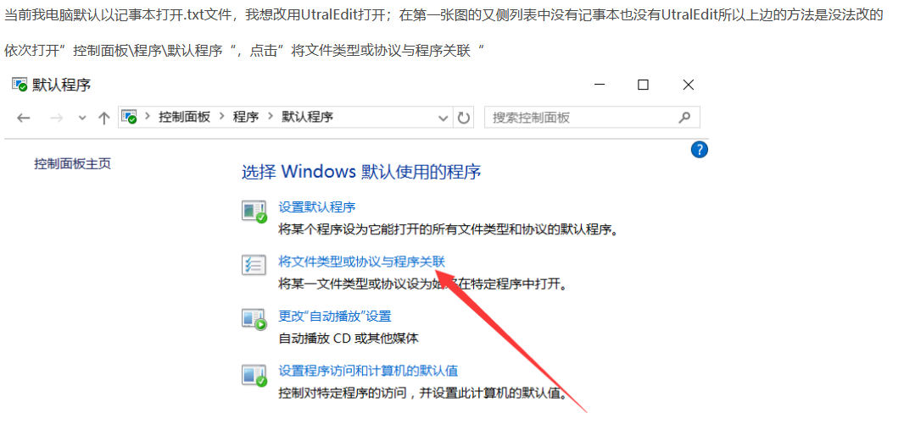

### 1.人工智能未来最终实现的目标
### 2.人工智能为什么要学习脑科学？？
#### ANS:抛开万千理由不谈，有一条理由是长期存在的，人需要向生命体学习。

#### 未来的方向：1.机器人 2.医学和生命学 3.服务业

notepad++：
手动修改注册表
如果你不想用上面的那个方法，也可以自己手动修改注册表。

修改注册表添加右键菜单项有两种方法，这里先介绍简单点的方法。

将以下内容保存为 .reg 文件，双击运行即可（其中可执行文件路径和菜单项名称请自行替换）：

Windows Registry Editor Version 5.00
 
[HKEY_CLASSES_ROOT\*\shell\NotePad++]
@="Edit with &Notepad++"
"Icon"="C:\\Portable\\notepad-pp\\notepad++.exe"
 
[HKEY_CLASSES_ROOT\*\shell\NotePad++\Command]
@="C:\\Portable\\notepad-pp\\notepad++.exe \"%1\""
如果要删除右键菜单，也是一样的道理：

Windows Registry Editor Version 5.00
 
[-HKEY_CLASSES_ROOT\*\shell\NotePad++]

