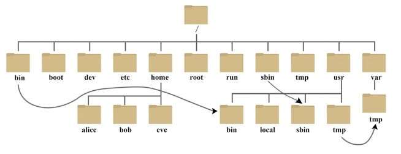

一、Linux具体目录结构    
  
1） root ： 该目录为系统管理员目录，root是具有超级权限的用户。    
2） bin －＞usr／bin ： 存放系统预装的可执行程序，这里存放的可执行文件可以在系统的任何目录下执行。  
3） usr是linux的系统资源目录，里边存放的都是一些系统可执行文件或者系统以来的一些头文件和库文件。  
4） usr／local；usr/bin：存放用户自己的可执行文件，同样这里存放的可执行文件可以在系统的任何目录下执行。  
5） lib－＞usr／lib： 这个目录存放着系统最基本的动态连接共享库，其作用类似于Windows里的DLL文件，几乎所有的应用程序都需要用到这些共享库。  
6） boot ： 这个目录存放启动Linux时使用的一些核心文件，包括一些连接文件以及镜像文件。   
7） dev： dev是Device（设备）的缩写， 该目录下存放的是Linux的外部设备，Linux中的设备也是以文件的形式存在。  
8） etc： 这个目录存放所有的系统管理所需要的配置文件。  
9） home：用户的主目录，在Linux中，每个用户都有一个自己的目录，一般该目录名以用户的账号命名，叫做用户的根目录；用户登录以后，默认打开自己的根目录。  
10） var ： 这个目录存放着在不断扩充着的东西，我们习惯将那些经常被修改的文件存放在该目录下，比如运行的各种日志文件。  
11） mnt ： 系统提供该目录是为了让用户临时挂载别的文件系统，我们可以将光驱挂载在／mnt／上，然后进入该目录就可以查看光驱里的内容   
12） opt： 这是给linux额外安装软件所存放的目录。比如你安装一个Oracle数据库则就可以放到这个目录下，默认为空。  
13） tmp： 这个目录是用来存放一些临时文件的  
