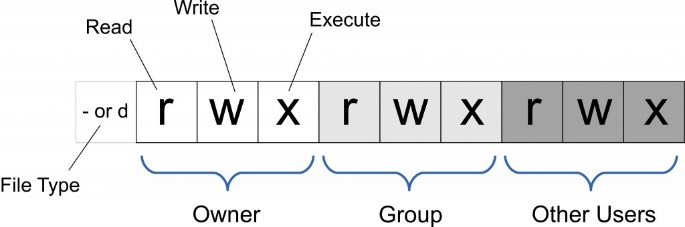
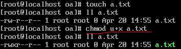
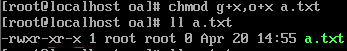
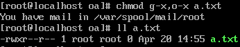
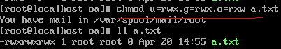
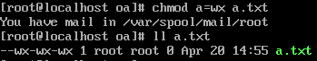

### Linux权限管理
Linux/Unix 的文件调用权限分为三级 : 文件所有者（Owner）、用户组（Group）、其它用户（Other Users）。linux的文件管理权限分为读、写和执行。靠chmod 命令修改。  

1.[root@localhost ~]# ls -l /bin/bash  
-rwxr-xr-x. 1 root root 960392 8月   3 2016 /bin/bash   
文件权限： -rwxr-xr-x.    
共分为五个部分：  
第一部分：第一个字母    
 -：普通文件  
d：目录文件   
l： 软链接（类似Windows的快捷方式）
(下面四种是特殊文件)   
b：块设备文件（例如硬盘、光驱等）  
p：管道文件   
c：字符设备文件（例如猫等串口设备）  
s：套接口文件/数据接口文件（例如启动一个MySql服务器时会产生一个mysql.sock文件）
第2-4部分，分为3个不同的区。   
见上图   
第5部分，最后一位  
.：是否启用facl     
   
权限对目录的作用：      
r：可使用ls命令获取其下的所有文件列表；    
w：可修改此目录下的文件列表；即创建或删除文件，包括子目录。     
x：可cd至此目录中；且可使用ls -l来获取所有文件的详细属性信息；    
u 表示该文件的拥有者，g 表示与该文件的拥有者属于同一个群体(group)者，o 表示其他以外的人，a 表示这三者皆是。
+ 表示增加权限、- 表示取消权限、= 表示唯一设定权限。  
linux中chmod命令就可以用来变更文件或目录的权限。  
   1.先创建一个文件a.txt,此时a.txt文件拥有者是没有执行权限，我们可以给它加上执行权限(x)，u就是代表文件拥有者。  
    
2.如果想给a.txt的用户组和其他用户也加上执行权限,可以加上多个.
   
3.既然可以加权限，也可以减权限,加号改成减号就行。   
   
4.还有更简单的方式，直接用等于号赋予相应的权限或者用a=的方式赋予，a就是代表all。   
   
5.也可以给多个文件赋予权限，我们在创建一个文件b.txt
   
　　  
 　　   
777最大   
1.练习：   
2.rw-rw-r--   664    
3.rwxrwxr-x   775   
4.rwxr-x---   750   
5.rw-------   600    
6.rwxr-xr-x   755  
  
四、Linux关机重启  
shutdown-h 或者halt  
shutdown now： 立刻进行关机  
shudown －h 1： 1小时后会关机了  
shutdown –r now： 现在重新启动计算机  
powerof 关机,在多用户方法下(Runlevel3)不建议运用.  
reboot： 现在重新启动计算机  
sync： 把内存的数据同步到磁盘  

