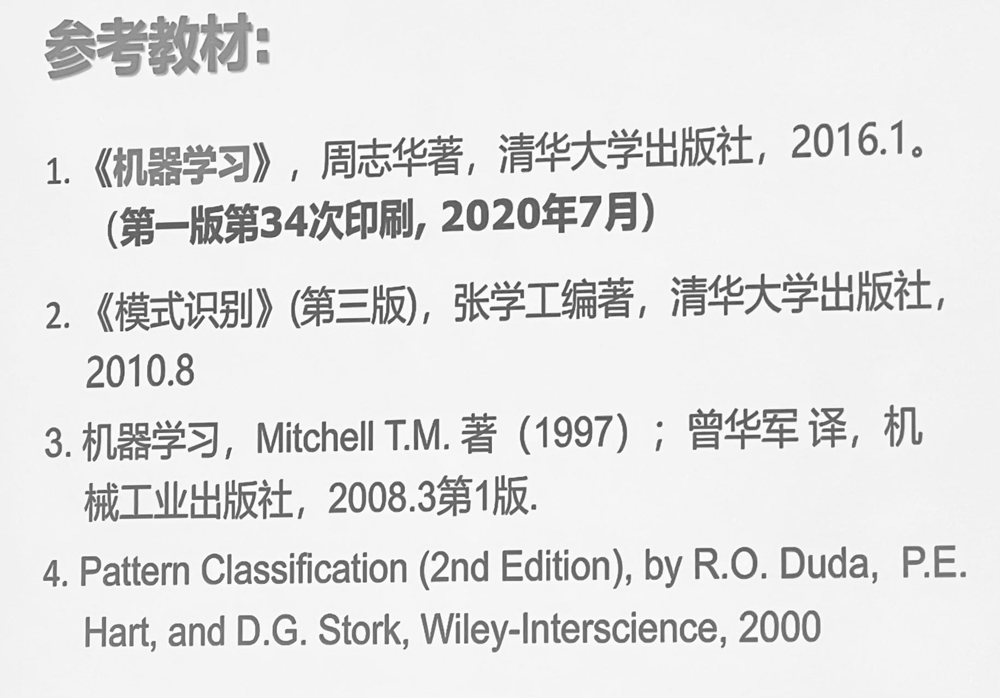
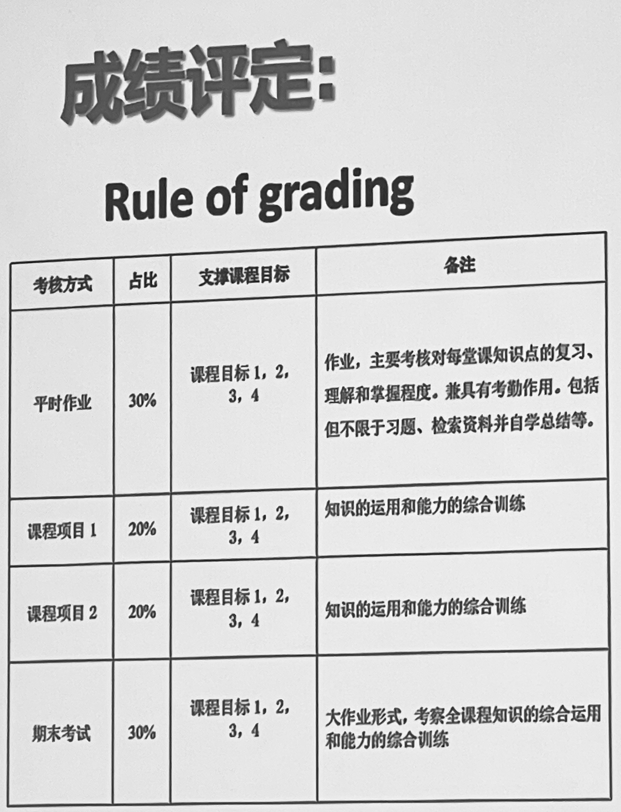
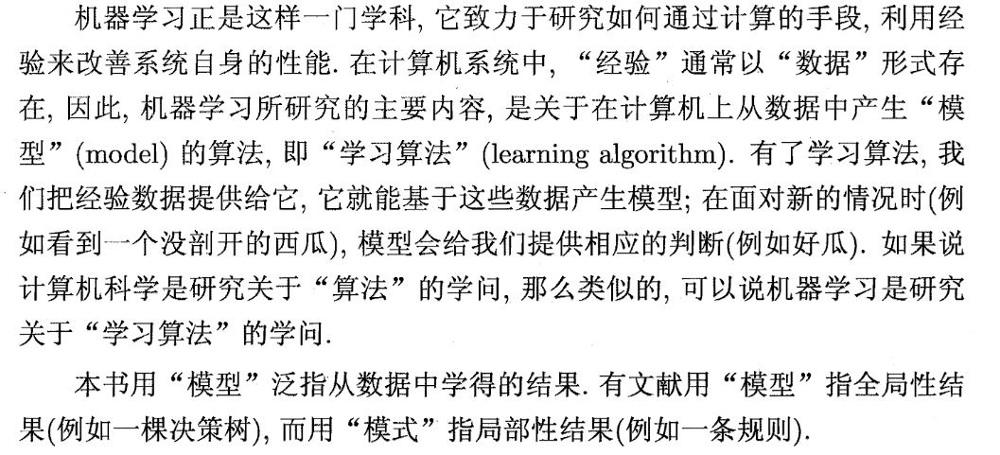

### 参考教材：

### 成绩构成：

* 1.先修知识：高等数学，线性代数，概率统计  
* 2.机器学习： **经验->数据**   
* 3.应用场景举例：在循证医学中进行文献筛选（由50篇文献的标记来进行33000篇文献的筛选）
* 4.应用场景：字符识别，指纹识别，人脸识别，车牌识别，医疗识别，遥感，环保监测分析，工业自动检测，语音识别，机器翻译，智慧交通，智慧农业，军事应用

### reading【2024.2.29】
