线性判别分析LDA(Linear Discriminant Analysis)又称为Fisher线性判别，是一种监督学习的降维技术，也就是说它的数据集的每个样本都是有类别输出的，这点与PCA（无监督学习）不同。LDA在模式识别领域（比如人脸识别，舰艇识别等图形图像识别领域）中有非常广泛的应用，因此我们有必要了解下它的算法原理。<br/>

1. LDA的思想
LDA的思想是：最大化类间均值，最小化类内方差 。意思就是将数据投影在低维度上，并且投影后同种类别数据的投影点尽可能的接近，不同类别数据的投影点的中心点尽可能的远。<br/>
我们先看看最简单的情况。假设我们有两类数据 分别为红色和蓝色，如下图所示，这些数据特征是二维的，我们希望将这些数据投影到一维的一条直线，让每一种类别数据的投影点尽可能的接近，而红色和蓝色数据中心之间的距离尽可能的大。<br/>

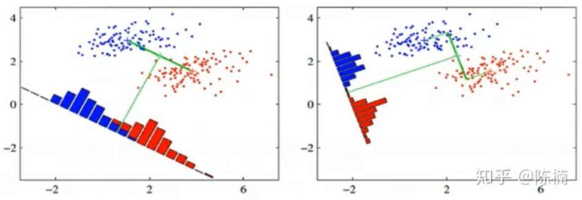
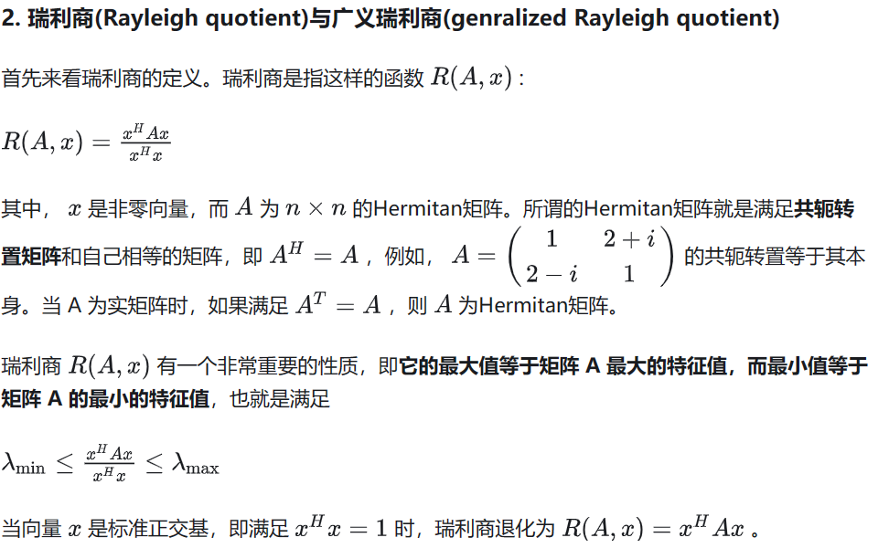
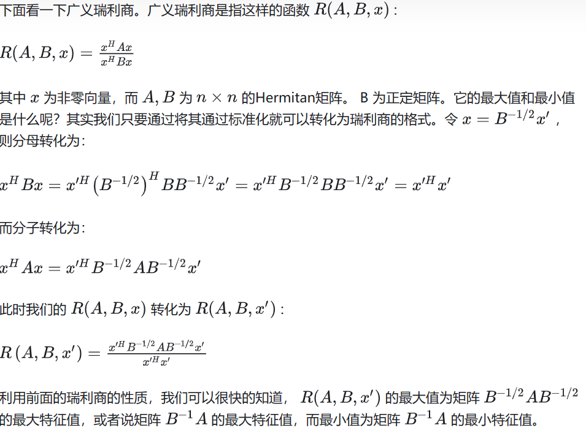

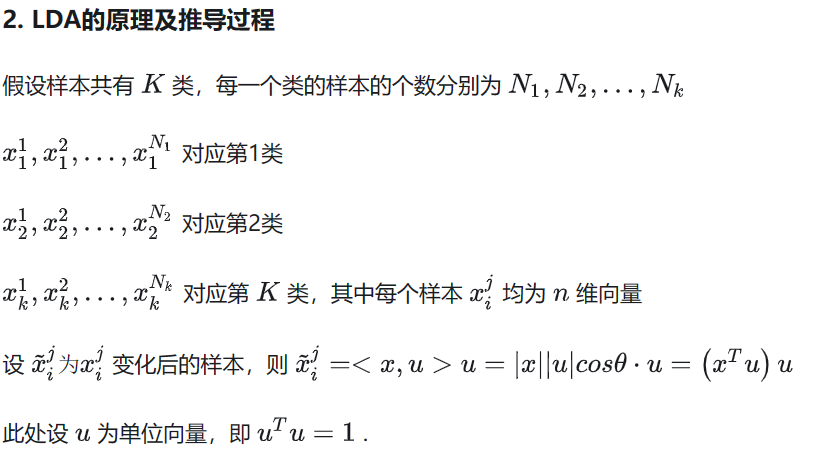
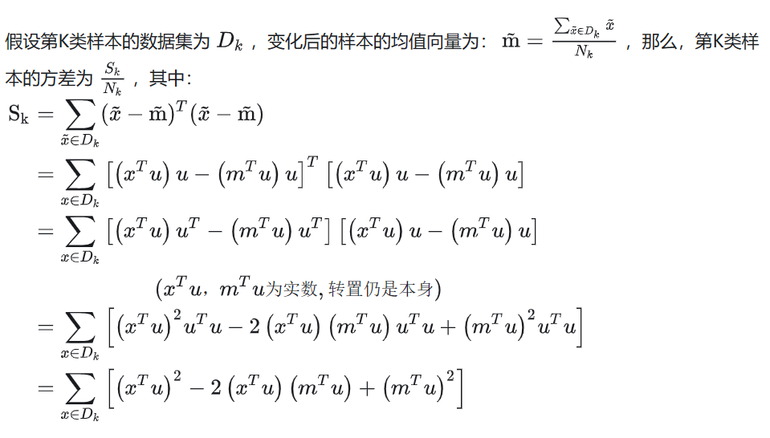
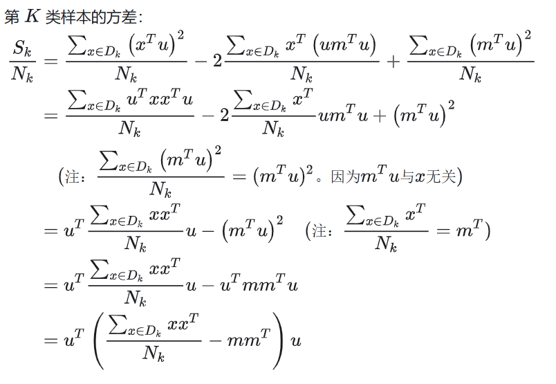
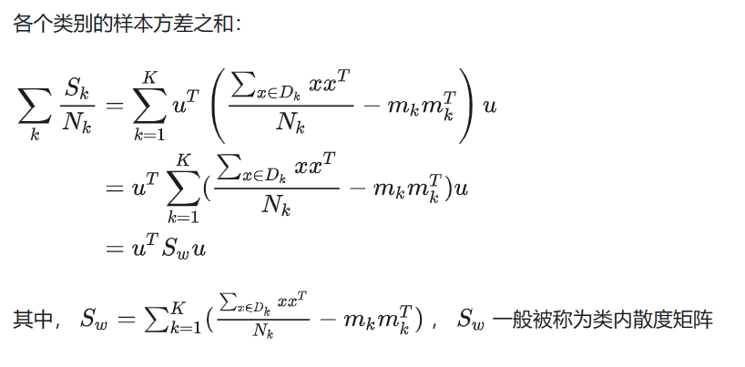
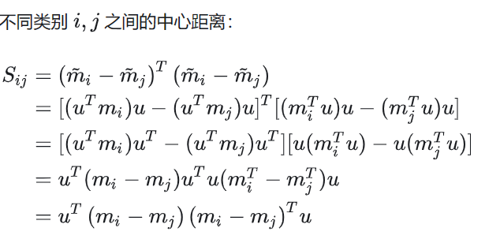
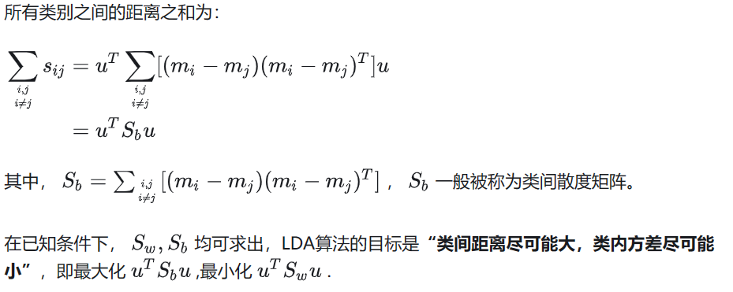
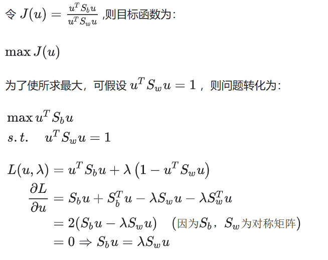
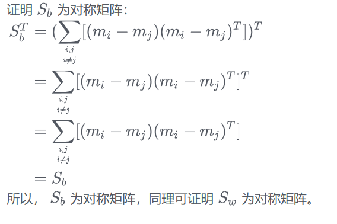
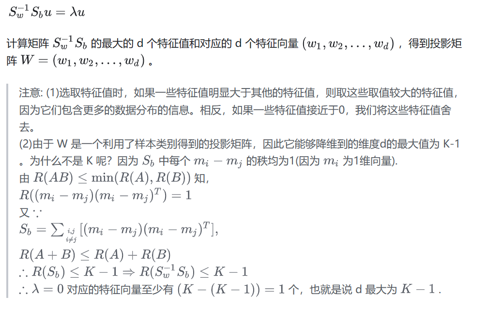
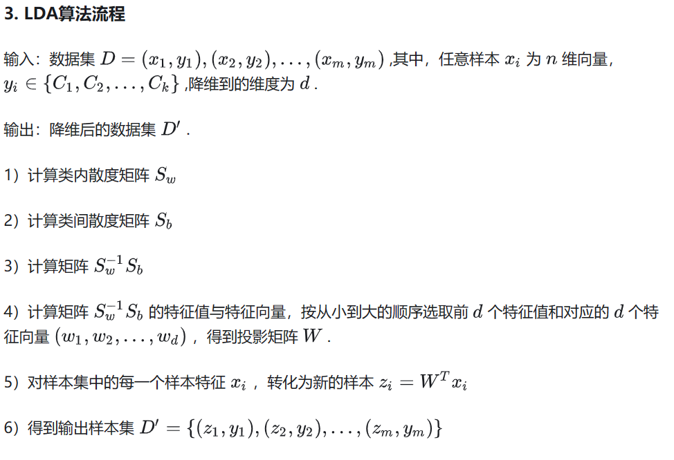
5. LDA算法小结
LDA算法既可以用来降维，也可以用来分来，但是目前来说，LDA主要用于降维，在进行与图像识别相关的数据分析时，LDA是一个有力的工具。下面总结一下LDA算法的优缺点。<br/>

### LDA算法的优点：

在降维过程中可以使用类别的先验知识经验，而像PCA这样的无监督学习无法使用先验知识；<br/>
LDA在样本分类信息依赖均值而不是方差的时候，比PCA算法较优。<br/>
LDA算法的缺点：<br/>
LDA与PCA均不适合对非高斯分布样本进行降维<br/>
LDA降维算法最多降到类别数K-1的维度，当降维的维度大于K-1时，则不能使用LDA。当然目前有一些改进的LDA算法可以绕过这个问题<br/>
LDA在样本分类信息依赖方差而非均值的时候，降维效果不好<br/>
LDA可能过度拟合数据<br/>


### 另一篇文章：
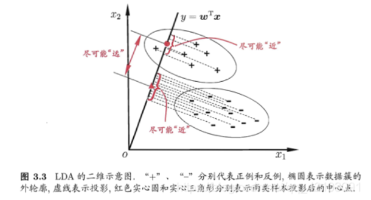<br/>
正如该图中展示的那样，LDA需要寻找一条合适的直线y = w T x y=w^Txy=wTx，使得数据集中的样例投影到该直线时同类样例的投影点尽可能接近，不同类样例的投影点尽可能远离，这样一来就可以对新样例进行分类了，具体做法同样是先将新样例投影到该直线上，然后根据投影点的位置来判断样本的类别。但是实际上LDA用于分类的情况并不是特别常见，其更常见的用法是用来进行高维数据的降维，但是本文还是对LDA分类进行了尝试。<br/>
 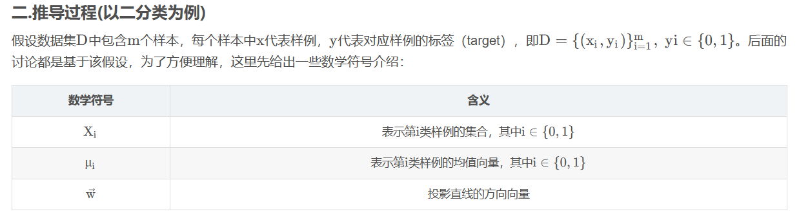<br/>
 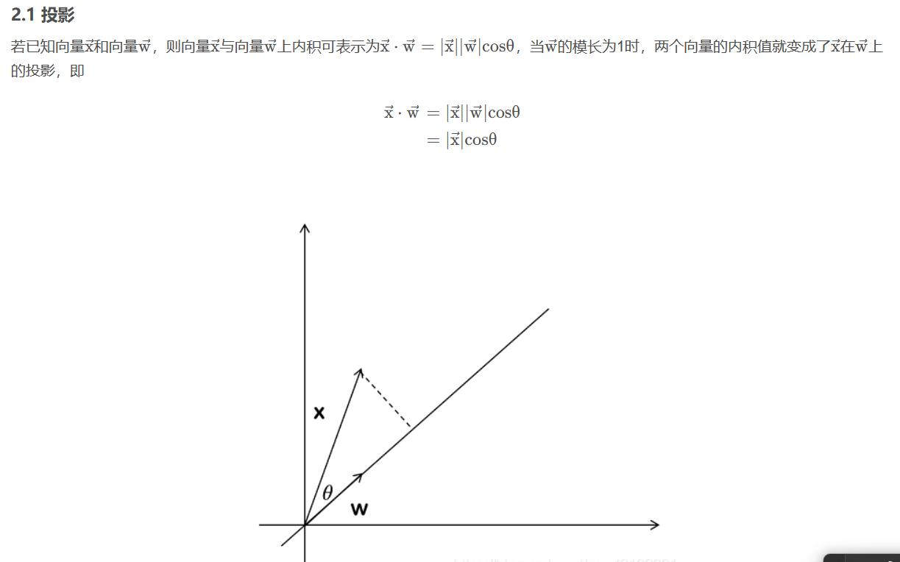<br/>
 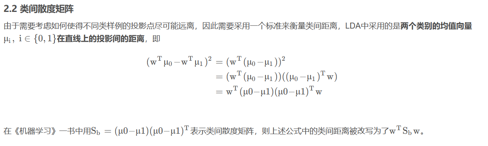<br/>
 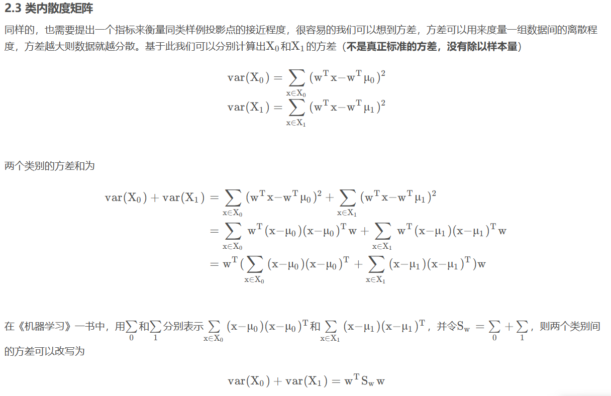<br/>
 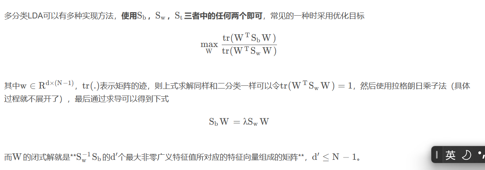<br/>


### 实际案例分析：
```
import numpy as np

def lda(X, y, num_components):
    # Class labels
    classes = np.unique(y)
    
    # Number of samples and features
    num_samples, num_features = X.shape
```
这里面x是iris.data，y是iris.target，这是鸢尾花数据集的一个对象，具体说明如下：<br/>
```
{'data': array([[5.1, 3.5, 1.4, 0.2],
        [4.9, 3. , 1.4, 0.2],
        [4.7, 3.2, 1.3, 0.2],
        [4.6, 3.1, 1.5, 0.2],
        [5. , 3.6, 1.4, 0.2],
        [5.4, 3.9, 1.7, 0.4],
        [4.6, 3.4, 1.4, 0.3],
        [5. , 3.4, 1.5, 0.2],
        [4.4, 2.9, 1.4, 0.2],
        [4.9, 3.1, 1.5, 0.1],
        [5.4, 3.7, 1.5, 0.2],
        [4.8, 3.4, 1.6, 0.2],
        [4.8, 3. , 1.4, 0.1],
        [4.3, 3. , 1.1, 0.1],
        [5.8, 4. , 1.2, 0.2],
        [5.7, 4.4, 1.5, 0.4],
        [5.4, 3.9, 1.3, 0.4],
        [5.1, 3.5, 1.4, 0.3],
        [5.7, 3.8, 1.7, 0.3],
        [5.1, 3.8, 1.5, 0.3],
        [5.4, 3.4, 1.7, 0.2],
        [5.1, 3.7, 1.5, 0.4],
        [4.6, 3.6, 1. , 0.2],
        [5.1, 3.3, 1.7, 0.5],
        [4.8, 3.4, 1.9, 0.2],
        [5. , 3. , 1.6, 0.2],
        [5. , 3.4, 1.6, 0.4],
        [5.2, 3.5, 1.5, 0.2],
        [5.2, 3.4, 1.4, 0.2],
        [4.7, 3.2, 1.6, 0.2],
        [4.8, 3.1, 1.6, 0.2],
        [5.4, 3.4, 1.5, 0.4],
        [5.2, 4.1, 1.5, 0.1],
        [5.5, 4.2, 1.4, 0.2],
        [4.9, 3.1, 1.5, 0.2],
        [5. , 3.2, 1.2, 0.2],
        [5.5, 3.5, 1.3, 0.2],
        [4.9, 3.6, 1.4, 0.1],
        [4.4, 3. , 1.3, 0.2],
        [5.1, 3.4, 1.5, 0.2],
        [5. , 3.5, 1.3, 0.3],
        [4.5, 2.3, 1.3, 0.3],
        [4.4, 3.2, 1.3, 0.2],
        [5. , 3.5, 1.6, 0.6],
        [5.1, 3.8, 1.9, 0.4],
        [4.8, 3. , 1.4, 0.3],
        [5.1, 3.8, 1.6, 0.2],
        [4.6, 3.2, 1.4, 0.2],
        [5.3, 3.7, 1.5, 0.2],
        [5. , 3.3, 1.4, 0.2],
        [7. , 3.2, 4.7, 1.4],
        [6.4, 3.2, 4.5, 1.5],
        [6.9, 3.1, 4.9, 1.5],
        [5.5, 2.3, 4. , 1.3],
        [6.5, 2.8, 4.6, 1.5],
        [5.7, 2.8, 4.5, 1.3],
        [6.3, 3.3, 4.7, 1.6],
        [4.9, 2.4, 3.3, 1. ],
        [6.6, 2.9, 4.6, 1.3],
        [5.2, 2.7, 3.9, 1.4],
        [5. , 2. , 3.5, 1. ],
        [5.9, 3. , 4.2, 1.5],
        [6. , 2.2, 4. , 1. ],
        [6.1, 2.9, 4.7, 1.4],
        [5.6, 2.9, 3.6, 1.3],
        [6.7, 3.1, 4.4, 1.4],
        [5.6, 3. , 4.5, 1.5],
        [5.8, 2.7, 4.1, 1. ],
        [6.2, 2.2, 4.5, 1.5],
        [5.6, 2.5, 3.9, 1.1],
        [5.9, 3.2, 4.8, 1.8],
        [6.1, 2.8, 4. , 1.3],
        [6.3, 2.5, 4.9, 1.5],
        [6.1, 2.8, 4.7, 1.2],
        [6.4, 2.9, 4.3, 1.3],
        [6.6, 3. , 4.4, 1.4],
        [6.8, 2.8, 4.8, 1.4],
        [6.7, 3. , 5. , 1.7],
        [6. , 2.9, 4.5, 1.5],
        [5.7, 2.6, 3.5, 1. ],
        [5.5, 2.4, 3.8, 1.1],
        [5.5, 2.4, 3.7, 1. ],
        [5.8, 2.7, 3.9, 1.2],
        [6. , 2.7, 5.1, 1.6],
        [5.4, 3. , 4.5, 1.5],
        [6. , 3.4, 4.5, 1.6],
        [6.7, 3.1, 4.7, 1.5],
        [6.3, 2.3, 4.4, 1.3],
        [5.6, 3. , 4.1, 1.3],
        [5.5, 2.5, 4. , 1.3],
        [5.5, 2.6, 4.4, 1.2],
        [6.1, 3. , 4.6, 1.4],
        [5.8, 2.6, 4. , 1.2],
        [5. , 2.3, 3.3, 1. ],
        [5.6, 2.7, 4.2, 1.3],
        [5.7, 3. , 4.2, 1.2],
        [5.7, 2.9, 4.2, 1.3],
        [6.2, 2.9, 4.3, 1.3],
        [5.1, 2.5, 3. , 1.1],
        [5.7, 2.8, 4.1, 1.3],
        [6.3, 3.3, 6. , 2.5],
        [5.8, 2.7, 5.1, 1.9],
        [7.1, 3. , 5.9, 2.1],
        [6.3, 2.9, 5.6, 1.8],
        [6.5, 3. , 5.8, 2.2],
        [7.6, 3. , 6.6, 2.1],
        [4.9, 2.5, 4.5, 1.7],
        [7.3, 2.9, 6.3, 1.8],
        [6.7, 2.5, 5.8, 1.8],
        [7.2, 3.6, 6.1, 2.5],
        [6.5, 3.2, 5.1, 2. ],
        [6.4, 2.7, 5.3, 1.9],
        [6.8, 3. , 5.5, 2.1],
        [5.7, 2.5, 5. , 2. ],
        [5.8, 2.8, 5.1, 2.4],
        [6.4, 3.2, 5.3, 2.3],
        [6.5, 3. , 5.5, 1.8],
        [7.7, 3.8, 6.7, 2.2],
        [7.7, 2.6, 6.9, 2.3],
        [6. , 2.2, 5. , 1.5],
        [6.9, 3.2, 5.7, 2.3],
        [5.6, 2.8, 4.9, 2. ],
        [7.7, 2.8, 6.7, 2. ],
        [6.3, 2.7, 4.9, 1.8],
        [6.7, 3.3, 5.7, 2.1],
        [7.2, 3.2, 6. , 1.8],
        [6.2, 2.8, 4.8, 1.8],
        [6.1, 3. , 4.9, 1.8],
        [6.4, 2.8, 5.6, 2.1],
        [7.2, 3. , 5.8, 1.6],
        [7.4, 2.8, 6.1, 1.9],
        [7.9, 3.8, 6.4, 2. ],
        [6.4, 2.8, 5.6, 2.2],
        [6.3, 2.8, 5.1, 1.5],
        [6.1, 2.6, 5.6, 1.4],
        [7.7, 3. , 6.1, 2.3],
        [6.3, 3.4, 5.6, 2.4],
        [6.4, 3.1, 5.5, 1.8],
        [6. , 3. , 4.8, 1.8],
        [6.9, 3.1, 5.4, 2.1],
        [6.7, 3.1, 5.6, 2.4],
        [6.9, 3.1, 5.1, 2.3],
        [5.8, 2.7, 5.1, 1.9],
        [6.8, 3.2, 5.9, 2.3],
        [6.7, 3.3, 5.7, 2.5],
        [6.7, 3. , 5.2, 2.3],
        [6.3, 2.5, 5. , 1.9],
        [6.5, 3. , 5.2, 2. ],
        [6.2, 3.4, 5.4, 2.3],
        [5.9, 3. , 5.1, 1.8]]),
 'target': array([0, 0, 0, 0, 0, 0, 0, 0, 0, 0, 0, 0, 0, 0, 0, 0, 0, 0, 0, 0, 0, 0,
        0, 0, 0, 0, 0, 0, 0, 0, 0, 0, 0, 0, 0, 0, 0, 0, 0, 0, 0, 0, 0, 0,
        0, 0, 0, 0, 0, 0, 1, 1, 1, 1, 1, 1, 1, 1, 1, 1, 1, 1, 1, 1, 1, 1,
        1, 1, 1, 1, 1, 1, 1, 1, 1, 1, 1, 1, 1, 1, 1, 1, 1, 1, 1, 1, 1, 1,
        1, 1, 1, 1, 1, 1, 1, 1, 1, 1, 1, 1, 2, 2, 2, 2, 2, 2, 2, 2, 2, 2,
        2, 2, 2, 2, 2, 2, 2, 2, 2, 2, 2, 2, 2, 2, 2, 2, 2, 2, 2, 2, 2, 2,
        2, 2, 2, 2, 2, 2, 2, 2, 2, 2, 2, 2, 2, 2, 2, 2, 2, 2]),
 'frame': None,
 'target_names': array(['setosa', 'versicolor', 'virginica'], dtype='<U10'),
 'DESCR': '.. _iris_dataset:\n\nIris plants dataset\n--------------------\n\n**Data Set Characteristics:**\n\n    :Number of Instances: 150 (50 in each of three classes)\n    :Number of Attributes: 4 numeric, predictive attributes and the class\n    :Attribute Information:\n        - sepal length in cm\n        - sepal width in cm\n        - petal length in cm\n        - petal width in cm\n        - class:\n                - Iris-Setosa\n                - Iris-Versicolour\n                - Iris-Virginica\n                \n    :Summary Statistics:\n\n    ============== ==== ==== ======= ===== ====================\n                    Min  Max   Mean    SD   Class Correlation\n    ============== ==== ==== ======= ===== ====================\n    sepal length:   4.3  7.9   5.84   0.83    0.7826\n    sepal width:    2.0  4.4   3.05   0.43   -0.4194\n    petal length:   1.0  6.9   3.76   1.76    0.9490  (high!)\n    petal width:    0.1  2.5   1.20   0.76    0.9565  (high!)\n    ============== ==== ==== ======= ===== ====================\n\n    :Missing Attribute Values: None\n    :Class Distribution: 33.3% for each of 3 classes.\n    :Creator: R.A. Fisher\n    :Donor: Michael Marshall (MARSHALL%PLU@io.arc.nasa.gov)\n    :Date: July, 1988\n\nThe famous Iris database, first used by Sir R.A. Fisher. The dataset is taken\nfrom Fisher\'s paper. Note that it\'s the same as in R, but not as in the UCI\nMachine Learning Repository, which has two wrong data points.\n\nThis is perhaps the best known database to be found in the\npattern recognition literature.  Fisher\'s paper is a classic in the field and\nis referenced frequently to this day.  (See Duda & Hart, for example.)  The\ndata set contains 3 classes of 50 instances each, where each class refers to a\ntype of iris plant.  One class is linearly separable from the other 2; the\nlatter are NOT linearly separable from each other.\n\n.. topic:: References\n\n   - Fisher, R.A. "The use of multiple measurements in taxonomic problems"\n     Annual Eugenics, 7, Part II, 179-188 (1936); also in "Contributions to\n     Mathematical Statistics" (John Wiley, NY, 1950).\n   - Duda, R.O., & Hart, P.E. (1973) Pattern Classification and Scene Analysis.\n     (Q327.D83) John Wiley & Sons.  ISBN 0-471-22361-1.  See page 218.\n   - Dasarathy, B.V. (1980) "Nosing Around the Neighborhood: A New System\n     Structure and Classification Rule for Recognition in Partially Exposed\n     Environments".  IEEE Transactions on Pattern Analysis and Machine\n     Intelligence, Vol. PAMI-2, No. 1, 67-71.\n   - Gates, G.W. (1972) "The Reduced Nearest Neighbor Rule".  IEEE Transactions\n     on Information Theory, May 1972, 431-433.\n   - See also: 1988 MLC Proceedings, 54-64.  Cheeseman et al"s AUTOCLASS II\n     conceptual clustering system finds 3 classes in the data.\n   - Many, many more ...',
 'feature_names': ['sepal length (cm)',
  'sepal width (cm)',
  'petal length (cm)',
  'petal width (cm)'],
 'filename': '/usr/local/lib/python3.8/dist-packages/sklearn/datasets/data/iris.csv'}
```
#### 上面是iris具体的数据格式
```
   classes = np.unique(y)
```

#### 这句话的作用是提取出所有的类别标签，y由于对应的是target变量，也就是分类的目标。<br/>
```
 # Number of samples and features
    num_samples, num_features = X.shape
```
#### X.shape最终返回的是:<br/>
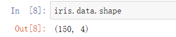

```
  # Mean vector
    mean_total = np.mean(X, axis=0)
    
    # Within-class scatter matrix
    Sw = np.zeros((num_features, num_features))
    for i in classes:
        Xi = X[y == i]
        mean_Xi = np.mean(Xi, axis=0)
        Swi = np.cov(Xi.T, bias=True)
        Sw += Swi
     
    # Between-class scatter matrix
    Sb = np.zeros((num_features, num_features))
    for i in classes:
        Xi = X[y == i]
        mean_Xi = np.mean(Xi, axis=0)
        Ni = Xi.shape[0]
        mean_diff = mean_Xi - mean_total
        Sb += Ni * np.outer(mean_diff, mean_diff)
    
    # Solve the generalized eigenvalue problem for the matrix Sw^-1 * Sb
    # to get the eigenvalues and eigenvectors
    eigenvalues, eigenvectors = np.linalg.eigh(np.linalg.inv(Sw).dot(Sb))
    
    # Sort the eigenvectors by decreasing eigenvalues
    sorted_indices = np.argsort(eigenvalues)[::-1]
    eigenvalues = eigenvalues[sorted_indices]
    eigenvectors = eigenvectors[:, sorted_indices]
    
    # Select the first num_components eigenvectors
    eigenvectors = eigenvectors[:, :num_components]
    
    # Transform the data
    X_transformed = X.dot(eigenvectors)
    
    return X_transformed

# Test the LDA function
from sklearn import datasets
iris = datasets.load_iris()
X = iris.data
y = iris.target

# Apply LDA and reduce to 2 dimensions
X_lda = lda(X, y, 2)
X_lda.shape
import matplotlib.pyplot as plt

# Plot the LDA-transformed data
plt.figure(figsize=(10, 8))
for i, label in enumerate(iris.target_names):
    plt.scatter(X_lda[y == i, 0], X_lda[y == i, 1], label=label)

plt.xlabel('LD1')
plt.ylabel('LD2')
plt.title('LDA of IRIS dataset')
plt.legend()
plt.show()

```