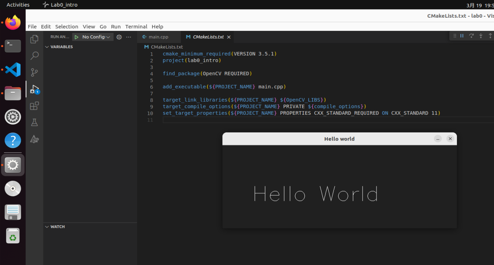
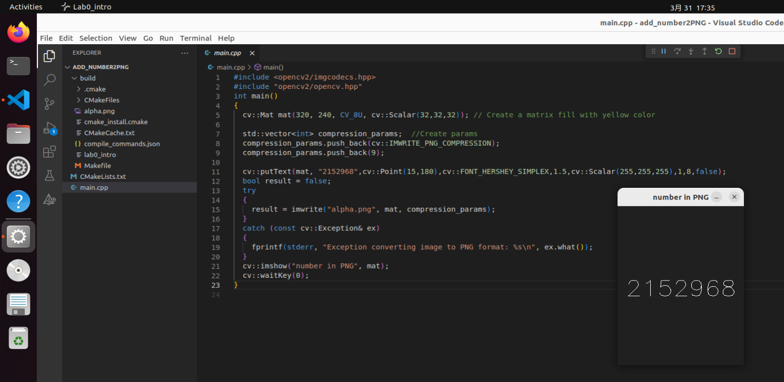

### 一些具体细节：

1.  当我们执行某些程序时，由于机器速度很快导致肉眼无法直接看到执行结果时程序便停止运行。这时候我们迫切需要在程序中暂停，专业术语叫做阻塞。下面列举几种常用的程序暂停方法：<br/>
    input()：<br/>
    用法：直接在欲等待处输入 input()即可。<br/>
    优点：不需要借助模块，执行到此处阻塞等待人工输入。<br/>
    缺点：程序结束时候需要强制结束或者在控制台输入值。<br/>
    time.sleep()<br/>
    用法：导入 time 模块；在欲等待处输入 time.sleep(time)（time 为数字，表示秒）即可。<br/>
    优点：动态等待程序执行完毕，不需要强行终止，等待时间可调。<br/>
    缺点：需要导入模块，等待规定时间结束后便继续往下执行。<br/>

    os.system("pause")<br/>
    用法：导入 os 模块；在欲等待处输入 os.system("pause")即可。<br/>
    优点：不必强行终止；不必等待时间，可自由按下 enter 继续。<br/>
    缺点：导入模块，执行系统命令。<br/>

# <center>Get familiar with OpenCV

## 一.实验任务

### 1. Establish development work flow with VSCode & Cmake.

### 2. Try basic OpenCV operations.

### 3. OpenCV Playground - acquire realtime video and processing

## 二.实验过程

### 1.1 Prepair VSCode for C++ development with Cmake

> install following extensions for opencv development:

- C/C++
- C/C++ Extension Pack
- CMake
- CMake Tools

### 1.2 a "Hello world" project

> Using "OPEN FOLDER" in VSCode to open working directory(eg. ~/work/labs/lab0/).

> Add "main.cpp" source code file in the working directory. In your working directory(eg. ~/work/labs/lab0/), create CMakeLists.txt file and then add following content.

### 1.3 How to use CMake in VSCode

- Call out VSCode command pallete using Ctrl+Shift+P, input CMake:Configure to call cmake to generate makefiles.
- Call out VSCode command pallete and input CMake:Build to compile source code.
- Call out VSCode command pallete and input CMake:Debug to enter the debug mode.
  > code:
  >
  > ```c++
  > #include "opencv2/opencv.hpp"
  > int main(int argc, char *argv[])
  > {
  >   cv::Mat image(240, 640, CV_8UC3, cv::Scalar(32,32,32));
  >   cv::putText(image, "Hello World",cv::Point(80,160),
  >   cv::FONT_HERSHEY_SIMPLEX,2,cv::Scalar(255,255,255),1,8,false);
  >   cv::imshow("Hello world", image);
  >   cv::waitKey(0);
  >   return EXIT_SUCCESS;
  > }
  > ```

> result image:
> 

### 2.1 Mat() -- Construction of a OpenCV array

reference:[click here](https://docs.opencv.org/4.9.0/d3/d63/classcv_1_1Mat.html)
Basic usage:

```c++
cv::Mat (int rows, int cols, int type, const Scalar &s);
```

### 2.2 imshow()-- Create a window to display an array

Basic usage:

```c++
cv::imshow(const String& winname, InputArray mat);
```

_const String& winname: string of the window name;_
_InputArray mat: opencv array to display._

### 2.3 imread()-- read Array from an image file

reference:[click here](https://docs.opencv.org/4.9.0/d4/da8/group__imgcodecs.html#ga288b8b3da0892bd651fce07b3bbd3a56)
Basic usage:

```c++
#include "opencv2/imgcodecs.hpp"
Mat cv::imread(const String & filename, int flags=IMREAD_COLOR);
```

_const String& filename: name string of the picture file;_
_int flags: option flags. refer to ImreadModes_
_This function return an opencv array object._

### 2.4 imwrite() -- write Array to an image file

reference:[click here](https://docs.opencv.org/4.9.0/d4/da8/group__imgcodecs.html#gabbc7ef1aa2edfaa87772f1202d67e0ce)
Basic usage:

```c++
#include <opencv2/imgcodecs.hpp>
bool cv::imwrite(const String & filename, InputArray img, const std::vector<int>& params);
```

_const String& filename: name string of the picture file;_
_InputArray img: array to store image;_
_const std::vector& params:_
_NOTE: With PNG encoder, 8-bit unsigned (CV_8U) and 16-bit unsigned (CV_16U) images can be saved_

> code:
>
> ```c++
> #include <opencv2/imgcodecs.hpp>
> #include "opencv2/opencv.hpp"
> int main()
> {
>   cv::Mat mat(320, 240, CV_8U, cv::Scalar(32,32,32)); // Create a matrix fill with yellow color
>
>   std::vector<int> compression_params;  //Create params
>   compression_params.push_back(cv::IMWRITE_PNG_COMPRESSION);
>   compression_params.push_back(9);
>
>   cv::putText(mat, "2152968",cv::Point(15,180),cv::FONT_HERSHEY_SIMPLEX,1.5,cv::Scalar(255,255,255),1,8,false);
>   bool result = false;
>   try
>   {
>     result = imwrite("alpha.png", mat, compression_params);
>   }
>   catch (const cv::Exception& ex)
>   {
>     fprintf(stderr, "Exception converting image to PNG format: %s\n", ex.> what());
>   }
>   cv::imshow("number in PNG", mat);
>   cv::waitKey(0);
> }
> ```

> result image:
> 

### 2.5 Drawing functions and some Useful operations

- line [click here](https://docs.opencv.org/4.9.0/d6/d6e/group__imgproc__draw.html#ga7078a9fae8c7e7d13d24dac2520ae4a2)
- circle [click here](https://docs.opencv.org/4.9.0/d6/d6e/group__imgproc__draw.html#gaf10604b069374903dbd0f0488cb43670)
- waitKey [click here](https://docs.opencv.org/4.9.0/d7/dfc/group__highgui.html#ga5628525ad33f52eab17feebcfba38bd7)
- resize [click here](https://docs.opencv.org/4.9.0/da/d54/group__imgproc__transform.html#ga47a974309e9102f5f08231edc7e7529d)
- putText [click here](https://docs.opencv.org/4.9.0/d6/d6e/group__imgproc__draw.html#ga5126f47f883d730f633d74f07456c576)

### 3.1 Adjust Vmware settings for using camera

- Before start your ubuntu in virtual machine, modify VM settings, adjust USB controller compatible settings to "USB 3.1"
- Start your ubuntu in vmware
- In vmware menus, find your camera in removable devices menu, choose "connect(Disconnect from host)", then your camera will connected to ubuntu in vmware.
- in terminal, using
  ```
  lsusb
  ```
  to list usb devices, your camera should in the list.
- open "Cheese" app to check your camera
- if the video flicks, choose preferences to change the resolution to 640x480.

### 3.2 Acquire and display live video

### 3.3 Add real time processing functions

- Convert color video to grayscale
- Invert color
- Display Histogram of the real-time video
- Using Canny edge detection

> code:
>
> ```c++
> #include "opencv2/highgui.hpp"
> #include "opencv2/opencv.hpp"
> #include <iostream>
> #include <time.h>
>
> using namespace std;
> using namespace cv;
>
> //turn frame to grey
> void color2grey(cv::Mat &image)
> {
>     cv::cvtColor(image, image, cv::COLOR_RGB2GRAY);
> }
>
> //Invert color
> void greyInvert(cv::Mat &greyImage)
> {
>     cv::bitwise_not(greyImage, greyImage);
> }
>
> //求Mat的中位数
> int GetMatMidVal(Mat& img)
> {
>   //判断如果不是单通道直接返回128
>   if (img.channels() > 1) return 128;
>   int rows = img.rows;
>   int cols = img.cols;
>   //定义数组
>   float mathists[256] = { 0 };
>   //遍历计算0-255的个数
>   for (int row = 0; row < rows; ++row) {
>     for (int col = 0; col < cols; ++col) {
>       int val = img.at<uchar>(row, col);
>       mathists[val]++;
>     }
>   }
>
>   int calcval = rows * cols / 2;
>   int tmpsum = 0;
>   for (int i = 0; i < 255; ++i) {
>     tmpsum += mathists[i];
>     if (tmpsum > calcval) {
>       return i;
>     }
>   }
>   return 0;
> }
>
> //求自适应阈值的最小和最大值
> void GetMatMinMaxThreshold(Mat& img, int& minval, int& maxval, float sigma=0.35)
> {
>   int midval = GetMatMidVal(img);
>   //cout << "midval:" << midval << endl;
>   // 计算低阈值
>   minval = saturate_cast<uchar>((1.0 - sigma) * midval);
>   //计算高阈值
>   maxval = saturate_cast<uchar>((1.0 + sigma) * midval);
> }
>
> //Using Canny edge detection
> void cannyEdge(cv::Mat &image)
> {
>
> 	//高斯滤波
>     GaussianBlur(image, image, Size(3, 3), 0.5, 0.5);
>     //获取自适应阈值
>     int minthreshold, maxthreshold;
>     GetMatMinMaxThreshold(image, minthreshold, maxthreshold);
>     cv::Canny(image, image,minthreshold, maxthreshold);
> }
>
> //add time to photo
> void drawTime(cv::Mat & image)
> {
>     time_t rawtime;
>     time(&rawtime);
>     char* time = ctime(&rawtime);
>     int i=0;
>
>     cv::putText(image, time,
>             cv::Point(10, 15),
>             cv::FONT_HERSHEY_COMPLEX, 0.5, // font face and scale
>             cv::Scalar(255, 255, 255), // white
>             1, cv::LINE_AA); // line thickness and type
> }
>
> int main(int argc, char *argv[])
> {
>     cv::VideoCapture input_stream(0);
>     if(!input_stream.isOpened())
>     {
>         std::cerr << "Could not open camera\n";
>         return EXIT_FAILURE;
>     }
>     const std::string window_title = "Lab 0:Intro to OpenCV";
>     cv::namedWindow(window_title, cv::WINDOW_NORMAL);
>     cv::Mat frame;
>
>     while(true)
>     {
>         input_stream >> frame;
>         color2grey(frame);
>         greyInvert(frame);
>         cannyEdge(frame);
>         //cv::Canny(frame, frame,150, 100);
>         drawTime(frame);
>
>         if(frame.empty())
>         {break;}
>
>         cv::imshow("cam", frame);
>         if(cv::waitKey(15) >=0)
>         {
>             break;
>         }
>     }
> }
> ```

> result image:
> 

## 三. 实验讨论与思考

- 在使用 VSCode 和 Cmake 建立开发工作流程时，我发现配置 Cmake 的过程比较复杂，特别是在确保依赖库正确安装和路径设置方面。我解决这个问题是通过查阅文档和在线资源，逐步调试配置文件，确保所有必要的库和路径都正确设置。
- 在尝试基本的 OpenCV 操作时，我发现在图像的加载、显示和保存方面存在一些困难。特别是在图像路径设置和文件格式兼容性方面。我通过查阅 OpenCV 官方文档和在线论坛，学习了正确的加载和保存图像的方法，并解决了这些问题。
- 在调整 VMware 设置以使用摄像头时，我遇到了一些 USB 设备连接的问题，导致摄像头无法被识别。我解决了这个问题是通过检查 VMware 设置和操作系统设备管理器，确保 USB 控制器和摄像头驱动程序正常工作。
- 在使用 CMake 进行项目配置时，我发现在生成 Makefile 和调试过程中存在一些不明确的地方。我希望能够更深入地了解 CMake 的工作原理，并掌握更多的调试技巧，以提高项目配置和调试的效率。
- 通过本次实验，我对于 VSCode、CMake 和 OpenCV 的使用有了更深入的了解，但仍然需要进一步学习和实践，以提高自己的技能水平。
- 实时视频处理功能让我深感兴趣，我认为这些功能在视频监控、人机交互等领域具有广泛的应用前景，我希望能够深入学习和掌握这些技术，为未来的项目开发提供更多可能性。
- 在处理图像时，了解图像的内部表示和处理方式对于提高算法的效率和性能非常重要。我认为深入学习图像处理的理论知识，掌握常用的图像处理算法和工具，将有助于我更好地应对图像处理项目中的挑战，并提高项目的质量和效率。
