### 前情提要报错：
OMP: Error #15: Initializing libiomp5md.dll, but found libiomp5md.dll already initialized.
OMP: Hint This means that multiple copies of the OpenMP runtime have been linked into the program. That is dangerous, since it can degrade performance or cause incorrect results. The best thing to do is to ensure that only a single OpenMP runtime is linked into the process, e.g. by avoiding static linking of the OpenMP runtime in any library. As an unsafe, unsupported, undocumented workaround you can set the environment variable KMP_DUPLICATE_LIB_OK=TRUE to allow the program to continue to execute, but that may cause crashes or silently produce incorrect results. For more information, please see http://www.intel.com/software/products/support/.
Process finished with exit code 3
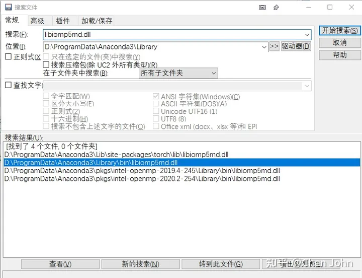

#### 本问题出现主要是因为torch包中包含了名为libiomp5md.dll的文件，与Anaconda环境中的同一个文件出现了某种冲突，所以需要删除一个。  

#### 在Anaconda文件夹下搜索，如下图，删除Anaconda包中libiomp5md.dll这个文件，即下图所选定的那个。
#### 但如果是在某个python环境下，则需要删除的是该环境下的对应文件。

#### 也就是：

#### 如果在Anaconda的base环境下：删除..\Anaconda3\Library\bin\libiomp5md.dll
#### 如果是在某个env(例如名为work)下：删除..\Anaconda3\envs\work\Library\bin\libiomp5md.dll

   
   --------------------------------------------------------------------------------------------  
   --------------------------------------------------------------------------------------------  
   --------------------------------------------------------------------------------------------  
   --------------------------------------------------------------------------------------------  
#### 相关介绍：
 torch.nn概述：  
Pytorch提供了几个设计得非常棒的模块和类，比如 torch.nn，torch.optim，Dataset 以及 DataLoader，来帮助程序员设计和训练神经网络。  
nn是Neural Network的简称，帮助程序员方便执行如下的与神经网络相关的行为：  
（1）创建神经网络  
（2）训练神经网络   
（3）保存神经网络  
（4）恢复神经网络  
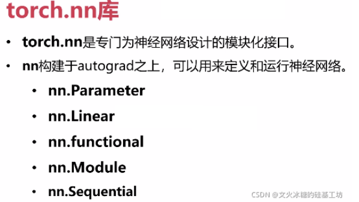

torch.nn库五大基本功能：nn.Parameter、nn.Linear、nn.functioinal、nn.Module、nn.Sequentia

1.1 torch.nn相关库的导入
#环境准备
import numpy as np              # numpy数组库
import math                     # 数学运算库
import matplotlib.pyplot as plt # 画图库
 
import torch             # torch基础库
import torch.nn as nn    # torch神经网络库
import torch.nn.functional as F
1.2 torch.nn概述
Pytorch提供了几个设计得非常棒的模块和类，比如 torch.nn，torch.optim，Dataset 以及 DataLoader，来帮助程序员设计和训练神经网络。

第2章 nn.Linear类（全连接层）
2.1 函数功能
用于创建一个多输入、多输出的全连接层。

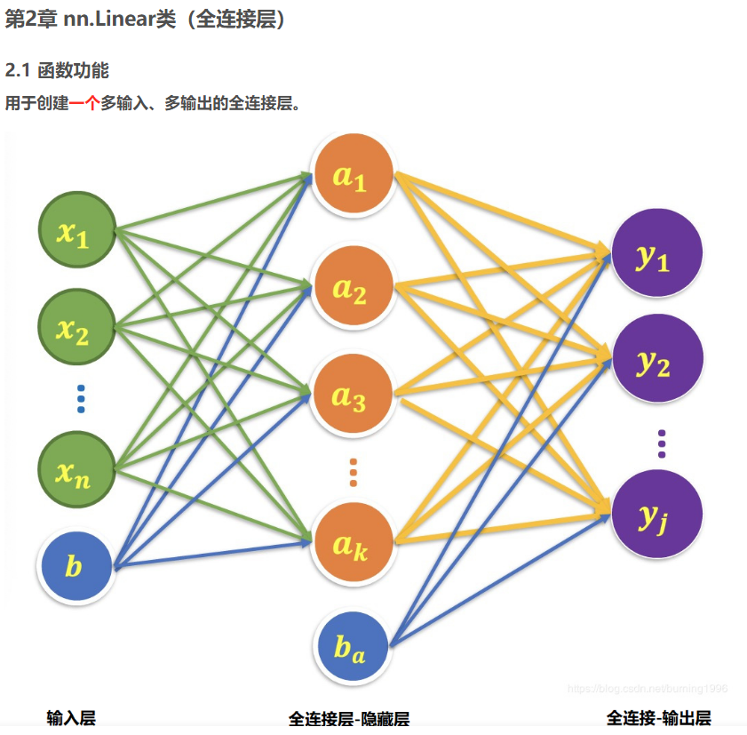
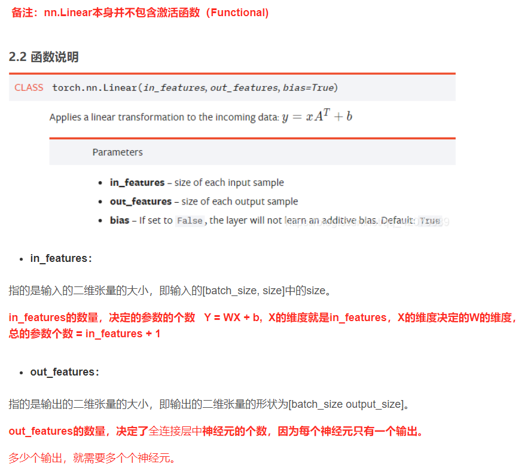

 备注：nn.Linear本身并不包含激活函数（Functional)

2.2 函数说明

in_features：
指的是输入的二维张量的大小，即输入的[batch_size, size]中的size。
in_features的数量，决定的参数的个数   Y = WX + b,  X的维度就是in_features，X的维度决定的W的维度， 总的参数个数 = in_features + 1
out_features：
指的是输出的二维张量的大小，即输出的二维张量的形状为[batch_size output_size]。  
out_features的数量，决定了全连接层中神经元的个数，因为每个神经元只有一个输出。  
多少个输出，就需要多个个神经元。  
从输入输出的张量的shape角度来理解，相当于一个输入为[batch_size, in_features]的张量变换成了[batch_size, out_features]的输出张量。  

2.3 多个全连接层构建全连接网络
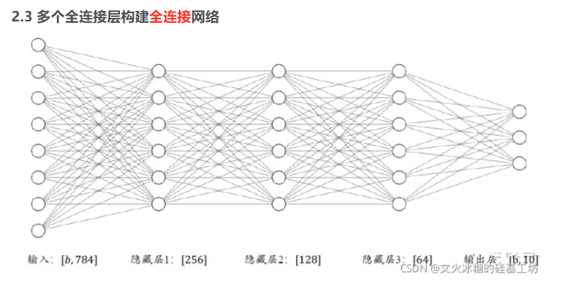
2.4 使用nn.Linear类创建全连接层
#### nn.Linear
#### 建立单层的多输入、多输出全连接层
#### in_features由输入张量的形状决定，out_features则决定了输出张量的形状 
full_connect_layer = nn.Linear(in_features = 28 * 28 * 1, out_features = 3)  
print("full_connect_layer:", full_connect_layer)  
print("parameters        :", full_connect_layer.parameters)  
 
#### 假定输入的图像形状为[64,64,3]
x_input = torch.randn(1, 28, 28, 1)  
 
#### 将四维张量转换为二维张量之后，才能作为全连接层的输入
x_input = x_input.view(1, 28 * 28 * 1)  
print("x_input.shape:", x_input.shape)  
 
#### 调用全连接层
y_output = full_connect_layer(x_input)  
print("y_output.shape:", y_output.shape)  
print("y_output:", y_output)  

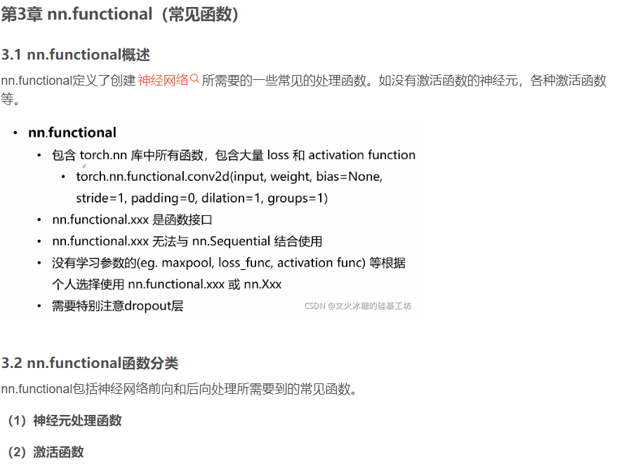
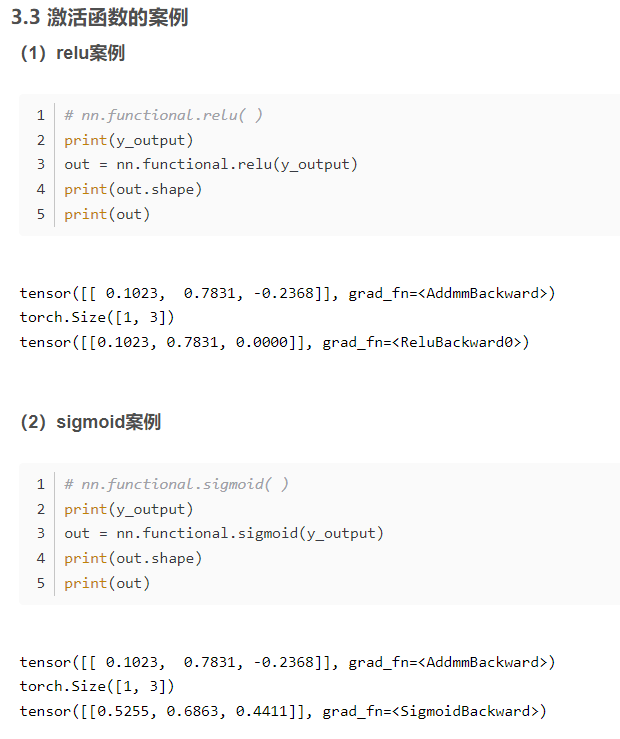

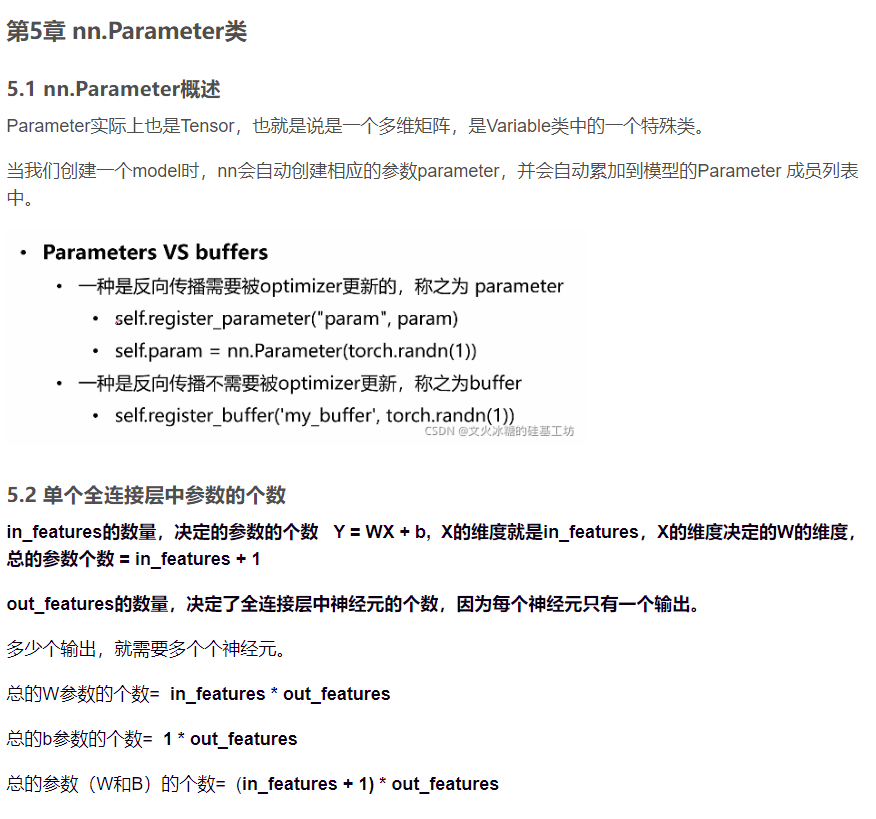
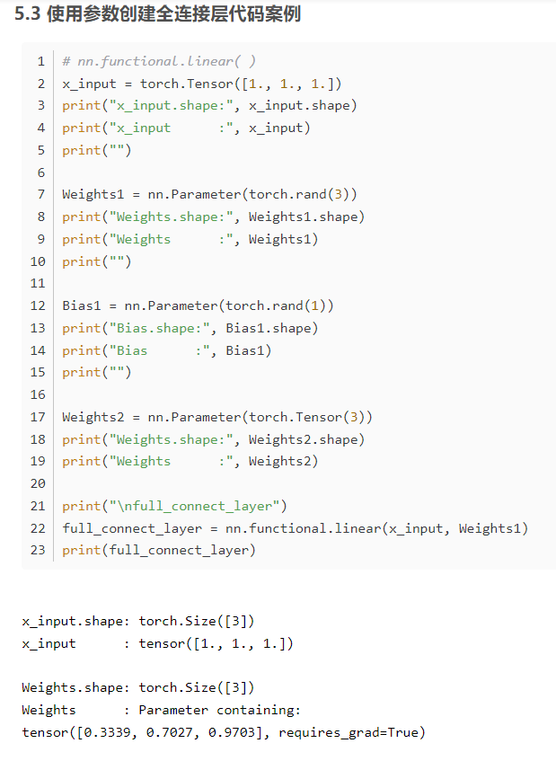
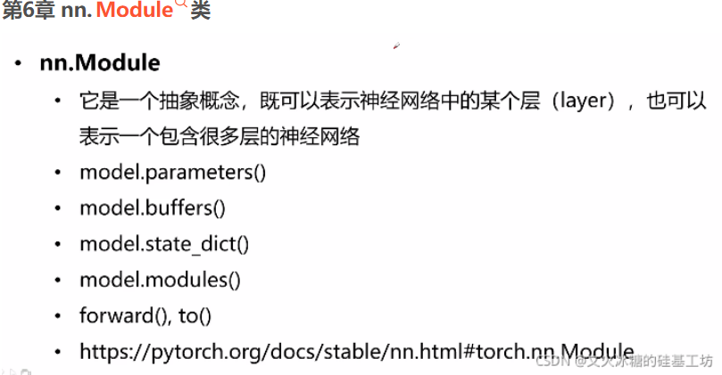
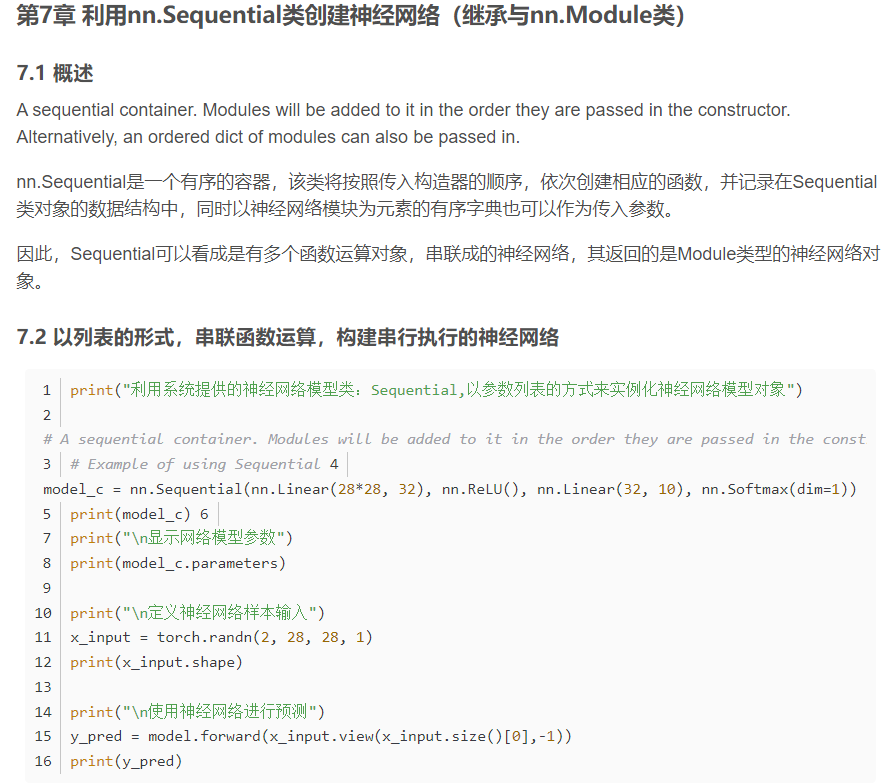
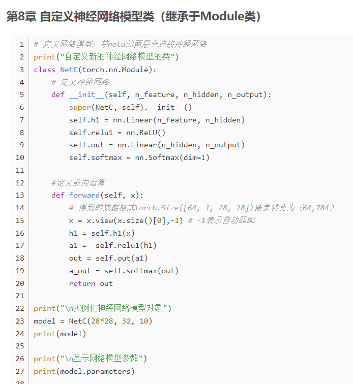

