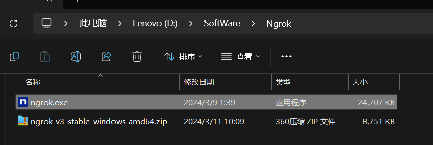
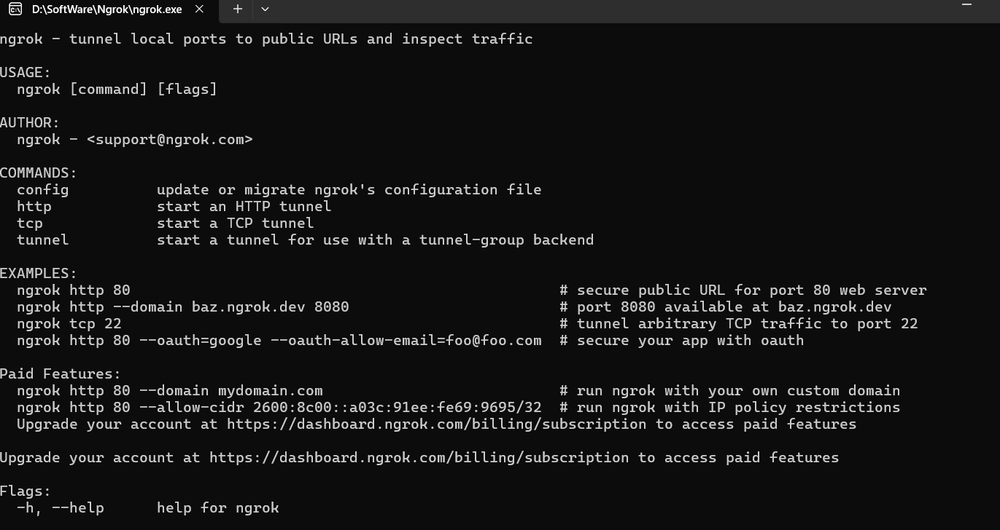
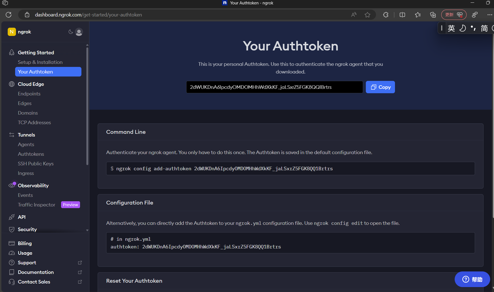
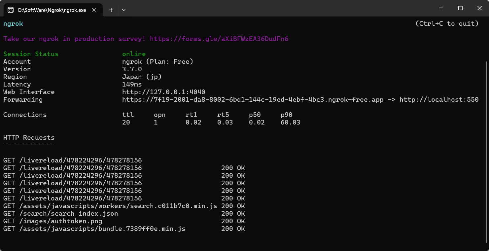

### 【ngrok是一个非常优秀的内网穿透工具，他和mkdocs结合，可以实现本地记的笔记直接公网访问.也就是说，当mkdocs在本地建立了静态网站的时候，可以把本地网站的端口，通过内网穿透，暴露到公网.总结一句话就是本地运行的项目，如果不使用内网穿透，只能本机访问。用到了内网穿透，就会给一个公网的ip代替本地ip,这样别人就可以访问到你的本地项目啦。】  
1.用到的工具：
ngrok 我们可以把他部署到windows上，也可以部署到linux上。接下来让我们来看看这两种应该怎么实现。
windows上安装: (访问ngrok官网) : https://ngrok.com/

  
2.双击之后，出现：  


3.获得authtoken：
  
获取到的token：
2dWUKDnA6IpcdyOMDOMHhWdXkKF_jaLSxrZ5FGK8QQ1Brtrs  

```py title="然后再刚才的命令行中执行如下命令后面数字需要换成你自己的密钥）"
ngrok authtoken 2dWUKDnA6IpcdyOMDOMHhWdXkKF_jaLSxrZ5FGK8QQ1Brtr

```
4.执行成功后，命令行界面中会出现下面的信息。此时，代表配置成功。ngrok程序已经在你的用户目录下，创建一个.ngrok2文件夹，并在文件夹中创建一个配置文件ngrok.yml。  
```py 
Authtoken saved to configuration file: C:\Users\acer/.ngrok2/ngrok.yml
```
5.在命令行界面中，执行下面命令，即将本地端口80映射到外网中，如果需要映射其他端口，只需将80改成相对应的端口即可。
```
ngrok http 8080
```
6.即可访问：
