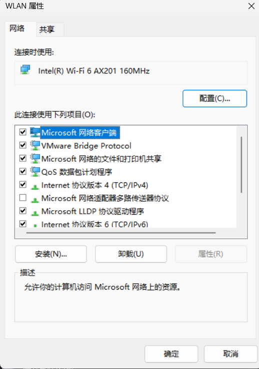

## 【树莓pi】  
### 【烧录系统文件】 
1.windiskimager是烧录到sd卡上的工具。  
2.debian是下载的树莓派的内核。   
3.操作时，将sd卡插入读卡器，然后启动烧录工具，选择需要的镜像文件，然后驱动器选择刚刚插入的设备，开始烧录即可。
  
【具体操作：  
1. 安装diskimg  
2. 根据镜像，写入img。镜像有2种，一种是32位的，一种是64位的。32位的系统以后下载python安装包都以armv7l.whl结尾；64位的以aarch64.whl结尾。   

3. 把目录7下的软件拷贝到名字为boot的磁盘根目录  
4.  由于我们没有显示环境，只能远程对树莓派进行连接，所以我们利用SSH连接树莓派。树莓派的ssh服务是默认关闭的，所以需要对ssh服务进行开启。  
5.  首先将文件夹显示中的文件后缀显示打开  
6.  在boot的根文件夹中，新建一个文本文档，将它重命名为SSH，并不带有任何后缀。  
7. 接下来设置网络，找到

到这里为止，网络的设置就告一段落了】

