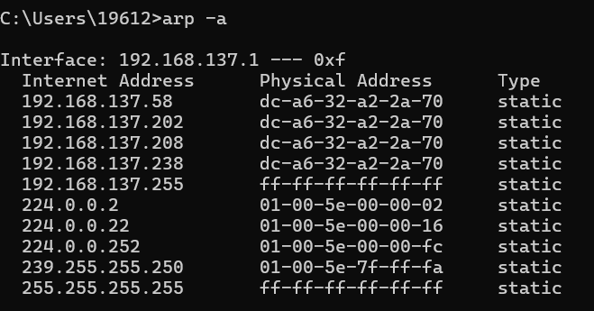
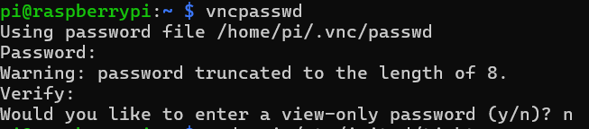

1. 打开CMD，输入arp -a，在接口192.168.137.1下面找到前缀相同，最后一个网段不同的IP地址，该地址即为树莓派的地址。如果出现多个，可以多试几次，或者清一下arp记录，然后再看IP地址。  

2. 在CMD中输入ssh pi@192.168.137.69（你自己的实际IP地址），然后输入yes，再根据提示输入密码，密码默认是raspberry，就是树莓派的英文，然后即可登录树莓派。  

3. 然后是在这个命令行中继续输入指令安装vnc服务。
sudo apt-get install tightvncserver

过程中会出现询问是否安装，输入y回车
4. 输入vncpasswd进行密码设置

过程中是否输入一个只读的密码，输入n
5. 设置该服务开机自启
需要在etc/init.d/中新建文件，我们将其命名为tightvncserver  
sudo vi /etc/init.d/tightvncserver  
将下面代码粘贴到cmd中（右键粘贴）
【具体请看docs文件夹中的tightvncserver.txt】
6. 按esc，然后输入:wq保存并退出。  
7. 给tightvncserver文件加执行权限，并更新开机启动列表  
sudo chmod 755 /etc/init.d/tightvncserver  
sudo update-rc.d tightvncserver defaults  
