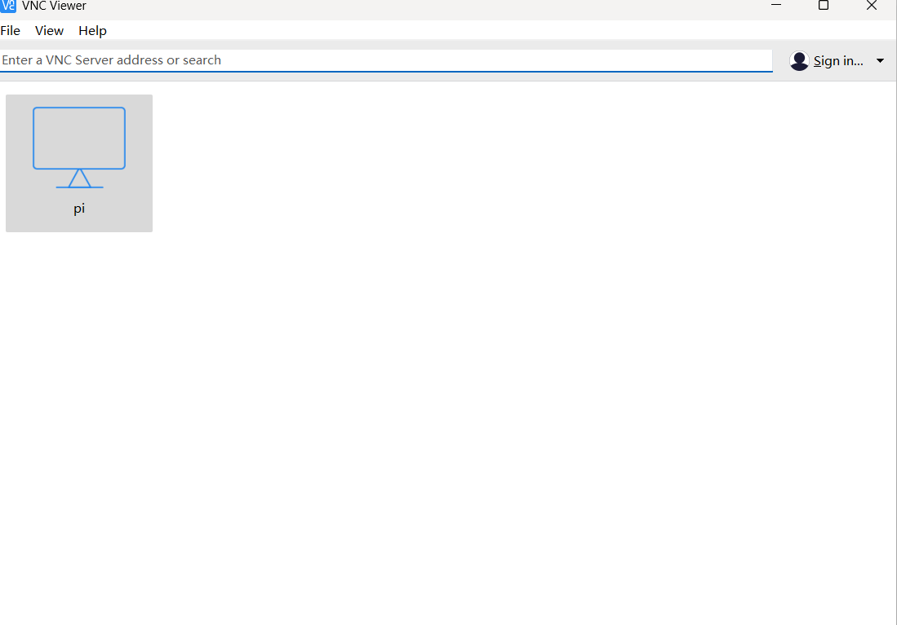
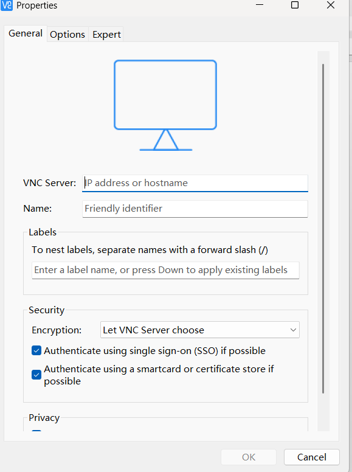

1. 开启vnc服务（依旧是在上面操作的cmd界面）  
tightvncserver -geometry 800x600 :1
2. 下载并安装VNCviewer【本地电脑】
https://www.realvnc.com/en/connect/download/viewer/
3. 创建新连接

密码是vncviewer

【注：
总的来说，localhost和127.0.0.1在大多数情况下是可以互换使用的。 它们之间的主要区别在于解析方式和灵活性。 如果你正在编写需要明确指定IP地址的代码（例如网络编程或系统配置），那么使用127.0.0.1可能是一个更安全的选择，因为它不受本地hosts文件或DNS设置的影响。】