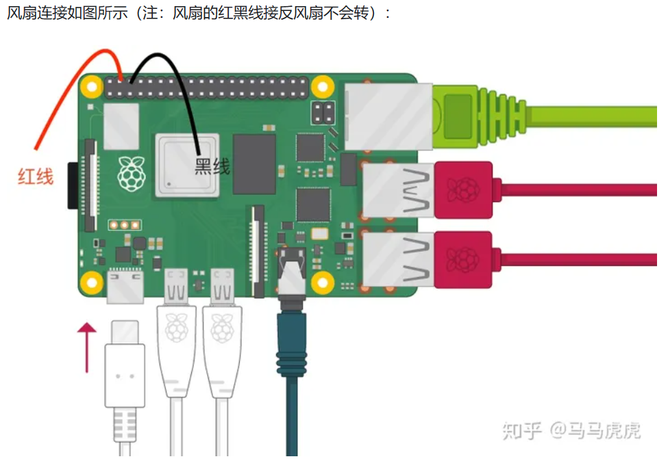

### 【一、重置树莓派的默认账号和密码】

【step 1】:在 SD 卡中根目录建立文件 userconf

【step 2】:在 userconf 中输入如下内容：

pi:$6$/4.VdYgDm7RJ0qM1$FwXCeQgDKkqrOU3RIRuDSKpauAbBvP11msq9X58c8Que2l1Dwq3vdJMgiZlQSbEXGaY5esVHGBNbCxKLVNqZW1

注意：以上其实就是 username:hash(password)，这一串 hash 就是 raspberry。  
【这样，重新进入时，默认账户就是 pi：raspberry 了】

linux 是多用户，多任务。

