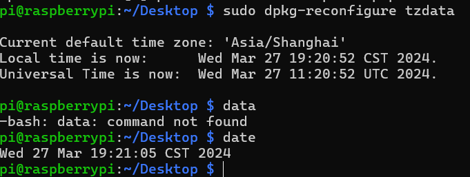

### 更改时间
1.date命令可以查看时间，如果不正确，可以更改时区。   
【```
sudo dpkg-reconfigure tzdata
```】  
执行完此命令之后可得到正确的时间：


### 更换源  
1.使用说明   
uname -m     查看系统的架构   
cat /etc/os-release   查看系统版本  
lsb_release -a   
  
2.选择对应的 Debian 版本:  Debian 9 (stretch) Debian 10 (buster) Debian 11 (bullseye)  

3.进入相应的文件
```
sudo nano /etc/apt/sources.list
```
下面所需要的命令，需要与时俱进：https://mirrors.tuna.tsinghua.edu.cn/help/debian/  


```
# armv7l 用户：编辑 `/etc/apt/sources.list` 文件，删除原文件所有内容，用以下内容取代
deb http://mirrors.tuna.tsinghua.edu.cn/raspbian/raspbian/ bullseye main non-free contrib rpi
# deb-src http://mirrors.tuna.tsinghua.edu.cn/raspbian/raspbian/ bullseye main non-free contrib rpi
 
# armv7l 用户如果需要开启 multi-arch 使用 arm64 软件源，需要在 `/etc/apt/sources.list` 中加上
deb [arch=arm64] http://mirrors.tuna.tsinghua.edu.cn/raspbian/multiarch/ bullseye main
 
# aarch64 用户：编辑 `/etc/apt/sources.list` 文件，用以下内容取代：
# 默认注释了源码镜像以提高 apt update 速度，如有需要可自行取消注释
deb https://mirrors.tuna.tsinghua.edu.cn/debian/ bullseye main contrib non-free
# deb-src https://mirrors.tuna.tsinghua.edu.cn/debian/ bullseye main contrib non-free
deb https://mirrors.tuna.tsinghua.edu.cn/debian/ bullseye-updates main contrib non-free
# deb-src https://mirrors.tuna.tsinghua.edu.cn/debian/ bullseye-updates main contrib non-free
deb https://mirrors.tuna.tsinghua.edu.cn/debian/ bullseye-backports main contrib non-free
# deb-src https://mirrors.tuna.tsinghua.edu.cn/debian/ bullseye-backports main contrib non-free
deb https://mirrors.tuna.tsinghua.edu.cn/debian-security bullseye-security main contrib non-free
# deb-src https://mirrors.tuna.tsinghua.edu.cn/debian-security bullseye-security main contrib non-free
 
# 对于两个架构，编辑 `/etc/apt/sources.list.d/raspi.list` 文件，删除原文件所有内容，用以下内容取代：
deb http://mirrors.tuna.tsinghua.edu.cn/raspberrypi/ bullseye main
```

检查和更新   
apt update  检查更新软件源列表  
apt upgrade        更新已安装的软件包   
