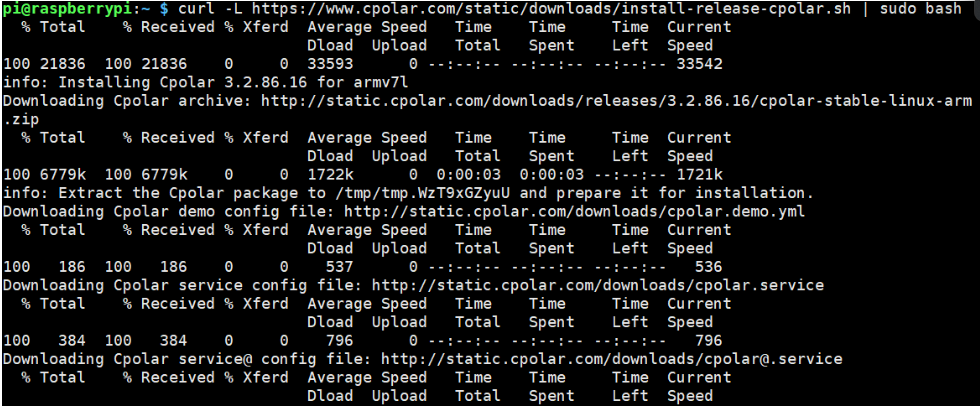
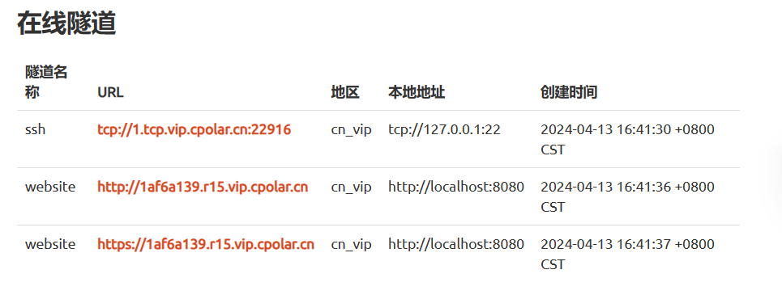

众所周知，一般我们远程连接树莓派，需要它和我们的电脑在同一局域网下。如果出门要用树莓派的话，只能把它一并带出门。

可如果我们想偷懒，把树莓派连上网线或wifi丢家里，然后在另外一个网络下远程连接树莓派的话，就需要借助cpolar来实现内网穿透，把树莓派变为联网的远程LINUX服务器
关于cpolar在树莓派上的基本配置，官方有很详细的帮助文档，但是里面有一些问题介绍的并不算清楚【官方文档连接】

本文是对官方帮助文档的细化（很多我搜到的博客基本就是照搬官方帮助文档）

在开始之前，请先注册一个你的cpolar账户

```https://www.cpolar.com/```

1.修改树莓派密码
注意：使用cpolar共享的SSH接口，主机地址都是一样的，只是端口号不一样

```sudo passwd pi```

2.在树莓派上初始化cpolar
下载用这个语句安装cpolar（国内用户）

```curl -L https://www.cpolar.com/static/downloads/install-release-cpolar.sh | sudo bash```

或者这个语句（适用于国外用户）

```curl -sL https://git.io/cpolar | sudo bash```

软件不是很大，一下子就下好了

使用这个语句查看版本信息

```cpolar version```

2.2token验证

注册账号后，选择了免费界面，你就可以进入后台管理系统
点击验证，可以找到你的隧道Authtoken
复制它，然后在树莓派上用下面的语句设置token

```cpolar authtoken ZWZlNGM4NzItYTllOS00M2MxLWFjNTItYzY1ZjZjZDJhYjc5```


2.3设置cpolar开机自启和系统保护
开机自启动

```sudo systemctl enable cpolar```

守护进程方式，启动cpolar（类似于把cpolar设置成了白名单应用）

```sudo systemctl start cpolar```

查看守护进程状态

```sudo systemctl status cpolar```

如图，状态为active, 说明启动状态成功

2.4查看隧道端口
cpolar会默认安装两个样例隧道，一个是Website隧道指向http 8080端口，一个是ssh隧道，指向tcp 22端口
和官方这里不同，我的后台管理中只有两个website地址和一个ssh地址

使用putty或者Xshell远程连接树莓派
确认你的ssh连接后，需要在树莓派本地设置一下

ssh pi@1.tcp.vip.cpolar.cn -p 20013
这里会让你填写树莓派的密码，并不是cpolar的密码

填写完毕后，到这里已经设置完毕啦！是不是很简单？

下面来试试远程使用树莓派
假设我们的SSH地址是下面这个

tcp://1.tcp.vip.cpolar.cn:20013
那么在Xshell中的主机和端口分别就要填写

主机1.tcp.vip.cpolar.cn
端口22916
然后就能连接上你的树莓派

这里需要你输入你树莓派的用户名和密码，输入完毕后，就和局域网使用树莓派没啥区别啦！

我搜资料的时候，就是这里填错了，导致一直没连上树莓派


```
命令如下： del /s PATH*.扩展名 例如： del /s D:AAA*.zip 表示删除D盘下AAA文件夹以及其子文件夹中所有的ZIP格式文件。 命令可以在cmd中直接执行或者卸载bat脚本中执行。
```
