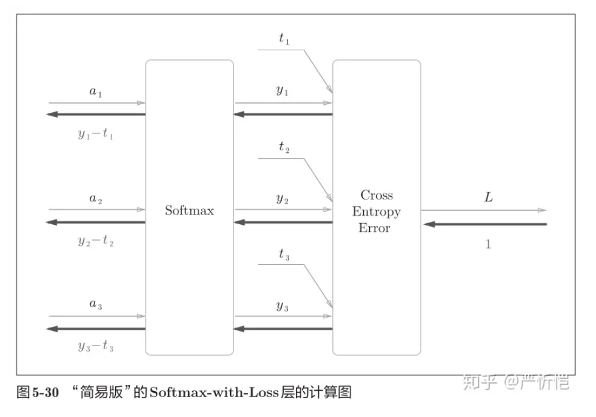
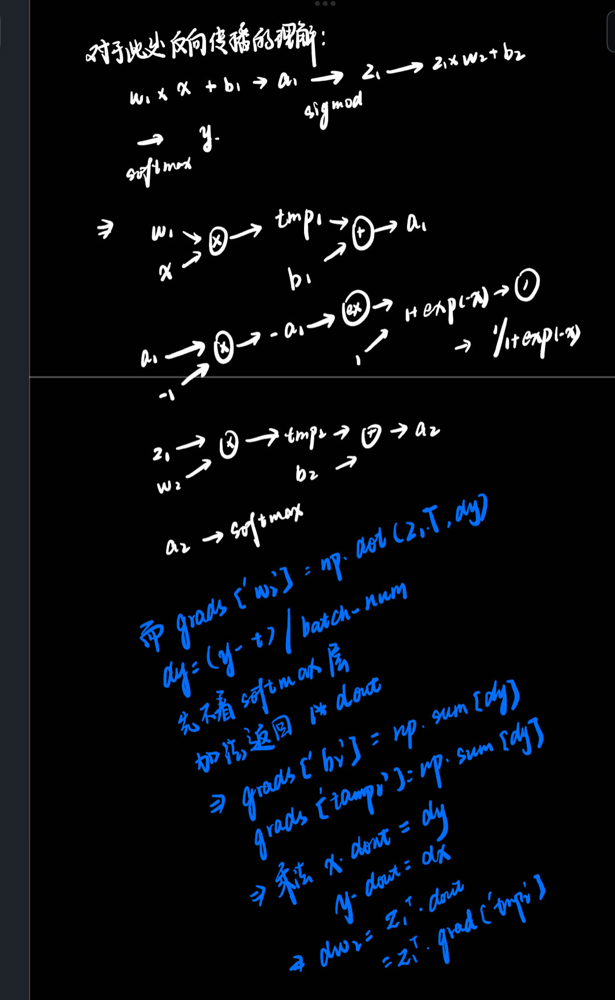

正确理解误差反向传播法，我个人认为有两种方法：一种是基于数学式；另一种是基于计算图（computational graph）。<br/>
主要介绍用计算图求解:<br/>
计算图将计算过程用图形表示出来。这里说的图形是数据结构图，通过多个节点和边表示（连接节点的直线称为“边”）。<br/>
举个简单的例子学会计算图的使用方法:<br/>

#### 问题 1：

太郎在超市买了 2 个 100 日元一个的苹果，消费税是 10%，请计算支付金额。<br/>
<br/>


#### 将计算的中间结果写在箭头的上方，表示各个节点的计算结果从左向右传递。

开始时，苹果的 100 日元流到“× 2”节点，变成 200 日元，然后被传递给下一个节点。接着，这个 200 日元流向“× 1.1”节点，变成 220 日元。因此，从这个计算图的结果可知，答案为 220 日元。<br/>

#### 问题 2： 太郎在超市买了 2 个苹果、3 个橘子。其中，苹果每个 100 日元，橘子每个 150 日元。消费税是 10%，请计算支付金额。<br/>


#### 新增了加法节点“+”，用来合计苹果和橘子的金额<br/>

综上，用计算图解题的情况下，需要按如下流程进行。<br/>

1.构建计算图。<br/>

2.在计算图上，从左向右进行计算。<br/>

从左向右进行计算”是一种正方向上的传播，简称为正向传播（forward propagation）。正向传播是从计算图出发点到结束点的传播。而从图上看从右向左的传播，这种传播称为反向传播（backward propagation）。<br/>

#### 为何用计算图解题？<br/>

1、局部计算，无论全局是多么复杂的计算，都可以通过局部计算使各个节点致力于简单的计算，从而简化问题。<br/>

####

这一点很关键，比如加法层，我们在考虑问题时，其反向传播的倒数，仅仅是最基础的 x+y 形式，而系数则是单独作为一个层来求解<br/>
2、利用计算图可以将中间的计算结果全部保存起来<br/>

3、可以通过反向传播高效计算导数。<br/>

#### 再来思考一下问题 1，假设我们想知道苹果价格的上涨会在多大程度上影响最终的支付金额，即求“支付金额关于苹果的价格的导数”。<br/>

#### 链式法则

传递局部导数的原理是基于链式法则（chain rule）的。链式法则是关于复合函数的导数的性质，定义如下。如果某个函数由复合函数表示，则该复合函数的导数可以用构成复合函数的各个函数的导数的乘积表示。<br/>

比如，z = (x + y) 2 是由式（5.1）所示的两个式子构成的。<br/>





```
# 在上一章中，提到了反向传播的一个实现

    def gradient(self, x, t):
        ## 误差反向传播法，比numerical_gradient(self, x, t)更快
        ## 下移章介绍，先不用管
        W1, W2 = self.params['W1'], self.params['W2']
        b1, b2 = self.params['b1'], self.params['b2']
        grads = {}

        batch_num = x.shape[0]

        # 向前传递
        a1 = np.dot(x, W1) + b1
        z1 = sigmoid(a1)
        a2 = np.dot(z1, W2) + b2
        y = softmax(a2)

        # 向后传递
        dy = (y - t) / batch_num
        grads['W2'] = np.dot(z1.T, dy)
        grads['b2'] = np.sum(dy, axis=0)

        dz1 = np.dot(dy, W2.T)
        da1 = sigmoid_grad(a1) * dz1
        grads['W1'] = np.dot(x.T, da1)
        grads['b1'] = np.sum(da1, axis=0)

        return grads
```



```
import numpy as np
class MulLayer:
def **init**(self):
self.x = None
self.y = None

    def forward(self, x, y):
        self.x = x
        self.y = y
        out = x * y

        return out

    def backward(self, dout): ## dout为上一层的导数
        dx = dout * self.y
        dy = dout * self.x

        return dx, dy

apple = 100
apple_num = 2
tax = 1.1

mul_apple_layer = MulLayer()
mul_tax_layer = MulLayer()

# 向前传播

apple_price = mul_apple_layer.forward(apple, apple_num)
price = mul_tax_layer.forward(apple_price, tax)

# 向后传播

dprice = 1
dapple_price, dtax = mul_tax_layer.backward(dprice)
dapple, dapple_num = mul_apple_layer.backward(dapple_price)

print("price:", int(price))
print("dApple:", dapple)
print("dApple_num:", int(dapple_num))
print("dTax:", dtax)

class AddLayer:
def **init**(self):
pass # 不需要特意初始化

    def forward(self, x, y):
        out = x + y

        return out

    def backward(self, dout):
        dx = dout * 1
        dy = dout * 1

        return dx, dy

apple = 100
apple_num = 2
orange = 150
orange_num = 3
tax = 1.1

# 创建层

mul_apple_layer = MulLayer()
mul_orange_layer = MulLayer()

# 此处通过实例化两个乘法层描述数量和税的比例对于价格的影响

add_apple_orange_layer = AddLayer()
mul_tax_layer = MulLayer()

# 前向传播

apple_price = mul_apple_layer.forward(apple, apple_num) # (1)
orange_price = mul_orange_layer.forward(orange, orange_num) # (2)
all_price = add_apple_orange_layer.forward(apple_price, orange_price) # (3)
price = mul_tax_layer.forward(all_price, tax) # (4)

# 后向传播

dprice = 1

# 返回时，我们只关心梯度对于 Ω 的调整，因此输入设置为 1

dall_price, dtax = mul_tax_layer.backward(dprice) # (4)
dapple_price, dorange_price = add_apple_orange_layer.backward(dall_price) # (3)
dorange, dorange_num = mul_orange_layer.backward(dorange_price) # (2)
dapple, dapple_num = mul_apple_layer.backward(dapple_price) # (1)

print("price:", int(price))
print("dApple:", dapple)
print("dApple_num:", int(dapple_num))
print("dOrange:", dorange)
print("dOrange_num:", int(dorange_num))
print("dTax:", dtax)

class Relu:
def **init**(self):
self.mask = None

    def forward(self, x):
        self.mask = (x <= 0)
        out = x.copy()
        out[self.mask] = 0

        return out

    def backward(self, dout):
        dout[self.mask] = 0
        dx = dout*1

        return dx

x = np.array([[0.1, -0.5],[-0.2, 0.3]])
print(x)

mask = (x <= 0)
print(mask)

class Sigmoid:
def **init**(self):
self.out = None

    def forward(self, x):
        out = sigmoid(x)
        self.out = out
        return out

    def backward(self, dout):
        dx = dout * (1.0 - self.out) * self.out

        return dx

```

### Affine/Softmax 层的实现


```
import numpy as np
X_dot_W = np.array([[0, 0, 0], [10, 10, 10]])
B = np.array([1, 2, 3])
print(X_dot_W)
print(X_dot_W + B)

class Affine:
    def __init__(self, W, b):
        self.W =W
        self.b = b
        self.x = None
        self.dW = None
        self.db = None

    def forward(self, x):
        self.x = x
        out = np.dot(self.x, self.W) + self.b

        return out

    def backward(self, dout):
        dx = np.dot(dout, self.W.T)
        self.dW = np.dot(self.x.T, dout)
        self.db = np.sum(dout, axis=0)

        return dx
```


```

class SoftmaxWithLoss:
    def __init__(self):
        self.loss = None
        self.y = None
        self.t = None

    def forward(self, x, t):
        self.t = t
        self.y = softmax(x)
        self.loss = cross_entropy_error(self.y, self.t)

        return self.loss

    def backward(self, dout=1):
        batch_size = self.t.shape[0]
        if self.t.size == self.y.size:
            dx = (self.y - self.t) / batch_size
        else:
            dx = self.y.copy()
            dx[np.arange(batch_size), self.t] -= 1
            dx = dx / batch_size

        return dx
```

请注意反向传播时，将要传播的值除以批的大小（batch_size）后，传递给前面的层的是单个数据的误差。<br/>

#### 思考与总结

补充：神经网络中进行的处理有推理（inference）和学习两个阶段，神经网络的推理通常不使用 Softmax 层，比如上图会将最后一个 Affine 层的输出作为识别结果，神经网络中未被正规化的输出结果有时被称为“得分”。也就是说，当神经网络的推理只需要给出一个答案的情况下，因为此时只对得分最大值感兴趣，所以不需要 Softmax 层，不过，神经网络的学习阶段则需要 Softmax 层。
